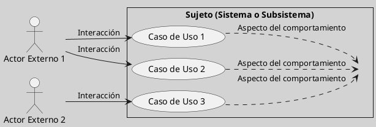
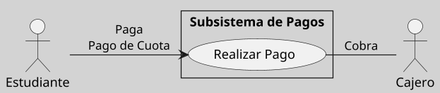

---
{"dg-publish":true,"permalink":"/050 Base de Conocimientos/200  Mi Zettelkasten/100 Docencia/IS1/2025/Clase 09 Diagrama de Casos de Uso (Fundamentos, Elementos, Relaciones)/Zk Diagrama de Casos de Uso - Elementos (Sujeto)/","tags":["digitalGarden","diagramaCasosDeUso","sujeto"]}
---

## Sujeto (Sistema)

En un **diagrama de casos de uso**, el **sujeto** (también conocido como el sistema) es el contexto dentro del cual se desarrollan las interacciones entre los actores y los casos de uso. Representa el sistema o subsistema que se está modelando, y se delimita gráficamente mediante un rectángulo que contiene los casos de uso relevantes ([[050 Base de Conocimientos/900 Biblioteca/Zk Lit (Booch et al., 2006) Booch, G., Rumbaugh, J., y Jacobson, I. (2006). El lenguaje Unificado de Modelado - Guía del Usuario (2a ed). Addison-Wesley.\|Booch et al., 2006, p. 246, 261]]; [[050 Base de Conocimientos/900 Biblioteca/Zk Lit (OMG, 2017) UML Specifications\|OMG, 2017, p. 641]]; [[050 Base de Conocimientos/900 Biblioteca/Zk Lit (Rumbaugh et al., 2007) Lenguaje Unificado de Modelado. Manual de Referencia\|Rumbaugh et al., 2007, 69]]).

----
### Características

| Característica  | Descripción                                                                                                                                                                                                                                                                                                                                                                                                                                                                                                         |
| --------------- | ------------------------------------------------------------------------------------------------------------------------------------------------------------------------------------------------------------------------------------------------------------------------------------------------------------------------------------------------------------------------------------------------------------------------------------------------------------------------------------------------------------------- |
| Delimitación    | El sujeto está claramente definido por un rectángulo que separa las funcionalidades internas del sistema de su entorno externo ([[050 Base de Conocimientos/900 Biblioteca/Zk Lit (Booch et al., 2006) Booch, G., Rumbaugh, J., y Jacobson, I. (2006). El lenguaje Unificado de Modelado - Guía del Usuario (2a ed). Addison-Wesley.\|Booch et al., 2006, p. 246, 261]]; [[050 Base de Conocimientos/900 Biblioteca/Zk Lit (OMG, 2017) UML Specifications\|OMG, 2017, p. 641]]; [[050 Base de Conocimientos/900 Biblioteca/Zk Lit (Rumbaugh et al., 2007) Lenguaje Unificado de Modelado. Manual de Referencia\|Rumbaugh et al., 2007, 190]]). |
| Interacciones   | Los actores interactúan con el sujeto desde fuera, sin conocer los detalles internos del sistema, lo que se alinea con el concepto de "caja negra" ([[050 Base de Conocimientos/900 Biblioteca/Zk Lit (Rumbaugh et al., 2007) Lenguaje Unificado de Modelado. Manual de Referencia\|Rumbaugh et al., 2007, 190]]).                                                                                                                                                                                                                                           |
| Funcionalidades | El sujeto provee funcionalidades específicas a los actores a través de los casos de uso. Uniendo todo los casos de uso, describen el comportamiento completo del sujeto ([[050 Base de Conocimientos/900 Biblioteca/Zk Lit (Booch et al., 2006) Booch, G., Rumbaugh, J., y Jacobson, I. (2006). El lenguaje Unificado de Modelado - Guía del Usuario (2a ed). Addison-Wesley.\|Booch et al., 2006, p. 246, 261]]).                                                                                                                                           |

----
### Representación Gráfica

El sujeto se representa mediante un rectángulo que rodea los casos de uso. Esta delimitación ayuda a identificar claramente los límites del sistema y las interacciones con el entorno externo ([[050 Base de Conocimientos/900 Biblioteca/Zk Lit (Booch et al., 2006) Booch, G., Rumbaugh, J., y Jacobson, I. (2006). El lenguaje Unificado de Modelado - Guía del Usuario (2a ed). Addison-Wesley.\|Booch et al., 2006, p. 260]]; [[050 Base de Conocimientos/900 Biblioteca/Zk Lit (OMG, 2017) UML Specifications\|OMG, 2017, p. 647]]; [[050 Base de Conocimientos/900 Biblioteca/Zk Lit (Rumbaugh et al., 2007) Lenguaje Unificado de Modelado. Manual de Referencia\|Rumbaugh et al., 2007, 190]]). 

**Figura**
_Representación Gráfica del Sujeto_

### Ejemplo Práctico
**Figura**
_Representación Gráfica del Sujeto Subsistema de Pagos_

