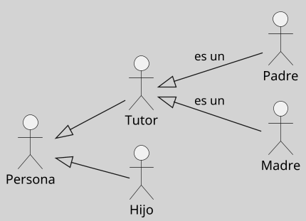
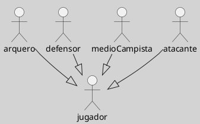

---
{"dg-publish":true,"permalink":"/050 Base de Conocimientos/200  Mi Zettelkasten/100 Docencia/IS1/2025/Clase 09 Diagrama de Casos de Uso (Fundamentos, Elementos, Relaciones)/Zk Diagrama de Casos de Uso - Relaciones (Entre Actores)/","tags":["digitalGarden","diagramaCasosDeUso","relaciones"]}
---

## Diagrama de Casos de Uso - Relaciones Entre Actores

En UML, la única relación admitida entre [[050 Base de Conocimientos/200  Mi Zettelkasten/100 Docencia/IS1/2025/Clase 09 Diagrama de Casos de Uso (Fundamentos, Elementos, Relaciones)/Zk Diagrama de Casos de Uso - Elementos (Actores)\|actores]] es la [[050 Base de Conocimientos/200  Mi Zettelkasten/100 Docencia/IS1/2025/Clase 08 Modelo Conceptual del UML - Elementos, Relaciones, Reglas y Mecanismos Comunes/Zk Modelo Conceptual del UML (Relaciones)#Generalización\|generalización]] (herencia), que permite modelar roles especializados que heredan características de un rol más general. Esta relación refleja cómo actores específicos comparten comportamientos comunes mientras añaden funcionalidades únicas ([[050 Base de Conocimientos/900 Biblioteca/Zk Lit (Booch et al., 2006) Booch, G., Rumbaugh, J., y Jacobson, I. (2006). El lenguaje Unificado de Modelado - Guía del Usuario (2a ed). Addison-Wesley.\|Booch et al., 2006, p. 244]]; [[050 Base de Conocimientos/900 Biblioteca/Zk Lit (OMG, 2017) UML Specifications\|OMG, 2017, p. 647]]; [[050 Base de Conocimientos/900 Biblioteca/Zk Lit (Rumbaugh et al., 2007) Lenguaje Unificado de Modelado. Manual de Referencia\|Rumbaugh et al., 2007, 69]]). 

### Características Clave

| Característica              | Descripción                                                                                                                                                                                                 |
| --------------------------- | ----------------------------------------------------------------------------------------------------------------------------------------------------------------------------------------------------------- |
| Generalización de Roles     | Los actores especializados heredan todas las interacciones y responsabilidades del actor general.          Ejemplo: Un "Administrador" hereda de "Usuario", accediendo a funcionalidades adicionales. |
| Flexibilidad en el Modelado | - Permite reutilizar comportamientos comunes sin duplicar casos de uso. - Facilita la adaptación del sistema a nuevos roles sin modificar la estructura base.                                            |

**Figura**
_Generalización de la Estructura de una Familia Tipo_
{ #5fc200}

_Explicación:_
- **Persona**: Actor general que modela a cualquier miembro de la familia, definiendo comportamientos comunes compartidos por todos.
- **Tutor**: Rol especializado que hereda de Persona y asume responsabilidades adicionales, como la atención y cuidado de otros miembros de la familia.
- **Padre/Madre**: Roles derivados de Tutor que, además de heredar sus responsabilidades, añaden nuevas tareas específicas relacionadas con su función dentro de la familia.
- **Hijo**: Es un rol que Hereda directamente de Persona, diferenciándose de otros miembros de la familia al tener características específicas según su contexto.

### Ejemplo

1. Modelado de Roles en el entorno de una familia tipo para en un sujeto (Sistema Smart TV)

	Para modelar cómo los miembros de una familia interactúan con un **sSstema Smart TV** ([[050 Base de Conocimientos/200  Mi Zettelkasten/100 Docencia/IS1/2025/Clase 09 Diagrama de Casos de Uso (Fundamentos, Elementos, Relaciones)/Zk Diagrama de Casos de Uso - Elementos (Sujeto)\|sujeto]]), podemos utilizar una jerarquía de [[050 Base de Conocimientos/200  Mi Zettelkasten/100 Docencia/IS1/2025/Clase 09 Diagrama de Casos de Uso (Fundamentos, Elementos, Relaciones)/Zk Diagrama de Casos de Uso - Elementos (Actores)\|actores]] basada en la [[#^5fc200|Estructura Familiar Tipo]]. Este enfoque refleja roles y responsabilidades específicas.

	**Jerarquía de Actores**
	
	1. **Actor General**:
	    
	    - **Persona**: Representa a cualquier miembro de la familia con acceso básico al sistema (ejemplo: ver contenido estándar).
	        
	2. **Actores Especializados**:
	    
	    - **Tutor**: Configura controles parentales, restricciones horarias y define políticas de acceso (ejemplo: bloquear contenido inapropiado).
	        
	    - **Hijo**: Accede únicamente a contenido aprobado por el Tutor y no puede modificar configuraciones del sistema.

2. [[050 Base de Conocimientos/200  Mi Zettelkasten/100 Docencia/IS1/2025/Clase 09 Diagrama de Casos de Uso (Fundamentos, Elementos, Relaciones)/Zk UML - Actores - Roles - Equipo de Fútbol\|Actores y Roles en un Equipo de Fútbol]]

<a class="markdown-embed-link" href="/050 Base de Conocimientos/200  Mi Zettelkasten/100 Docencia/IS1/2025/Clase 09 Diagrama de Casos de Uso (Fundamentos, Elementos, Relaciones)/Zk UML - Actores - Roles - Equipo de Fútbol/#aacf7a" aria-label="Open link"><svg xmlns="http://www.w3.org/2000/svg" width="24" height="24" viewBox="0 0 24 24" fill="none" stroke="currentColor" stroke-width="2" stroke-linecap="round" stroke-linejoin="round" class="svg-icon lucide-link"><path d="M10 13a5 5 0 0 0 7.54.54l3-3a5 5 0 0 0-7.07-7.07l-1.72 1.71"></path><path d="M14 11a5 5 0 0 0-7.54-.54l-3 3a5 5 0 0 0 7.07 7.07l1.71-1.71"></path></svg></a>

### Uso de la Relación de Generalización para Casos de Uso con Usuarios Multiples pero no Concurrentes

Para más detalles ver [[050 Base de Conocimientos/200  Mi Zettelkasten/100 Docencia/IS1/2025/Clase 09 Diagrama de Casos de Uso (Fundamentos, Elementos, Relaciones)/Zk Diagrama de Casos de Uso - Relaciones (Entre Actores, Uso de la Relación de Generalización para Casos de Uso con Usuarios Multiples pero no Concurrentes)\|Caso de Uso con Usuarios Multiples pero no Concurrentes]]
