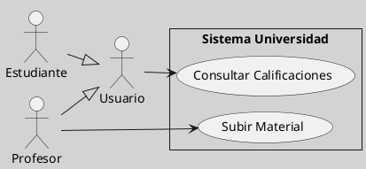
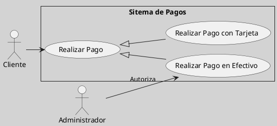

---
{"dg-publish":true,"permalink":"/050 Base de Conocimientos/200  Mi Zettelkasten/100 Docencia/IS1/2025/Clase 09 Diagrama de Casos de Uso (Fundamentos, Elementos, Relaciones)/Zk Diagramas de Casos de Uso (Relaciones de Asociación entre Actores y Casos de Uso Generalizados y Especializados)/","tags":["digitalGarden","diagramaCasosDeUso","relaciones"]}
---

## Relaciones de Asociación entre Actores y Casos de Uso Generalizados y Especializados

Las **generalizaciones** (herencia) entre actores o casos de uso tienen implicaciones en sus relaciones de asociación. Estas asociaciones se heredan automáticamente, pero pueden ampliarse o modificarse en los elementos especializados. A continuación, se detalla cómo funcionan estas relaciones:

Las relaciones de asociación en contextos de generalización permiten modelar sistemas jerárquicos de manera eficiente, evitando redundancias y manteniendo la claridad. Los elementos especializados heredan las interacciones de sus padres, pero pueden ampliarlas para reflejar comportamientos específicos. Este enfoque es esencial para sistemas complejos donde los roles y funcionalidades evolucionan gradualmente.

### Generalización de Actores y Herencia de Asociaciones

Cuando un actor especializado hereda de un actor generalizado, **hereda todas sus asociaciones con casos de uso**. Además, puede añadir nuevas asociaciones propias.

Ver también [[050 Base de Conocimientos/200  Mi Zettelkasten/100 Docencia/IS1/2025/Clase 09 Diagrama de Casos de Uso (Fundamentos, Elementos, Relaciones)/Zk Diagrama de Casos de Uso - Relaciones (Entre Actores)\|Relaciones Entre Actores]].

#### Ejemplo

**Figura**
_Ejemplo de Generalización de Actores y su Implicancia en las Asociaciones con Casos de Uso_

_Explicación:_
- `Estudiante` y `Profesor` heredan la asociación de `Usuario` con `Consultar Calificaciones`.
- `Profesor` añade una asociación exclusiva con `Subir Material`.

### Generalización de Casos de Uso y Herencia de Asociaciones

Cuando un caso de uso especializado hereda de uno generalizado, **hereda las asociaciones con los actores del padre**. Sin embargo, puede asociarse con actores adicionales.

#### Ejemplo

**Figura**
_Ejemplo de Generalización de Casos de Uso y su Implicancia en las Asociaciones con Actores_

_Explicación:_
- `Realizar Pago con Tarjeta` y `Realizar Pago en Efectivo` heredan la asociación con `Cliente`.
- `Realizar Pago en Efectivo` añade una asociación exclusiva con `Administrador`.

### Aspectos a Considerar

| Aspecto             | Explicación                                                                       |
| ------------------- | --------------------------------------------------------------------------------- |
| Herencia Automática | Los actores/casos de uso especializados heredan todas las asociaciones del padre. |
| Extensión Pemitida  | Los elementos especializados pueden asociarse con nuevos actores o casos de uso.  |
