---
{"dg-publish":true,"permalink":"/050 Base de Conocimientos/200  Mi Zettelkasten/100 Docencia/IS1/2025/Clase 09 Diagrama de Casos de Uso (Fundamentos, Elementos, Relaciones)/Zk Modelo Conceptual del UML (Mecanismos Comunes, Estereotipo)/","tags":["digitalGarden","modeloConceptualUML"]}
---

## Mecanismo Comunes de Extensión: Estereotipo

Los **estereotipos** en UML son [[050 Base de Conocimientos/200  Mi Zettelkasten/100 Docencia/IS1/2025/Clase 08 Modelo Conceptual del UML - Elementos, Relaciones, Reglas y Mecanismos Comunes/Zk Modelo Conceptual del UML (Mecanismos Comunes)#Mecanismos de Extensibilidad\|mecanismos de extensión]] que permiten personalizar elementos del lenguaje para adaptarlos a dominios específicos o necesidades particulares. Se representan mediante etiquetas encerradas entre `<< >>` y pueden aplicarse a clases, [[050 Base de Conocimientos/200  Mi Zettelkasten/100 Docencia/IS1/2025/Clase 09 Diagrama de Casos de Uso (Fundamentos, Elementos, Relaciones)/Zk Diagrama de Casos de Uso - Elementos (Caso de Uso)\|casos de uso]], [[050 Base de Conocimientos/200  Mi Zettelkasten/100 Docencia/IS1/2025/Clase 08 Modelo Conceptual del UML - Elementos, Relaciones, Reglas y Mecanismos Comunes/Zk Modelo Conceptual del UML (Relaciones)\|relaciones]] y otros [[050 Base de Conocimientos/200  Mi Zettelkasten/100 Docencia/IS1/2025/Clase 07 Modelo Conceptual del UML - Diagramas/Zk Modelo Conceptual del UML (Tipos de Elementos)\|elementos]] del modelo. Su propósito es ampliar la semántica de UML sin alterar su sintaxis base [[050 Base de Conocimientos/900 Biblioteca/Zk Lit (OMG, 2017) UML Specifications\|(OMG, sección 22.3)]].

----
### Propósito

1. **Personalización**: Adaptar elementos UML para reflejar conceptos específicos de un dominio (ejemplo: `<<Entity>>`, `<<Service>>`).

2. **Claridad**: Mejorar la legibilidad de los diagramas al agregar información contextual.

3. **Reutilización**: Definir patrones o plantillas aplicables en múltiples contextos.

----
### Notación

La sintaxis del los estereotipos es como el siguiente ejemplo: `<<NombreDelEstereotipo>>`.

----
#### Ubicación en el Elemento o Relación

##### En Clases
Encima del nombre de la clase.

Figura
_Clase con Estereotipo_

```plantuml
@startuml
!pragma layout smetana
skinparam style strictuml
skinparam classAttributeIconSize 0
skinparam BackgroundColor LightGray
'left to right direction
skinparam linetype ortho

class Cliente <<Entity>> {
  - nombre: String
  + guardar()
}

@enduml
```

##### En relaciones
Junto a la línea de asociación.
_Relación con Estereotipo_

```plantuml
@startuml
!pragma layout smetana
skinparam style strictuml
skinparam classAttributeIconSize 0
skinparam BackgroundColor LightGray
'left to right direction
skinparam linetype ortho

(Realizar Compra) .> (Validar Usuario) : <<include>>

@enduml
```

##### En casos de uso
Dentro del elemento caso de uso.
Asociación con Estereotipo_

```plantuml
@startuml
!pragma layout smetana
skinparam style strictuml
skinparam classAttributeIconSize 0
skinparam BackgroundColor LightGray
'left to right direction
skinparam linetype ortho

(Realizar Pago) <<BusinessProcess>>

@enduml
```

