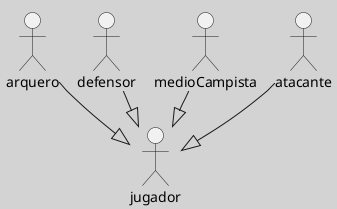

---
{"dg-publish":true,"permalink":"/050 Base de Conocimientos/200  Mi Zettelkasten/100 Docencia/IS1/2025/Clase 09 Diagrama de Casos de Uso (Fundamentos, Elementos, Relaciones)/Zk UML - Actores - Roles - Equipo de Fútbol/","tags":["ejemploAplicación","UML","actores","modelado"]}
---

## Idea Principal

En el fútbol, un deporte colectivo, el éxito del equipo depende de la [[050 Base de Conocimientos/200  Mi Zettelkasten/100 Docencia/Org1/2025/Clase 03 Sinergia y Recursividad/Zk Sinergia en la Teoría General de Sistemas\|colaboración]] y el esfuerzo conjunto de todos sus jugadores. Cada uno de los 11 jugadores en el campo puede asumir distintos [[050 Base de Conocimientos/200  Mi Zettelkasten/100 Docencia/IS1/2025/Clase 09 Diagrama de Casos de Uso (Fundamentos, Elementos, Relaciones)/Zk Rol\|roles]], como arquero, defensor, mediocampista o atacante. Cada rol conlleva responsabilidades específicas que contribuyen al funcionamiento del equipo y al logro de sus objetivos.

**Figura**
_Roles en un Equipo de Fútbol_
{ #5aa78c}

{ #aacf7a}

 
 El concepto de actor y rol en este contexto ilustra que un actor (jugador) puede asumir diferentes roles, y que estos roles pueden compartir o tener habilidades únicas.
 
 Por ejemplo, aunque todos los jugadores pueden usar cualquier parte del cuerpo para jugar el balón, no pueden utilizar las manos, incluidos los brazos si están "separados" del cuerpo. Sin embargo, el arquero es una excepción, dentro del área de su arco, el arquero puede tomar el balón con las manos, lo que destaca su rol especializado en la defensa del arco.

Este ejemplo muestra que un actor puede asumir múltiples roles dentro de un sistema, y varios actores pueden compartir o desempeñar varios roles, destacando la flexibilidad y adaptabilidad en la dinámica del equipo de fútbol.

## Explicación
- Este diagrama muestra una jerarquía de actores en un sistema.
- El actor "jugador" es una generalización de cuatro tipos específicos de actores: arquero, defensor, mediocampista y atacante.
- Esto sugiere que todos estos actores (arquero, defensor, mediocampista, y atacante) comparten comportamientos o responsabilidades comunes representados por el actor "jugador".
- Es un esquema típico de herencia en UML donde el actor "jugador" define comportamientos comunes que son heredados por los otros actores más específicos.

## Enlaces

[[050 Base de Conocimientos/200  Mi Zettelkasten/100 Docencia/IS1/2025/Clase 09 Diagrama de Casos de Uso (Fundamentos, Elementos, Relaciones)/Zk UML - Actores - Roles - Casos de Uso - Equipo de Fútbol\|Actores, Roles y Casos de Uso de un Equipo de Fútbol]]

