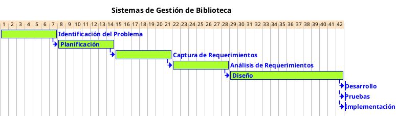

---
{"dg-publish":true,"permalink":"/050 Base de Conocimientos/200  Mi Zettelkasten/100 Docencia/IS1/2025/Clase 12 Caso Práctico de Aplicando SDLC/Sistema de Biblioteca/20 Planificación del Proyecto/Zk Ejemplo Sistema de Biblioteca (Planificación del Proyecto)/","tags":["digitalGarden","diagramaCasosDeUso"]}
---

## Planificación del Proyecto

>[!Info] Observación
>Esta sección tiene únicamente fines ilustrativos y muestra un ejemplo correspondiente a la fase de Planificación del Proyecto, dentro del [[050 Base de Conocimientos/200  Mi Zettelkasten/100 Docencia/IS1/2025/Clase 03 Costos y Complejidad del Software/Zk Ciclo de Vida del Desarrollo del Software (SDLC)\|Ciclo de Vida del Desarrollo del Software]].

### Objetivo del Proyecto

Desarrollar un sistema automatizado para resolver las ineficiencias identificadas en la [[050 Base de Conocimientos/200  Mi Zettelkasten/100 Docencia/IS1/2025/Clase 12 Caso Práctico de Aplicando SDLC/Sistema de Biblioteca/10 Identificación del Problema/Zk Ejemplo Sistema de Biblioteca (Identificación del Problema)\|gestión manual de la biblioteca]], optimizando procesos críticos como préstamos, devoluciones, control de inventario y generación de reportes.

### Alcance del Proyecto

#### Áreas Principales

1. **Gestión de Préstamos y Devoluciones**
    
    - Registro automatizado con validación en tiempo real.
    - Integración con el módulo de inventario.

2. **Control de Inventario**
    
    - Seguimiento preciso de disponibilidad y ubicación de libros.
    - Alertas para reposición de ejemplares perdidos o dañados.

3. **Consulta Autónoma para Usuarios**
    
    - Búsqueda avanzada por título, autor, categoría o ISBN.
    - Acceso a historial personal de préstamos.

4. **Gestión de Roles**
    
    - Permisos diferenciados para estudiantes, investigadores y bibliotecarios.

5. **Reportes y Estadísticas**
    
    - Generación de informes sobre préstamos frecuentes, libros menos solicitados y tendencias de uso.

#### Límites

- No incluye gestión de adquisiciones de nuevos libros.
- No integra sistemas externos de pago (multas).

### Etapas del Proyecto
{ #b35a03}

Basado en el [[050 Base de Conocimientos/200  Mi Zettelkasten/100 Docencia/IS1/2025/Clase 03 Costos y Complejidad del Software/Zk Ciclo de Vida del Desarrollo del Software (SDLC)\|SDLC]].

| Etapa                       | Actividades Clave                                                                                                | Duración Estimada                       |
| --------------------------- | ---------------------------------------------------------------------------------------------------------------- | --------------------------------------- |
| Identificación del Problema | - Acotar el problema a abordar.                                                                                  | 1 semana                                |
| Planificación               | - Definir objetivos y alcance.   - Identificar stakeholders.   - Elaborar cronograma.                      | 1 semana                                |
| Captura de Requerimientos   | - Recolección de requisitos funcionales, no funcionales y requerimientos del dominio.                            | 1 semana                                |
| Análisis de Requerimientos  | - Modelado de casos de uso.                                                                                      | 1 semanas                               |
| Diseño                      | - Diseño conceptual (diagramas UML).   - Diseño lógico (base de datos relacional).   - Diseño de interfaz. | 2 semanas                               |
| Desarrollo                  | - Programación del sistema.   - Integración de módulos.   - Pruebas unitarias.                             | Fuera del alcance del presente proyecto |
| Pruebas                     | - Pruebas de integración y rendimiento.   - Validación con usuarios finales.                                  | Fuera del alcance del presente proyecto |
| Implementación              | - Migración de datos.   - Capacitación al personal.   - Lanzamiento controlado.                            | Fuera del alcance del presente proyecto |

### Recursos Requeridos

#### Humanos

| Recurso                | Descripción                                               |
| ---------------------- | --------------------------------------------------------- |
| Equipo de desarrollo   | 1 líder de proyecto, 2 desarrolladores, 1 diseñador UX/UI |
| Personal bibliotecario | 2 especialistas para validación de requisitos.            |
| Usuarios piloto        | 10 estudiantes y 3 investigadores para pruebas.           |

#### Tecnológicos

| Recurso  | Descripción                                                                                                                                                                                              |
| -------- | -------------------------------------------------------------------------------------------------------------------------------------------------------------------------------------------------------- |
| Software | Entorno de desarrollo (a definir), gestor de base de datos (a definir), herramientas de modelado ([[050 Base de Conocimientos/200  Mi Zettelkasten/010 Informática/Zk Herramienta CASE (Computer Aided Software Engineering)\|Herramienta CASE]] con soporte para UML). |
| Hardware | Servidor local para pruebas, 5 computadoras para estaciones de préstamo.                                                                                                                                 |
| ...      |                                                                                                                                                                                                          |

#### Financieros

- Presupuesto estimado: `monto` USD (incluye licencias, hardware y capacitación).

### Cronograma
Cronograma basado en las [[050 Base de Conocimientos/200  Mi Zettelkasten/100 Docencia/IS1/2025/Clase 12 Caso Práctico de Aplicando SDLC/Sistema de Biblioteca/20 Planificación del Proyecto/Zk Ejemplo Sistema de Biblioteca (Planificación del Proyecto)#^b35a03\|Etapas del Proyecto]], definidas más arriba.

**Figura**
_Cronograma de Actividades del Proyecto Sistema de Gestión de Biblioteca_

_Nota:_ Ejemplo de cronograma con fines didácticos.

### Riesgos y Mitigación

| Riesgo                       | Impacto | Estrategia de Mitigación                                    |
| ---------------------------- | ------- | ----------------------------------------------------------- |
| Retrasos en el desarrollo    | Alto    | Uso de metodologías que permitan...                         |
| Resistencia al cambio        | Medio   | Capacitación progresiva y sesiones demostrativas.           |
| Fallos en migración de datos | Crítico | Copias de seguridad y pruebas piloto en entorno controlado. |
