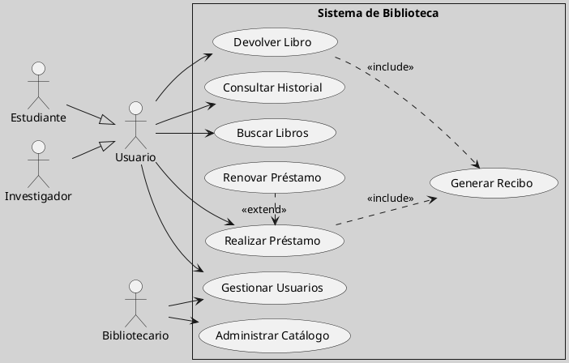

---
{"dg-publish":true,"permalink":"/050 Base de Conocimientos/200  Mi Zettelkasten/100 Docencia/IS1/2025/Clase 12 Caso Práctico de Aplicando SDLC/Sistema de Biblioteca/40 Análisis de Requerimientos/Zk Ejemplo Sistema de Biblioteca (Análisis de Requerimientos del Sistema)/","tags":["digitalGarden","sistema","UML","diagramaCasosDeUso"]}
---

## Análisis de Requerimientos del Sistema

El presente documento, representa la formalización de la fase de **Análisis** dentro del [[050 Base de Conocimientos/200  Mi Zettelkasten/100 Docencia/IS1/2025/Clase 03 Costos y Complejidad del Software/Zk Ciclo de Vida del Desarrollo del Software\|Ciclo de Vida del Desarrollo del Software (SDLC)]] para el proyecto "Sistema de Gestión de Biblioteca".

Tras la fase inicial de **identificación del problema**, donde se definieron las necesidades y desafíos de la gestión bibliotecaria actual, y la **planificación del proyecto**, donde se establecieron los objetivos y el alcance, esta fase de **análisis** se centra en **comprender en profundidad los requerimientos** que el nuevo sistema debe satisfacer.

Mediante un riguroso proceso de **captura de requerimientos**, se ha elaborado una [[050 Base de Conocimientos/200  Mi Zettelkasten/100 Docencia/IS1/2025/Clase 12 Caso Práctico de Aplicando SDLC/Sistema de Biblioteca/30 Captura de Requerimientos/Zk Ejemplo Sistema de Biblioteca (Lista de Requerimientos del Sistema)\|lista de las funcionalidades]] esperadas por los usuarios ([[050 Base de Conocimientos/200  Mi Zettelkasten/100 Docencia/IS1/2025/Clase 12 Caso Práctico de Aplicando SDLC/Sistema de Biblioteca/30 Captura de Requerimientos/Zk Ejemplo Sistema de Biblioteca (Lista de Requerimientos del Sistema)#Requerimientos Funcionales (RF)\|Requerimientos Funcionales]]]]), así como las cualidades que el sistema debe poseer ([[050 Base de Conocimientos/200  Mi Zettelkasten/100 Docencia/IS1/2025/Clase 12 Caso Práctico de Aplicando SDLC/Sistema de Biblioteca/30 Captura de Requerimientos/Zk Ejemplo Sistema de Biblioteca (Lista de Requerimientos del Sistema)#Requerimientos No Funcionales (RNF)\|Requerimientos No Funcionales]]) y las restricciones que condicionan su desarrollo ([[050 Base de Conocimientos/200  Mi Zettelkasten/100 Docencia/IS1/2025/Clase 12 Caso Práctico de Aplicando SDLC/Sistema de Biblioteca/30 Captura de Requerimientos/Zk Ejemplo Sistema de Biblioteca (Lista de Requerimientos del Sistema)#Requerimientos del Dominio o Restricciones\|Seudorrequerimientos, Restricciones o Restricciones del Dominio]]).

Representa una **visión general y estructurada de dichos requerimientos**, empleando un [[050 Base de Conocimientos/200  Mi Zettelkasten/100 Docencia/IS1/2025/Clase 07 Modelo Conceptual del UML - Diagramas/Zk Modelo Conceptual del UML (Diagrama de Casos de Uso)\|diagrama de casos de uso]] que ilustra las [[050 Base de Conocimientos/200  Mi Zettelkasten/100 Docencia/IS1/2025/Clase 09 Diagrama de Casos de Uso (Fundamentos, Elementos, Relaciones)/Zk Diagrama de Casos de Uso - Relaciones (Entre Actores y Casos de Uso)\|interacciones]] entre los distintos [[050 Base de Conocimientos/200  Mi Zettelkasten/100 Docencia/IS1/2025/Clase 09 Diagrama de Casos de Uso (Fundamentos, Elementos, Relaciones)/Zk Diagrama de Casos de Uso - Elementos (Actores)\|actores]] (usuarios, estudiantes, investigadores y bibliotecarios) y las principales funcionalidades del sistema. El propósito de este análisis es proporcionar una base sólida y transparente para las siguientes fases del [[050 Base de Conocimientos/200  Mi Zettelkasten/100 Docencia/IS1/2025/Clase 03 Costos y Complejidad del Software/Zk Ciclo de Vida del Desarrollo del Software\|SDLC]], como el diseño e implementación, asegurando que el "Sistema de Gestión de Biblioteca" responda de manera eficaz a las necesidades detectadas.

Para un examen detallado y la justificación de cada requerimiento, se recomienda consultar la sección [[050 Base de Conocimientos/200  Mi Zettelkasten/100 Docencia/IS1/2025/Clase 12 Caso Práctico de Aplicando SDLC/Sistema de Biblioteca/40 Análisis de Requerimientos/Zk Ejemplo Sistema de Biblioteca (Análisis de Requerimientos del Sistema)#Especificaciones de Casos de Uso\|Especificaciones de Casos de Uso]]. Asimismo, para garantizar la trazabilidad entre los requerimientos y los casos de uso, se sugiere revisar la [[050 Base de Conocimientos/200  Mi Zettelkasten/100 Docencia/IS1/2025/Clase 12 Caso Práctico de Aplicando SDLC/Sistema de Biblioteca/40 Análisis de Requerimientos/Zk Ejemplo Sistema de Biblioteca (Matriz Requerimientos vs Casos de Uso)\|Matriz Requerimientos vs Casos de Uso]].

### Diagrama de Casos de Uso

El siguiente diagrama proporciona una representación visual de las interacciones entre los diferentes actores y el sistema:

**Figura**
_Sistema de Biblioteca (Diagrama de Casos de Uso)_

Este diagrama sintetiza los **casos de uso** identificados, representando las interacciones esenciales que los usuarios requieren del sistema para alcanzar sus objetivos. Cada caso de uso corresponde a una funcionalidad clave del "Sistema de Gestión de Biblioteca". Para una explicación detallada, véase [[050 Base de Conocimientos/200  Mi Zettelkasten/100 Docencia/IS1/2025/Clase 12 Caso Práctico de Aplicando SDLC/Sistema de Biblioteca/40 Análisis de Requerimientos/Zk Ejemplo Sistema de Biblioteca (Explicación del Diagrama de Casos de Uso)\|explicación del diagrama de casos de uso de este ejemplo]].

### Especificaciones de Casos de Uso

La presente sección desarrolla en detalle las **especificaciones de los casos de uso** identificados para el "Sistema de Gestión de Biblioteca". Cada caso de uso se describe de manera estructurada, siguiendo las mejores prácticas recomendadas en la Ingeniería del Software, con el objetivo de garantizar la claridad, la trazabilidad y la exhaustividad de los requerimientos funcionales del sistema.

Para la redacción de cada especificación, se han considerado los siguientes elementos, según lo habíamos desarrollado en [[050 Base de Conocimientos/200  Mi Zettelkasten/100 Docencia/IS1/2025/Clase 09 Diagrama de Casos de Uso (Fundamentos, Elementos, Relaciones)/Zk Diagrama de Casos de Uso - Elementos (Caso de Uso, Especificación)\|Especificaciones de Casos de Uso]].

- [[050 Base de Conocimientos/200  Mi Zettelkasten/100 Docencia/IS1/2025/Clase 12 Caso Práctico de Aplicando SDLC/Sistema de Biblioteca/40 Análisis de Requerimientos/Zk Ejemplo Sistema de Biblioteca (Especificación del Caso de Uso Buscar Libros)\|Buscar Libro]]
- [[050 Base de Conocimientos/200  Mi Zettelkasten/100 Docencia/IS1/2025/Clase 12 Caso Práctico de Aplicando SDLC/Sistema de Biblioteca/40 Análisis de Requerimientos/Zk Ejemplo Sistema de Biblioteca (Especificación del Caso de Uso Realizar Préstamo)\|Realizar Préstamo]]
- [[050 Base de Conocimientos/200  Mi Zettelkasten/100 Docencia/IS1/2025/Clase 12 Caso Práctico de Aplicando SDLC/Sistema de Biblioteca/40 Análisis de Requerimientos/Zk Ejemplo Sistema de Biblioteca (Especificación del Caso de Uso Renovar Préstamo)\|Renovar Préstamo]]
- [[050 Base de Conocimientos/200  Mi Zettelkasten/100 Docencia/IS1/2025/Clase 12 Caso Práctico de Aplicando SDLC/Sistema de Biblioteca/40 Análisis de Requerimientos/Zk Ejemplo Sistema de Biblioteca (Especificación del Caso de Uso Devolver Libro)\|Devolver Libro]]
- [[050 Base de Conocimientos/200  Mi Zettelkasten/100 Docencia/IS1/2025/Clase 12 Caso Práctico de Aplicando SDLC/Sistema de Biblioteca/40 Análisis de Requerimientos/Zk Ejemplo Sistema de Biblioteca (Especificación del Caso de Uso Consultar Historial)\|Consultar Historial]]
- [[050 Base de Conocimientos/200  Mi Zettelkasten/100 Docencia/IS1/2025/Clase 12 Caso Práctico de Aplicando SDLC/Sistema de Biblioteca/40 Análisis de Requerimientos/Zk Ejemplo Sistema de Biblioteca (Especificación del Caso de Uso Administrar Catálogo)\|Administrar Catálogo]]
- [[050 Base de Conocimientos/200  Mi Zettelkasten/100 Docencia/IS1/2025/Clase 12 Caso Práctico de Aplicando SDLC/Sistema de Biblioteca/40 Análisis de Requerimientos/Zk Ejemplo Sistema de Biblioteca (Especificación del Caso de Uso Gestionar Usuario)\|Gestionar Usuario]]
- [[050 Base de Conocimientos/200  Mi Zettelkasten/100 Docencia/IS1/2025/Clase 12 Caso Práctico de Aplicando SDLC/Sistema de Biblioteca/40 Análisis de Requerimientos/Zk Ejemplo Sistema de Biblioteca (Especificación del Caso de Uso Generar Recibo)\|Generar Recibos]]
