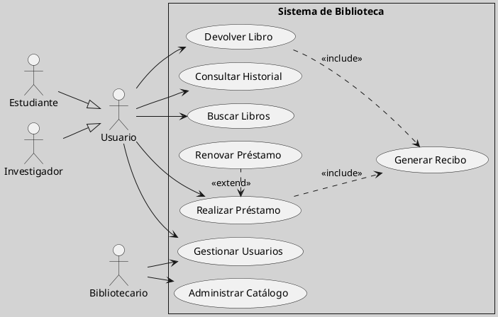

---
{"dg-publish":true,"permalink":"/050 Base de Conocimientos/200  Mi Zettelkasten/100 Docencia/IS1/2025/Clase 12 Diagrama de Casos de Uso (Caso Práctico)/Sistema de Biblioteca/40 Análisis de Requerimientos/Zk Ejemplo Sistema de Biblioteca (Análisis de Requerimientos del Sistema)/","tags":["digitalGarden","sistema","UML","diagramaCasosDeUso"]}
---

## Análisis de Requerimientos del Sistema

El presente documento, representa la formalización de la fase de **Análisis** dentro del [[050 Base de Conocimientos/200  Mi Zettelkasten/100 Docencia/IS1/2025/Clase 03 Costos y Complejidad del Software/Zk Ciclo de Vida del Desarrollo del Software\|Ciclo de Vida del Desarrollo del Software (SDLC)]] para el proyecto "Sistema de Gestión de Biblioteca".

Tras la fase inicial de **identificación del problema**, donde se definieron las necesidades y desafíos de la gestión bibliotecaria actual, y la **planificación del proyecto**, donde se establecieron los objetivos y el alcance, esta fase de **análisis** se centra en **comprender en profundidad los requerimientos** que el nuevo sistema debe satisfacer.

A través de la **Captura de Requerimientos**, se ha obtenido una [[050 Base de Conocimientos/200  Mi Zettelkasten/100 Docencia/IS1/2025/Clase 12 Diagrama de Casos de Uso (Caso Práctico)/Sistema de Biblioteca/30 Captura de Requerimientos/Zk Ejemplo Sistema de Biblioteca (Lista de Requerimientos del Sistema)\|lista detallada de las funcionalidades]] esperadas por los usuarios ([[050 Base de Conocimientos/200  Mi Zettelkasten/100 Docencia/IS1/2025/Clase 12 Diagrama de Casos de Uso (Caso Práctico)/Sistema de Biblioteca/30 Captura de Requerimientos/Zk Ejemplo Sistema de Biblioteca (Lista de Requerimientos del Sistema)#Requerimientos Funcionales (RF)\|Requerimientos Funcionales]]), las cualidades que el sistema debe poseer ([[050 Base de Conocimientos/200  Mi Zettelkasten/100 Docencia/IS1/2025/Clase 12 Diagrama de Casos de Uso (Caso Práctico)/Sistema de Biblioteca/30 Captura de Requerimientos/Zk Ejemplo Sistema de Biblioteca (Lista de Requerimientos del Sistema)#Requerimientos No Funcionales (RNF)\|Requerimientos No Funcionales]]) y las restricciones que deben ser consideradas durante el desarrollo ([[050 Base de Conocimientos/200  Mi Zettelkasten/100 Docencia/IS1/2025/Clase 12 Diagrama de Casos de Uso (Caso Práctico)/Sistema de Biblioteca/30 Captura de Requerimientos/Zk Ejemplo Sistema de Biblioteca (Lista de Requerimientos del Sistema)#Requerimientos del Dominio o Restricciones\|Seudorrequerimientos, Restricciones o Restricciones del Dominio]]).

Este documento presenta una **visión general y organizada de estos requerimientos**, utilizando un [[050 Base de Conocimientos/200  Mi Zettelkasten/100 Docencia/IS1/2025/Clase 07 Modelo Conceptual del UML - Diagramas/Zk Modelo Conceptual del UML (Diagrama de Casos de Uso)\|diagrama de casos de uso]] para ilustrar las [[050 Base de Conocimientos/200  Mi Zettelkasten/100 Docencia/IS1/2025/Clase 09 Diagrama de Casos de Uso (Fundamentos, Elementos, Relaciones)/Zk Diagrama de Casos de Uso - Relaciones (Entre Actores y Casos de Uso)\|interacciones]] entre los diferentes [[050 Base de Conocimientos/200  Mi Zettelkasten/100 Docencia/IS1/2025/Clase 09 Diagrama de Casos de Uso (Fundamentos, Elementos, Relaciones)/Zk Diagrama de Casos de Uso - Elementos (Actores)\|actores]] (usuarios, estudiantes, investigadores y bibliotecarios) y las principales funcionalidades del sistema. El objetivo de este análisis es proporcionar una base sólida y clara para las siguientes fases del [[050 Base de Conocimientos/200  Mi Zettelkasten/100 Docencia/IS1/2025/Clase 03 Costos y Complejidad del Software/Zk Ciclo de Vida del Desarrollo del Software\|SDLC]], como el diseño del sistema y la implementación, asegurando que el "Sistema de Gestión de Biblioteca" responda eficazmente a las necesidades identificadas.

Para una comprensión más detallada de cada requerimiento, se remitirse a: [[050 Base de Conocimientos/200  Mi Zettelkasten/100 Docencia/IS1/2025/Clase 12 Diagrama de Casos de Uso (Caso Práctico)/Sistema de Biblioteca/40 Análisis de Requerimientos/Zk Ejemplo Sistema de Biblioteca (Análisis de Requerimientos del Sistema)#Especificaciones de Casos de Uso\|Especificaciones de Casos de Uso]] y para la trazabilidad entre los requerimientos y los casos de uso, se puede consultar la [[050 Base de Conocimientos/200  Mi Zettelkasten/100 Docencia/IS1/2025/Clase 12 Diagrama de Casos de Uso (Caso Práctico)/Sistema de Biblioteca/40 Análisis de Requerimientos/Zk Ejemplo Sistema de Biblioteca (Matriz Requerimientos vs Casos de Uso)\|Matriz Requerimientos vs Casos de Uso]].

### Diagrama de Casos de Uso

El diagrama de casos de uso presentado a continuación ofrece una representación visual de la interacción de los usuarios con el sistema.

Figura
_Sistema de Biblioteca (Diagrama de Casos de Uso)_

Este diagrama proporciona una representación concisa de los **casos de uso** identificados, que son las interacciones específicas que los usuarios tendrán con el sistema para lograr sus objetivos. Cada caso de uso representa una funcionalidad del "Sistema de Gestión de Biblioteca". Para más detalles ver [[050 Base de Conocimientos/200  Mi Zettelkasten/100 Docencia/IS1/2025/Clase 12 Diagrama de Casos de Uso (Caso Práctico)/Sistema de Biblioteca/40 Análisis de Requerimientos/Zk Ejemplo Sistema Biblioteca (Explicación del Diagrama de Casos de Uso)\|explicación del diagrama de casos de uso]].

### Especificaciones de Casos de Uso

- [[050 Base de Conocimientos/200  Mi Zettelkasten/100 Docencia/IS1/2025/Clase 12 Diagrama de Casos de Uso (Caso Práctico)/Sistema de Biblioteca/40 Análisis de Requerimientos/Zk Ejemplo Sistema de Biblioteca (Especificación del Caso de Uso Buscar Libros)\|Buscar Libro]]
- [[050 Base de Conocimientos/200  Mi Zettelkasten/100 Docencia/IS1/2025/Clase 12 Diagrama de Casos de Uso (Caso Práctico)/Sistema de Biblioteca/40 Análisis de Requerimientos/Zk Ejemplo Sistema de Biblioteca (Especificación del Caso de Uso Realizar Préstamo)\|Realizar Préstamo]]
- [[050 Base de Conocimientos/200  Mi Zettelkasten/100 Docencia/IS1/2025/Clase 12 Diagrama de Casos de Uso (Caso Práctico)/Sistema de Biblioteca/40 Análisis de Requerimientos/Zk Ejemplo Sistema de Biblioteca (Especificación del Caso de Uso Renovar Préstamo)\|Renovar Préstamo]]
- [[050 Base de Conocimientos/200  Mi Zettelkasten/100 Docencia/IS1/2025/Clase 12 Diagrama de Casos de Uso (Caso Práctico)/Sistema de Biblioteca/40 Análisis de Requerimientos/Zk Ejemplo Sistema de Biblioteca (Especificación del Caso de Uso Devolver Libro)\|Devolver Libro]]
- [[050 Base de Conocimientos/200  Mi Zettelkasten/100 Docencia/IS1/2025/Clase 12 Diagrama de Casos de Uso (Caso Práctico)/Sistema de Biblioteca/40 Análisis de Requerimientos/Zk Ejemplo Sistema de Biblioteca (Especificación del Caso de Uso Consultar Historial)\|Consultar Historial]]
- [[050 Base de Conocimientos/200  Mi Zettelkasten/100 Docencia/IS1/2025/Clase 12 Diagrama de Casos de Uso (Caso Práctico)/Sistema de Biblioteca/40 Análisis de Requerimientos/Zk Ejemplo Sistema de Biblioteca (Especificación del Caso de Uso Administrar Catálogo)\|Administrar Catálogo]]
- [[050 Base de Conocimientos/200  Mi Zettelkasten/100 Docencia/IS1/2025/Clase 12 Diagrama de Casos de Uso (Caso Práctico)/Sistema de Biblioteca/40 Análisis de Requerimientos/Zk Ejemplo Sistema de Biblioteca (Especificación del Caso de Uso Gestionar Usuario)\|Gestionar Usuario]]
- [[050 Base de Conocimientos/200  Mi Zettelkasten/100 Docencia/IS1/2025/Clase 12 Diagrama de Casos de Uso (Caso Práctico)/Sistema de Biblioteca/40 Análisis de Requerimientos/Zk Ejemplo Sistema de Biblioteca (Especificación del Caso de Uso Generar Recibo)\|Generar Recibos]]

