---
{"dg-publish":true,"permalink":"/050 Base de Conocimientos/200  Mi Zettelkasten/100 Docencia/IS1/2025/Clase 13 Diagrama de Clases (Fundamentos, Elementos, Relaciones, etc.)/Zk Diagrama de Clases (Elemento, Clase ->  Operaciones, Métodos)/","tags":["digitalGarden"]}
---

## Diagrama de Clases (Elemento, Clase -> Operaciones, Métodos)

> [!info]  **Resumen**  
> Las operaciones definen los servicios que una clase ofrece, mientras los métodos especifican su implementación concreta. Este zettel detalla su sintaxis, tipos y buenas prácticas para modelar comportamientos en UML[[050 Base de Conocimientos/900 Biblioteca/Zk Lit (OMG, 2017) UML Specifications\|(OMG, 2017)]].

### 1. Operación vs. Método

- **Operación**: Declaración abstracta de un servicio que una clase ofrece a su entorno.
- **Método**: Implementación concreta de una operación en un lenguaje específico [[050 Base de Conocimientos/900 Biblioteca/Zk Lit (Rumbaugh et al., 2007) Lenguaje Unificado de Modelado. Manual de Referencia\|(Rumbaugh et al., 2007)]].

**Figura**
_Ejemplo de la Representación la Operación de una Clase_

```plantuml
@startuml
!pragma layout smetana
skinparam style strictuml
skinparam classAttributeIconSize 0
skinparam BackgroundColor LightGray
left to right direction
'top to bottom direction
skinparam linetype ortho
scale 1

class CuentaBancaria {
  +depositar(monto: double): void
  +retirar(monto: double): boolean
  +consultarSaldo(): double
}
@enduml
```

> [!note]  Nota
> Las operaciones se listan en el tercer compartimento de la clase. Cada una incluye:
> 
> - **Visibilidad** (`+` público, `-` privado, `#` protegido).
>     
> - **Nombre**.
>     
> - **Parámetros** (nombre: tipo).
>     
> - **Tipo de retorno** (opcional).

### 2. Sintaxis Detallada

**Estructura básica**
`± nombreOperación (parámetro1: Tipo, parámetro2: Tipo = valorPredeterminado): TipoRetorno`

**Ejemplo de Firma de Operación**

**Figura**
_Ejemplo de la Representación la Operación de una Clase_

```plantuml
@startuml
!pragma layout smetana
skinparam style strictuml
skinparam classAttributeIconSize 0
skinparam BackgroundColor LightGray
left to right direction
'top to bottom direction
skinparam linetype ortho
scale 1

class SensorTérmico {
  #leerTemperatura(escala: Escala = Celsius): float
  +activarAlerta(umbral: float): void
}
@enduml
```

### 3. Tipos de Operaciones

| Tipo            | Descripción                                   | Ejemplo                             |
| --------------- | --------------------------------------------- | ----------------------------------- |
| **Constructor** | Inicializa objetos (`<<create>>`)             | `+ crearCliente(nombre: String)`    |
| **Query**       | No modifican estado (sin efectos secundarios) | `+ obtenerEdad(): int`              |
| **Signal**      | Disparan eventos asincrónicos                 | `+ notificarError(mensaje: String)` |

## 4. Métodos y Sobreescritura

**Implementación en Clases Hijas**

**Figura**
_Ejemplo Implementación en Clases Hijas_

```plantuml
@startuml
!pragma layout smetana
skinparam style strictuml
skinparam classAttributeIconSize 0
skinparam BackgroundColor LightGray
left to right direction
'top to bottom direction
skinparam linetype ortho
scale 1

class Figura {
  +dibujar(): void
}
class Circulo {
  +dibujar(): void
}
Figura <|-- Circulo
@enduml
```

_Nota_: El método `dibujar()` en `Circulo` sobreescribe el de `Figura`.

## 5. Ejercicio Práctico

**Modelar**

- Clase `SensorSeguridad` con:
    
    - Operación pública `activar()` sin retorno.
    - Operación protegida `calibrar(nivel: int): boolean`.
    - Método privado `verificarConexión(): boolean`.

**Solución**

```plantuml
@startuml
!pragma layout smetana
skinparam style strictuml
skinparam classAttributeIconSize 0
skinparam BackgroundColor LightGray
left to right direction
'top to bottom direction
skinparam linetype ortho
scale 1

class SensorSeguridad {
  +activar(): void
  #calibrar(nivel: int): boolean
  -verificarConexión(): boolean
}
@enduml
```

