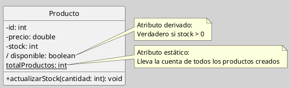
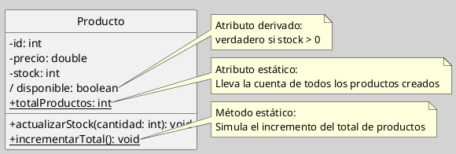

---
{"dg-publish":true,"permalink":"/050 Base de Conocimientos/200  Mi Zettelkasten/100 Docencia/IS1/2025/Clase 13 Diagrama de Clases (Fundamentos, Elementos, Relaciones, etc.)/Zk Diagrama de Clases (Elemento, Clase -> Atributos)/","tags":["digitalGarden"]}
---

## Diagrama de Clases (Elemento, Clase->Atributos)

> [!info]  **Resumen**  
> Los atributos son características estructurales de una clase, que representan información almacenada por cada instancia. Su correcta definición es esencial para la integridad, claridad y reutilización del modelo de clases UML ([[050 Base de Conocimientos/900 Biblioteca/Zk Lit (OMG, 2017) UML Specifications\|OMG, 2017]]).

### 1. Definición de Atributo

Un **atributo** es una propiedad estructural de una clase, especifica un rango de valores que cada instancia de la clase puede almacenar. Los atributos se representan en el segundo compartimento del rectángulo de la clase, debajo del nombre [[050 Base de Conocimientos/900 Biblioteca/Zk Lit (Rumbaugh et al., 2007) Lenguaje Unificado de Modelado. Manual de Referencia\|(Rumbaugh et al., 2007)]].

### 2. Sintaxis y Notación

- **Visibilidad**:
    - `+` público
    - `-` privado
    - `#` protegido
        
- **Formato básico**:  
    `visibilidad nombre: Tipo [= valorPorDefecto] {propiedades}`

#### Ejemplo
**Figura**
_Ejemplo de la Representación de Atributos_

```plantuml
@startuml
!pragma layout smetana
skinparam style strictuml
skinparam classAttributeIconSize 0
skinparam BackgroundColor LightGray
left to right direction
'top to bottom direction
skinparam linetype ortho
scale 1

class Producto {
  - id: int
  - precio: double
  - stock: int
  / disponible: boolean
  {static} totalProductos: int
}

@enduml
```

_Nota_:
- Los atributos derivados se indican con `/` antes del nombre (ejemplo: `/disponible`).
- Los atributos estáticos se subrayan o se anotan con `{static}`.

### 3. Tipos y Propiedades de los Atributos
#### 3.1 Tipo

| Tipo  | Explicación                                                                                        |
| ----- | -------------------------------------------------------------------------------------------------- |
| Tipo  | Puede ser un tipo primitivo (`int`, `double`, `boolean`, etc.) u otra clase definida en el modelo. |

#### 3.2 Propiedades

| Propiedad           | Explicación                                                                                                                                                                                                          |
| ------------------- | -------------------------------------------------------------------------------------------------------------------------------------------------------------------------------------------------------------------- |
| Valor por defecto   | Puede especificarse a continuación de un signo igual ` = `.                                                                                                                                                          |
| Multiplicidad       | Indica cuántos valores puede almacenar el atributo. Se muestra entre corchetes tras el tipo (por ejemplo, `telefono: String[*]` para una lista de teléfonos) [[050 Base de Conocimientos/900 Biblioteca/Zk Lit (OMG, 2017) UML Specifications\|(OMG, 2017)]]. |
| Atributos derivados | Calculados a partir de otros atributos o asociaciones; se representan con el símbolo ` / ` (por ejemplo, `/disponible: boolean`).                                                                                    |
| Atributos estáticos | Compartidos por todas las instancias de la clase; se subrayan o se indica `{static}`.                                                                                                                                |

### 4. Ejemplo

**Figura**
_Ejemplo de Atributos: Estático y Derivado_

### 5. Buenas Prácticas

- Usar visibilidad privada (`-`) para atributos y exponer acceso mediante métodos.
- Documentar atributos complejos o con lógica derivada.
- Nombrar atributos de manera clara y consistente.
- Definir la multiplicidad cuando sea relevante (listas, colecciones).

### 6. Ejercicio Práctico

#### Modelar la clase `Producto` con:

- **Atributos privados:**
    
    - `id` (int)
    - `precio` (double)
    - `stock` (int)
        
- **Atributo derivado:**
    
    - `disponible` (boolean)  
        _Debe ser verdadero si `stock > 0`._
        
- **Atributo estático:**
    
    - `totalProductos` (int)  
        _Representa la cantidad total de objetos `Producto` creados._
        
- **Método público:**
    
    - `actualizarStock(cantidad: int)`  
        _Modifica el valor de `stock` sumando la cantidad indicada (puede ser positiva o negativa)._

#### Solución

**Figura**
_Ejercicio Resuelto_

