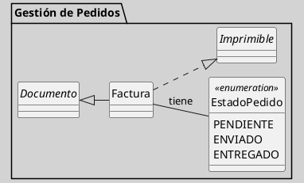

---
{"dg-publish":true,"permalink":"/050 Base de Conocimientos/200  Mi Zettelkasten/100 Docencia/IS1/2025/Clase 13 Diagrama de Clases (Fundamentos, Elementos, Relaciones, etc.)/Zk Diagrama de Clases (Elementos -> Otros)/","tags":["digitalGarden"]}
---

## Diagrama de Clases (Elementos - Otros)

> [!info]  **Resumen:**  
> Además de clases, atributos, operaciones y relaciones, los diagramas de clases UML pueden incluir una variedad de elementos adicionales que enriquecen la semántica y flexibilidad del modelado. Estos elementos permiten representar conceptos avanzados, patrones de diseño, plantillas, restricciones y otros aspectos estructurales del sistema ([[050 Base de Conocimientos/900 Biblioteca/Zk Lit (OMG, 2017) UML Specifications\|OMG, 2017]]; [[050 Base de Conocimientos/900 Biblioteca/Zk Lit (Rumbaugh et al., 2007) Lenguaje Unificado de Modelado. Manual de Referencia\|(Rumbaugh et al., 2007)]]).

### 1. **Interfaces**

Una **interfaz** es un tipo de clase abstracta que define un conjunto de operaciones sin implementación. Se representa con el estereotipo `<<interface>>` o como un círculo conectado a las clases que la implementan.

```
interface Imprimible {
  +imprimir(): void
}

class Documento implements Imprimible
```

**Figura**
_Ejemplo de Interface_

```plantuml
@startuml
!pragma layout smetana
skinparam style strictuml
skinparam classAttributeIconSize 0
skinparam BackgroundColor LightGray
'left to right direction
top to bottom direction
skinparam linetype ortho
scale 1

interface Imprimible {
  +imprimir(): void
}
class Documento implements Imprimible
@enduml
```

_Nota_: Imprimible es la interface

### 2. **Clases Abstractas**

Clases que no pueden ser instanciadas directamente y que suelen contener operaciones abstractas (sin implementación). Se representan con el nombre en cursiva o el estereotipo `<<abstract>>`.

```
abstract class Figura {
  +dibujar(): void
}

class Circulo extends Figura
```

**Figura**
_Ejemplo Clase Abstracta_

```plantuml
@startuml
!pragma layout smetana
skinparam style strictuml
skinparam classAttributeIconSize 0
skinparam BackgroundColor LightGray
'left to right direction
top to bottom direction
skinparam linetype ortho
scale 1

abstract class Figura {
  +dibujar(): void
}
class Circulo extends Figura
@enduml
```


### 3. **Enumeraciones**

Las **enumeraciones** (`<<enumeration>>`) definen un tipo de dato con un conjunto finito de valores posibles.

```
enum EstadoPedido {
  PENDIENTE
  ENVIADO
  ENTREGADO
}
```

**Figura**
_Ejemplo de Enumeraciones_

```plantuml
@startuml
!pragma layout smetana
skinparam style strictuml
skinparam classAttributeIconSize 0
skinparam BackgroundColor LightGray
left to right direction
'top to bottom direction
skinparam linetype ortho
scale 1

enum EstadoPedido {
  PENDIENTE
  ENVIADO
  ENTREGADO
}
@enduml
```


### 4. Estereotipos

- Los **estereotipos** extienden la semántica de UML, permitiendo clasificar elementos (ejemplo: `<<entity>>`, `<<persistent>>`).  

### 5. **Notas y Restricciones**

- Las **notas** (`note`) permiten añadir comentarios o aclaraciones en el diagrama.  
- Las **restricciones** se expresan entre llaves `{}` y pueden incluirse sobre atributos, operaciones o relaciones, (ejemplo: `{not null}`, `{visible}`, etc.)

**Figura**
_Ejemplo de Notas y Restricciones_

```plantuml
@startuml
!pragma layout smetana
skinparam style strictuml
skinparam classAttributeIconSize 0
skinparam BackgroundColor LightGray
left to right direction
'top to bottom direction
skinparam linetype ortho
scale 1

class Producto {
  -precio: double {not null}
  +vender(): void
}
note right of Producto
  {precio >= 0}
end note
@enduml

```


### 6. **Compartimentos Adicionales**

Además de atributos y operaciones, una clase puede mostrar compartimentos personalizados, como responsabilidades, reglas, historias de modificación, etc.

### 7. **Otros Elementos y Relaciones Relevantes**

- **Paquetes**: Agrupan clases y otros elementos para modularidad.
- **Dependencias**: Indican relaciones de uso o vinculación entre elementos.
- **Clases anidadas**: Clases definidas dentro de otras clases para encapsular lógica interna.
- **Metaclases**: Clases cuyos objetos son clases, usadas en metamodelado (`<<metaclass>>`).

### 8. Ejemplo

**Figura**
_Ejemplo_

