---
{"dg-publish":true,"permalink":"/050 Base de Conocimientos/200  Mi Zettelkasten/100 Docencia/IS1/2025/Clase 13 Diagrama de Clases (Fundamentos, Elementos, Relaciones, etc.)/Zk Diagrama de Clases (Elementos)/","tags":["digitalGarden","diagramaDeClases"]}
---

## Diagrama de Clases (Elementos)

> [!info]  Resumen
> La [[050 Base de Conocimientos/200  Mi Zettelkasten/100 Docencia/IS1/2025/Clase 08 Modelo Conceptual del UML - Elementos, Relaciones, Reglas y Mecanismos Comunes/Zk Modelo Conceptual del UML (Elementos Estructurales)#Clase\|clase]] es uno de los elementos estructurales de los [[050 Base de Conocimientos/200  Mi Zettelkasten/100 Docencia/IS1/2025/Clase 06 Introducción al UML/Zk Modelo Conceptual del UML#Bloques Básicos de Construcción\|bloques básicos de construcción]] del UML y es fundamental para el [[050 Base de Conocimientos/200  Mi Zettelkasten/100 Docencia/IS1/2025/Clase 13 Diagrama de Clases (Fundamentos, Elementos, Relaciones, etc.)/Zk Diagrama de Clases (Introducción, Definición, Características y sus Usos)\|diagrama de clases]].

### Clase

Una **clase** es una descripción abstracta de un conjunto de objetos que comparten atributos, operaciones, relaciones y semántica. Se representa mediante un rectángulo dividido en tres compartimentos: nombre, atributos y operaciones [[050 Base de Conocimientos/900 Biblioteca/Zk Lit (OMG, 2017) UML Specifications\|(OMG, 2017)]].

#### Sintaxis

**Figura**
_Ejemplo de una Clase_

```plantuml
@startuml 
!pragma layout smetana
skinparam style strictuml
skinparam classAttributeIconSize 0
skinparam BackgroundColor LightGray
left to right direction
'top to bottom direction
skinparam linetype ortho
scale 1

class CuentaBancaria {
  -saldo: double
  -numeroCuenta: String
  +depositar(monto: double): void
  +obtenerSaldo(): double
}

@enduml
```

_Nota_:
- **Nombre:** En negrita, centrado en el primer compartimento. Debe ser único dentro del modelo.
- **Atributos:** Se escriben en el segundo compartimento. Incluyen su [[Zk Visibilidad en UML\|visibilidad]] (`-` privado, `+`público, `#` protegido), nombre, tipo (opcional), valor inicial (opcional), y pueden incluir valores etiquetados y restricciones.
- **Operaciones:** Se ubican en el tercer compartimento. Incluyen [[Zk Visibilidad en UML\|visibilidad]], nombre, lista de parámetros (nombre: tipo), tipo de retorno (opcional) y pueden tener restricciones asociadas.
- **Compartimentos:** Los compartimentos de atributos y operaciones son opcionales; pueden omitirse para simplificar el diagrama, siempre que su información no sea relevante para el modelo.

#### Mecanismo de Extensibilidad

La clase en UML puede aprovechar los mecanismos de [[050 Base de Conocimientos/200  Mi Zettelkasten/100 Docencia/IS1/2025/Clase 09 Diagrama de Casos de Uso (Fundamentos, Elementos, Relaciones)/Zk Modelo Conceptual del UML (Mecanismos Comunes, Estereotipo)\|estereotipos]], [[valores etiquetados\|valores etiquetados]] y [[restricciones\|restricciones]] para adaptar y enriquecer la semántica de los modelos. Por ejemplo, el estereotipo «Entity» indica que la clase es persistente, es decir, almacena y permite la recuperación de datos a lo largo del tiempo. El uso de estereotipos permite extender o complementar la semántica de los elementos del modelo, facilitando la adaptación del lenguaje UML a necesidades particulares.

**Figura**
_Clase Utilizando Estereotipo_

```plantuml
@startuml
!pragma layout smetana
skinparam style strictuml
skinparam classAttributeIconSize 0
skinparam BackgroundColor LightGray
left to right direction
'top to bottom direction
skinparam linetype ortho
scale 1
class CuentaBancaria <<Entity>> {
	-saldo: double
} 
@enduml
```

**Otros ejemplos de estereotipos comunes:**
- «Boundary»: Representa una interfaz entre el sistema y los actores externos.
- «Control»: Encapsula la lógica de control o coordinación.
- «Entity»: Representa información persistente o de negocio.

### Consideraciones adicionales

- **Restricciones:** Se pueden especificar restricciones utilizando el lenguaje OCL (Object Constraint Language) o mediante notas en el diagrama, para expresar reglas de negocio o invariantes.

- **Valores etiquetados:** Permiten añadir metadatos personalizados a los elementos del modelo.

### Interface

Una **interfaz** es un tipo especial de clase que define un conjunto de operaciones que deben ser implementadas por las clases que la [[realizan\|realizan]]. No puede tener atributos de instancia ni implementación de métodos, solo la firma de las operaciones.

#### Sintaxis