---
{"dg-publish":true,"permalink":"/050 Base de Conocimientos/200  Mi Zettelkasten/100 Docencia/IS1/2025/Clase 13 Diagrama de Clases (Fundamentos, Elementos, Relaciones, etc.)/Zk Diagrama de Clases (Elementos, Clases Persistentes)/","tags":["digitalGarden","diagramaDeClases"]}
---

## Diagrama de Clases (Elementos - Clases Persistentes)

> [!info]  Resumen
> Una **clase persistente** es aquella cuyo estado puede conservarse más allá de la ejecución de la aplicación, generalmente mediante su almacenamiento en una base de datos u otro medio permanente. Estas clases modelan entidades del dominio que requieren persistencia y suelen estar asociadas a mecanismos de mapeo objeto-relacional o a capas de persistencia en la arquitectura del software ([[050 Base de Conocimientos/900 Biblioteca/Zk Lit (OMG, 2017) UML Specifications\|OMG, 2017]]; [[050 Base de Conocimientos/900 Biblioteca/Zk Lit (Rumbaugh et al., 2007) Lenguaje Unificado de Modelado. Manual de Referencia\|Rumbaugh et al., 2007]]).

### Clase Persistente

Una **clase persistente** representa una entidad de negocio cuyo ciclo de vida trasciende la ejecución del programa, permitiendo que sus instancias sean almacenadas y recuperadas posteriormente. La persistencia implica que los objetos de estas clases pueden ser guardados, modificados, consultados y eliminados en un almacenamiento permanente, como una base de datos relacional u orientada a objetos.  ([[050 Base de Conocimientos/900 Biblioteca/Zk Lit (OMG, 2017) UML Specifications\|OMG, 2017]]; [[050 Base de Conocimientos/900 Biblioteca/Zk Lit (Rumbaugh et al., 2007) Lenguaje Unificado de Modelado. Manual de Referencia\|Rumbaugh et al., 2007]]).

No todas las clases de un modelo deben ser persistentes; la decisión depende de los requisitos del sistema y de la necesidad de conservar información a largo plazo. Las clases persistentes suelen corresponder a entidades principales del dominio, como Cliente, Producto o Pedido

### Características

| Característica              | Explicación                                                                                                                                            |
| --------------------------- | ------------------------------------------------------------------------------------------------------------------------------------------------------ |
| Estado persistente          | Los objetos de la clase pueden mantener su estado entre diferentes ejecuciones del sistema                                                             |
| Mapeo a almacenamiento      | Generalmente, cada clase persistente se mapea a una tabla (en bases de datos relacionales) o a una colección (en bases de datos orientadas a objetos). |
| Atributos persistentes      | Los atributos de la clase corresponden a columnas o campos en el almacenamiento.                                                                       |
| Operaciones de persistencia | Suelen incluir métodos para crear, leer, actualizar y eliminar (CRUD) instancias.                                                                      |
| Restricciones y Reglas      | Pueden tener restricciones de integridad y reglas de negocio asociadas, que deben cumplirse durante las operaciones de persistencia.                   |

#### Sintaxis
En UML, una clase persistente puede representarse como una clase estándar, pero es común utilizar el estereotipo `<<persistent>>` o `<<entity>>` para distinguirlas de las clases transitorias o de control. En los diagramas de clases, se recomienda detallar los atributos, tipos de datos y restricciones relevantes para la persistencia.

**Figura**
_Ejemplo de una Clase_

```plantuml
@startuml 
!pragma layout smetana
skinparam style strictuml
skinparam classAttributeIconSize 0
skinparam BackgroundColor LightGray
left to right direction
'top to bottom direction
skinparam linetype ortho
scale 1

class Cliente <<persistent>> {
  +id: int
  +nombre: String
  +email: String
  +guardar()
  +eliminar()
}
@enduml
```

### Reglas y Recomendaciones para Identificar Clases Persistentes

- Las clases que representan entidades fundamentales del dominio suelen ser persistentes
- Si una clase compuesta es persistente, sus componentes también lo serán.
- Si una subclase es persistente, sus superclases también deben serlo.
- Las clases de control o utilitarias generalmente **no** son persistentes.
- Es recomendable separar la lógica de persistencia de la lógica de negocio, utilizando capas o patrones de acceso a datos.

### Relación con el Modelo de Datos

La transformación de clases persistentes en UML a tablas de una base de datos es una práctica común en el desarrollo de sistemas de información[(Arango et. al.,2005)](http://www.scielo.org.co/pdf/dyna/v73n149/a14v73n149.pdf). Cada clase persistente se convierte, típicamente, en una tabla, y sus atributos en columnas. Las relaciones entre clases (asociaciones, agregaciones, composiciones) se transforman en claves foráneas o tablas intermedias según la cardinalidad.

