---
{"dg-publish":true,"permalink":"/050 Base de Conocimientos/200  Mi Zettelkasten/100 Docencia/IS1/2025/Clase 13 Diagrama de Clases (Fundamentos, Elementos, Relaciones, etc.)/Zk Diagrama de Clases (Introducción, Características, su Usos)/","tags":["digitalGarden","diagramaDeClases"]}
---

## Diagrama de Clases (Introducción, Características, su Usos)

> [!info]  **Resumen**  
> El diagrama de clases es el pilar fundamental del modelado orientado a objetos en UML. Permite visualizar la estructura estática del sistema, facilitando la comprensión, análisis y diseño del software desde una perspectiva conceptual y técnica ([[050 Base de Conocimientos/900 Biblioteca/Zk Lit (OMG, 2017) UML Specifications\|OMG, 2017]]).

### 1. ¿Qué es un Diagrama de Clases UML?

Un **diagrama de clases** es una representación gráfica que muestra las clases de un sistema, sus atributos, operaciones (métodos) y las relaciones estáticas entre ellas. Es el diagrama estructural más utilizado en UML y sirve como base para el análisis y diseño orientado a objetos ([[050 Base de Conocimientos/900 Biblioteca/Zk Lit (OMG, 2017) UML Specifications\|OMG, 2017]]; [[050 Base de Conocimientos/900 Biblioteca/Zk Lit (Rumbaugh et al., 2007) Lenguaje Unificado de Modelado. Manual de Referencia\|(Rumbaugh et al., 2007)]]).

> [!quote]  
> "El diagrama de clases describe la estructura de los sistemas mostrando las clases del sistema, sus atributos, operaciones y las relaciones entre los objetos."
> 
> [[050 Base de Conocimientos/900 Biblioteca/Zk Lit (OMG, 2017) UML Specifications\|OMG, 2017, sec. 7.3.1]]
>     

### 2. Características Principales

- **Estructura Estática:** Modela la estructura estática del sistema, es decir, cómo se organizan y relacionan las clases, sin describir el comportamiento dinámico.
    
- **Visibilidad Multinivel:** Puede emplearse tanto para modelar sistemas de alto nivel (visión conceptual) como para detalles de implementación (visión concreta) [[050 Base de Conocimientos/900 Biblioteca/Zk Lit (Pressman, 2013) Ingeniería del Software - Un Enfoque Práctico (Séptima edición). McGraw-Hill Education\|(Pressman, 2013)]].
    
- **Elementos Fundamentales:** Incluye clases, atributos, operaciones, relaciones (asociación, agregación, composición, generalización, dependencia), interfaces y clases abstractas.
    
- **Soporte para Abstracción y Modularidad:** Permite identificar responsabilidades, modularizar el sistema y definir contratos entre clases [[050 Base de Conocimientos/900 Biblioteca/Zk Lit (Booch et al., 2006) Booch, G., Rumbaugh, J., y Jacobson, I. (2006). El lenguaje Unificado de Modelado - Guía del Usuario (2a ed). Addison-Wesley.\|(Booch et al., 2006)]].

### 3. Usos del Diagrama de Clases

- **Análisis:** Identificación de conceptos clave y relaciones en el dominio del problema.
    
- **Diseño:** Definición de la arquitectura del sistema, asignación de responsabilidades y diseño de la interacción entre objetos.
    
- **Documentación:** Sirve como documentación técnica para desarrolladores, testers y stakeholders.
    
- **Base para otros diagramas:** Los diagramas de clases son la base para diagramas de interacción (secuencia, colaboración) y de implementación (componentes, despliegue) [[050 Base de Conocimientos/900 Biblioteca/Zk Lit (Sommerville, 2011) Ingeniería del Software\|(Sommerville, 2011)]].
    

> [!tip]  Sugerencia Didáctica  
> Iniciar la modelación de un sistema siempre con un diagrama de clases ayuda a clarificar los conceptos y relaciones principales antes de abordar el comportamiento dinámico.

### 4. Ejemplo Básico

```plantuml
@startuml
!pragma layout smetana
skinparam style strictuml
skinparam classAttributeIconSize 0
skinparam BackgroundColor LightGray
left to right direction
'top to bottom direction
skinparam linetype ortho
scale 1

class Persona {
	-nombre: String
	-edad: integer
	+saludar(): void 
} 

class Estudiante {
	-matricula: String
	+inscribirse(): void
} 

Persona <|-- Estudiante

@enduml

```

> [!example]  Ejemplo
> En este ejemplo, `Estudiante` hereda de `Persona`, mostrando la relación de generalización.
