---
{"dg-publish":true,"permalink":"/050 Base de Conocimientos/200  Mi Zettelkasten/100 Docencia/IS1/2025/Clase 13 Diagrama de Clases (Fundamentos, Elementos, Relaciones, etc.)/Zk Diagrama de Clases (Introducción, Definición, Características y sus Usos)/","tags":["digitalGarden","diagramaDeClases"]}
---

## Diagrama de Clases (Introducción, Definición, Características y sus Usos)

> [!info]  **Resumen** 
> El diagrama de clases es el pilar fundamental del modelado orientado a objetos en UML. Permite visualizar la **estructura estática** de un sistema, facilitando la comprensión, análisis y diseño del software desde una perspectiva conceptual y técnica ([[050 Base de Conocimientos/900 Biblioteca/Zk Lit (Booch et al., 2006) Booch, G., Rumbaugh, J., y Jacobson, I. (2006). El lenguaje Unificado de Modelado - Guía del Usuario (2a ed). Addison-Wesley.\|Booch et al., 2006]]; [[050 Base de Conocimientos/900 Biblioteca/Zk Lit (Rumbaugh et al., 2007) Lenguaje Unificado de Modelado. Manual de Referencia\|Rumbaugh et al., 2007]]).

### Introducción

El [[050 Base de Conocimientos/200  Mi Zettelkasten/100 Docencia/IS1/2025/Clase 06 Introducción al UML/Zk Modelo Conceptual del UML\|Modelo Conceptual del UML]] establece que la combinación de los **elementos** y las **relaciones** permiten crear los diferentes **diagramas** del lenguaje. Entre estos diagramas destaca el Diagrama de Clases. Esta [[050 Base de Conocimientos/200  Mi Zettelkasten/100 Docencia/Org1/2025/Clase 03 Sinergia y Recursividad/Zk Sinergia en la Teoría General de Sistemas\|sinergia]] de elementos y relaciones es esencial para visualizar y modelar los distintos aspectos de un sistema desde diversas perspectivas, facilitando así el análisis y diseño en el desarrollo de software.

### Definición

Un **diagrama de clases** es una representación gráfica que muestra las clases de un sistema, sus atributos, operaciones (métodos) y las relaciones estáticas entre ellas. Es el diagrama [[050 Base de Conocimientos/200  Mi Zettelkasten/100 Docencia/IS1/2025/Clase 07 Modelo Conceptual del UML - Diagramas/Zk Diagramas UML 2.5.1 (Estructurales)\|estructural]] más utilizado en UML y sirve como base para el análisis y diseño orientado a objetos ([[050 Base de Conocimientos/900 Biblioteca/Zk Lit (Booch et al., 2006) Booch, G., Rumbaugh, J., y Jacobson, I. (2006). El lenguaje Unificado de Modelado - Guía del Usuario (2a ed). Addison-Wesley.\|Booch et al., 2006]]; [[050 Base de Conocimientos/900 Biblioteca/Zk Lit (Rumbaugh et al., 2007) Lenguaje Unificado de Modelado. Manual de Referencia\|Rumbaugh et al., 2007]]).

### Características Principales

| Característica                         | Explicación                                                                                                                                                                                                                                                                         |
| -------------------------------------- | ----------------------------------------------------------------------------------------------------------------------------------------------------------------------------------------------------------------------------------------------------------------------------------- |
| Estructura Estática                    | Modela la estructura estática del sistema, es decir, cómo se organizan y relacionan las clases, sin describir el comportamiento dinámico [[050 Base de Conocimientos/900 Biblioteca/Zk Lit (Pressman, 2013) Ingeniería del Software - Un Enfoque Práctico (Séptima edición). McGraw-Hill Education\|(Pressman, 2013)]].      |
| Visibilidad Multinivel                 | Puede emplearse tanto para modelar sistemas de alto nivel (visión conceptual) como para detalles de implementación (visión concreta) [[050 Base de Conocimientos/900 Biblioteca/Zk Lit (Pressman, 2013) Ingeniería del Software - Un Enfoque Práctico (Séptima edición). McGraw-Hill Education\|(Pressman, 2013)]].          |
| Elementos Fundamentales                | Incluye clases, atributos, operaciones, relaciones (asociación, agregación, composición, generalización, dependencia), interfaces y clases abstractas ([[050 Base de Conocimientos/900 Biblioteca/Zk Lit (OMG, 2017) UML Specifications\|OMG, 2017]]).                                                                       |
| Soporte para Abstracción y Modularidad | Permite identificar responsabilidades, modularizar el sistema y definir contratos entre clases [[050 Base de Conocimientos/900 Biblioteca/Zk Lit (Booch et al., 2006) Booch, G., Rumbaugh, J., y Jacobson, I. (2006). El lenguaje Unificado de Modelado - Guía del Usuario (2a ed). Addison-Wesley.\|(Booch et al., 2006)]]. |

### Usos

| Uso                       | Explicación                                                                                                                                                                                                            |
| ------------------------- | ---------------------------------------------------------------------------------------------------------------------------------------------------------------------------------------------------------------------- |
| Análisis                  | Identificación de conceptos clave y relaciones en el dominio del problema.                                                                                                                                             |
| Diseño                    | Definición de la arquitectura del sistema, asignación de responsabilidades y diseño de la interacción entre objetos.                                                                                                   |
| Documentación             | Sirve como documentación técnica para desarrolladores, testers y stakeholders.                                                                                                                                         |
| Base para otros diagramas | Los diagramas de clases son la base para diagramas de interacción (secuencia, colaboración) y de implementación (componentes, despliegue) [[050 Base de Conocimientos/900 Biblioteca/Zk Lit (Sommerville, 2011) Ingeniería del Software\|(Sommerville, 2011)]]. |

> [!tip]  Sugerencia Didáctica  
> Modelar con un diagrama de clases, ayuda a clarificar los conceptos y relaciones principales antes de abordar el comportamiento dinámico.

### Ejemplo Básico

```plantuml
@startuml
!pragma layout smetana
skinparam style strictuml
skinparam classAttributeIconSize 0
skinparam BackgroundColor LightGray
'left to right direction
top to bottom direction
skinparam linetype ortho
scale 1

class Persona {
	-nombre: String
	-edad: integer
	+saludar(): void 
} 

class Estudiante {
	-matricula: String
	+inscribirse(): void
} 

Persona <|-- Estudiante

@enduml

```

_Nota_: `Estudiante` hereda de `Persona`, mostrando la relación de generalización.
