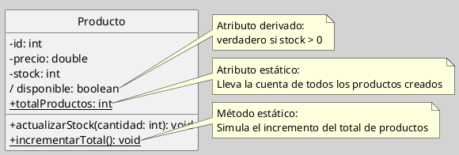

---
{"dg-publish":true,"permalink":"/050 Base de Conocimientos/200  Mi Zettelkasten/100 Docencia/IS1/2025/Clase 13 Diagrama de Clases (Fundamentos, Elementos, Relaciones, etc.)/Zk Diagrama de Clases (Presentación de Elementos y Relaciones)/","tags":["digitalGarden","diagramaDeClases"]}
---

## Diagrama de Clases (Presentación de Elementos y Relaciones)

> [!info]  Resumen
> La clase es el bloque básico y fundamentales del diagrama de clases UML.

### 1. Definición de Clase

Una **clase** es una descripción de un conjunto de objetos que comparten atributos, operaciones, relaciones y semántica. Se representa como un rectángulo dividido en tres compartimentos: nombre, atributos y operaciones [[050 Base de Conocimientos/900 Biblioteca/Zk Lit (OMG, 2017) UML Specifications\|(OMG, 2017)]].

### 2. Sintaxis de Clase

**Figura**
_Ejemplo de una Clase_

```plantuml
@startuml 
!pragma layout smetana
skinparam style strictuml
skinparam classAttributeIconSize 0
skinparam BackgroundColor LightGray
left to right direction
'top to bottom direction
skinparam linetype ortho
scale 1

class CuentaBancaria {
  -saldo: double = 0.0
  -numeroCuenta: String
  +depositar(monto: double): void
  +obtenerSaldo(): double
}
@enduml

```

_Nota_:

- **Nombre**: En negrita, centrado en el primer compartimento.
    
- **Atributos**: Visibilidad (`-` privado, `+` público, `#` protegido), nombre, tipo (opcional), valor inicial (opcional), otros.
    
- **Operaciones**: Visibilidad, nombre, parámetros, tipo de retorno (opcional).

> [!note]  
> Los estereotipos como `<<Entity>>` se colocan arriba del nombre
> 

**Figura**
_Clase utilizando estereotipo_

```plantuml
@startuml
!pragma layout smetana
skinparam style strictuml
skinparam classAttributeIconSize 0
skinparam BackgroundColor LightGray
left to right direction
'top to bottom direction
skinparam linetype ortho
scale 1
class CuentaBancaria <<Entity>> {
	-saldo: double
} 
@enduml
```

### 3. Atributos: Reglas y Convenciones

#### **Visibilidad**

| Símbolo | Tipo      | Acceso                   |
| ------- | --------- | ------------------------ |
| `-`     | Privado   | Sólo dentro de la clase  |
| `+`     | Público   | Cualquier clase          |
| `#`     | Protegido | Clase y subclases        |
| `~`     | Paquete   | Clases del mismo paquete |

#### Ejemplo

**Figura**
_Visibilidad en Atributos y Operaciones_

```plantuml
@startuml
!pragma layout smetana
skinparam style strictuml
skinparam classAttributeIconSize 0
skinparam BackgroundColor LightGray
left to right direction
'top to bottom direction
skinparam linetype ortho
scale 1

class Empleado {
  -id: integer
  #nombre: String
  +calcularSalario(): double
}
@enduml
```

#### Tipos de Datos

- **Primitivos**: `int`, `integer`, `double`, `boolean`, `String`,  `boolean`
    
- **Personalizados**: Clases del sistema (ejemplo: Dirección`, etc.)
    

> [!warning]  Error Común
> Usar tipos de implementación (ej: `ArrayList`) en etapas de análisis. Preferir abstracciones del dominio (ejemplo: `ListaPedidos`).

### 4. Atributos Derivados y Estáticos

#### Derivados
Se calculan a partir de otros atributos. Se marcan con `/`.

**Figura**
_Atributo Derivado_

```plantuml
@startuml
!pragma layout smetana
skinparam style strictuml
skinparam classAttributeIconSize 0
skinparam BackgroundColor LightGray
left to right direction
'top to bottom direction
skinparam linetype ortho
scale 1

class Triangulo {
	-base: double
	-altura: double 
	/area: double 
}
@enduml
```

_Nota_: Área = (base × altura) / 2

#### Estáticos
Los atributos estáticos en una clase son aquellos que pertenecen a la clase en sí misma, no a instancias individuales de la clase. Son compartidos por todas las instancias de la clase, y se pueden acceder directamente a través de la clase sin necesidad de crear una instancia. Se subrayan.

**Figura**
_Atributo Estático_

#### Abstractos
En una clase, los atributos abstractos, también conocidos como propiedades abstractas, son miembros de clase que son declarados pero no implementados dentro de la clase abstracta misma. En lugar de eso, las subclases que heredan de la clase abstracta son responsables de proporcionar la implementación de estos atributos

**Figura**
_Atributo Estático_

```plantuml
@startuml
!pragma layout smetana
skinparam style strictuml
skinparam classAttributeIconSize 0
skinparam BackgroundColor LightGray
left to right direction
'top to bottom direction
skinparam linetype ortho
scale 1

class Contador { 
	- {static} cantidadInstancias: integer 
	+ {static} getInstancias(): int 
}
@enduml
```

### 5. Buenas Prácticas

1. **Principio de Ocultación**: Minimizar atributos públicos (`+`) [[050 Base de Conocimientos/900 Biblioteca/Zk Lit (Pressman, 2013) Ingeniería del Software - Un Enfoque Práctico (Séptima edición). McGraw-Hill Education\|(Pressman, 2013)]].
    
2. **Nomenclatura**:
    
    - Atributos: `lowerCamelCase` (ej: `saldoActual`)
        
    - Constantes: `MAYÚSCULAS` (ej: `MAX_INTENTOS = 3`)
        
3. **Documentación**: Añadir comentarios para atributos complejos.

**Figura**
_Atributo con Comentario_

```plantuml
@startuml
!pragma layout smetana
skinparam style strictuml
skinparam classAttributeIconSize 0
skinparam BackgroundColor LightGray
'left to right direction
top to bottom direction
skinparam linetype ortho
scale 1

class Sensor { 
	- ultimaLectura :double 
}

note right of Sensor::ultimaLectura
  Comentario a un atributo
end note
@enduml
```

### 6. Ejercicio Práctico

#### Modelar la clase `Producto` con:

- **Atributos privados:**
    
    - `id` (int)
    - `precio` (double)
    - `stock` (int)
        
- **Atributo derivado:**
    
    - `disponible` (boolean)  
        _Debe ser verdadero si `stock > 0`._
        
- **Atributo estático:**
    
    - `totalProductos` (int)  
        _Representa la cantidad total de objetos `Producto` creados._
        
- **Método público:**
    
    - `actualizarStock(cantidad: int)`  
        _Modifica el valor de `stock` sumando la cantidad indicada (puede ser positiva o negativa)._

#### Solución

**Figura**
_Atributo con Comentario_

