---
{"dg-publish":true,"permalink":"/050 Base de Conocimientos/200  Mi Zettelkasten/100 Docencia/IS1/2025/Clase 13 Diagrama de Clases (Fundamentos, Elementos, Relaciones, etc.)/Zk Diagrama de Clases (Presentación de Elementos y Relaciones)/","tags":["digitalGarden","diagramaDeClases"]}
---

## Diagrama de Clases (Presentación de Elementos y Relaciones)

> [!info]  Resumen
> La clase es el bloque básico y fundamentales del diagrama de clases UML.

### 1. Definición de Clase

Una **clase** es una descripción de un conjunto de objetos que comparten atributos, operaciones, relaciones y semántica. Se representa como un rectángulo dividido en tres compartimentos: nombre, atributos y operaciones [[050 Base de Conocimientos/900 Biblioteca/Zk Lit (OMG, 2017) UML Specifications\|(OMG, 2017)]].

### 2. Sintaxis de Clase

**Figura**
_Ejemplo de una Clase_

```plantuml
@startuml 
!pragma layout smetana
skinparam style strictuml
skinparam classAttributeIconSize 0
skinparam BackgroundColor LightGray
left to right direction
'top to bottom direction
skinparam linetype ortho
scale 1

class CuentaBancaria {
  -saldo: double = 0.0
  -numeroCuenta: String
  +depositar(monto: double): void
  +obtenerSaldo(): double
}
@enduml

```

_Nota_:

- **Nombre**: En negrita, centrado en el primer compartimento.
    
- **Atributos**: Visibilidad (`-` privado, `+` público, `#` protegido), nombre, tipo (opcional), valor inicial (opcional), otros.
    
- **Operaciones**: Visibilidad, nombre, parámetros, tipo de retorno (opcional).

> [!note]  
> Los estereotipos como `<<Entity>>` se colocan arriba del nombre
> 

**Figura**
_Clase utilizando estereotipo_

```plantuml
@startuml
!pragma layout smetana
skinparam style strictuml
skinparam classAttributeIconSize 0
skinparam BackgroundColor LightGray
left to right direction
'top to bottom direction
skinparam linetype ortho
scale 1
class CuentaBancaria <<Entity>> {
	-saldo: double
} 
@enduml
```

