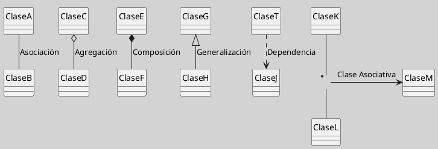

---
{"dg-publish":true,"permalink":"/050 Base de Conocimientos/200  Mi Zettelkasten/100 Docencia/IS1/2025/Clase 13 Diagrama de Clases (Fundamentos, Elementos, Relaciones, etc.)/Zk Diagrama de Clases (Relaciones)/","tags":["digitalGarden"]}
---

## Diagrama de Clases (Relaciones)

> [!info]  **Resumen**  
> Las relaciones en UML definen cómo las clases interactúan y se vinculan estructural o comportamentalmente. Son esenciales para modelar la arquitectura estática de un sistema ([[050 Base de Conocimientos/900 Biblioteca/Zk Lit (OMG, 2017) UML Specifications\|OMG, 2017]]; [[050 Base de Conocimientos/900 Biblioteca/Zk Lit (Rumbaugh et al., 2007) Lenguaje Unificado de Modelado. Manual de Referencia\|Rumbaugh et al., 2007]]).

### 1. Tipos de Relaciones Principales

| Relación                                                               | Símbolo              | Descripción                                      |
| ---------------------------------------------------------------------- | -------------------- | ------------------------------------------------ |
| [[050 Base de Conocimientos/200  Mi Zettelkasten/100 Docencia/IS1/2025/Clase 13 Diagrama de Clases (Fundamentos, Elementos, Relaciones, etc.)/Zk Diagrama de Clases (Relaciones, Asociación)\|Asociación]]         | Línea continua       | Conexión estructural entre clases independientes |
| [[050 Base de Conocimientos/200  Mi Zettelkasten/100 Docencia/IS1/2025/Clase 13 Diagrama de Clases (Fundamentos, Elementos, Relaciones, etc.)/Zk Diagrama de Clases (Relaciones, Agregación)\|Agregación]]         | Rombo vacío          | Relación "todo-parte" no exclusiva               |
| [[050 Base de Conocimientos/200  Mi Zettelkasten/100 Docencia/IS1/2025/Clase 13 Diagrama de Clases (Fundamentos, Elementos, Relaciones, etc.)/Zk Diagrama de Clases (Relaciones, Composición)\|Composición]]       | Rombo relleno        | Relación "todo-parte" con dependencia vital      |
| [[050 Base de Conocimientos/200  Mi Zettelkasten/100 Docencia/IS1/2025/Clase 13 Diagrama de Clases (Fundamentos, Elementos, Relaciones, etc.)/Zk Diagrama de Clases (Relaciones, Generalización)\|Generalización]] | Flecha hueca         | Herencia entre clases (relación padre-hijo)      |
| [[050 Base de Conocimientos/200  Mi Zettelkasten/100 Docencia/IS1/2025/Clase 13 Diagrama de Clases (Fundamentos, Elementos, Relaciones, etc.)/Zk Diagrama de Clases (Relaciones, Dependencia)\|Dependencia]]       | Línea punteada       | Uso temporal o débil entre clases                |
| [[050 Base de Conocimientos/200  Mi Zettelkasten/100 Docencia/IS1/2025/Clase 13 Diagrama de Clases (Fundamentos, Elementos, Relaciones, etc.)/Zk Diagrama de Clases (Relaciones, Clases Asociativas)\|Clase Asociativa]]       | Rectángulo vinculado | Clase que gestiona atributos de una asociación   |

**Figura**
_Ejemplos de Relaciones_

### 2. Características Comunes

- **Multiplicidad**: Define cuántas instancias participan en la relación (ejemplo: `1`, `0..*`, `1..5`) [[050 Base de Conocimientos/900 Biblioteca/Zk Lit (Rumbaugh et al., 2007) Lenguaje Unificado de Modelado. Manual de Referencia\|(Rumbaugh et al., 2007)]].
- **Navegabilidad**: Indica la dirección accesible de la relación (flecha opcional).
- **Roles**: Nombres que describen la función de cada extremo (ejemplo: `empleado: Empleado`).
