```plantuml
@startuml 
!pragma layout smetana
skinparam style strictuml
skinparam classAttributeIconSize 0
skinparam BackgroundColor LightGray
'left to right direction
top to bottom direction
skinparam linetype ortho
scale 1

class Equipo
class Jugador

Equipo o-- "1..11" Jugador : alineación
@enduml
```

---
{"dg-publish":true,"permalink":"/050 Base de Conocimientos/200  Mi Zettelkasten/100 Docencia/IS1/2025/Clase 13 Diagrama de Clases (Fundamentos, Elementos, Relaciones, etc.)/Zk Diagrama de Clases (Relaciones, Agregación)/","tags":["digitalGarden"]}
---

## Diagrama de Clases (Relaciones, Agregación)

> [!info]  **Resumen**  
> La **agregación** es una forma especial de asociación en UML que representa una relación "todo-parte" entre clases, donde la parte puede existir independientemente del todo. Es útil para modelar estructuras jerárquicas y colecciones de objetos, manteniendo una semántica de débil acoplamiento entre los participantes ([[050 Base de Conocimientos/900 Biblioteca/Zk Lit (OMG, 2017) UML Specifications\|OMG, 2017]]; [[050 Base de Conocimientos/900 Biblioteca/Zk Lit (Rumbaugh et al., 2007) Lenguaje Unificado de Modelado. Manual de Referencia\|Rumbaugh et al., 2007]]).

### 1. Definición

La **asociación por agregación** indica que una clase (el "todo" o agregador) está compuesta por una o varias instancias de otra clase (la "parte"), pero la existencia de las partes no depende de la existencia del todo. Si el todo se destruye, las partes pueden seguir existiendo independientemente.

### 2. Notación y Sintaxis

- Se representa como una **línea continua** con un **rombo blanco** en el extremo del "todo"
- El rombo apunta hacia la clase agregadora.
- Se pueden especificar multiplicidades y roles en ambos extremos.

**Figura**
_Ejemplo de una Relación de Asociación por Agregación_

```plantuml
@startuml 
!pragma layout smetana
skinparam style strictuml
skinparam classAttributeIconSize 0
skinparam BackgroundColor LightGray
'left to right direction
top to bottom direction
skinparam linetype ortho
scale 1

class Departamento
class Empleado

Departamento o-- "0..*" Empleado : contiene
@enduml
```

_Nota_: En este ejemplo, un `Departamento` puede contener varios `Empleado`, pero los empleados pueden existir aunque el departamento se elimine.

### 3. Características Clave

- **Relación débil "todo-parte"**: El ciclo de vida de las partes es independiente del todo.
- **Multiplicidad**: Se usa para indicar cuántas partes puede tener el todo (ejemplo: `0..*`).
- **Navegabilidad**: Puede ser bidireccional o unidireccional, según el dominio.
- **Semántica**: La agregación es principalmente conceptual y no implica necesariamente una implementación física de contención.

### 4. Ejemplo con Roles y Multiplicidad

**Figura**
_Ejemplo de una Relación de Asociación por Agregación de un Equipo de Fútbol_

_Nota_: Un `Equipo` tiene entre 1 y 11 `Jugador`, pero un jugador puede existir fuera de un equipo.

### 5. Buenas Prácticas

- Utilizar agregación solo cuando la relación "todo-parte" sea relevante en el dominio.
- No abusar de la agregación; en muchos casos, una asociación simple es suficiente.
- Documentar claramente el significado de la relación en el contexto del modelo.

<a class="markdown-embed-link" href="/050 Base de Conocimientos/200  Mi Zettelkasten/100 Docencia/IS1/2025/Clase 13 Diagrama de Clases (Fundamentos, Elementos, Relaciones, etc.)/Zk Diagrama de Clases (Relaciones, Composición)/#6-diferencia-entre-agregacion-y-composicion" aria-label="Open link"><svg xmlns="http://www.w3.org/2000/svg" width="24" height="24" viewBox="0 0 24 24" fill="none" stroke="currentColor" stroke-width="2" stroke-linecap="round" stroke-linejoin="round" class="svg-icon lucide-link"><path d="M10 13a5 5 0 0 0 7.54.54l3-3a5 5 0 0 0-7.07-7.07l-1.72 1.71"></path><path d="M14 11a5 5 0 0 0-7.54-.54l-3 3a5 5 0 0 0 7.07 7.07l1.71-1.71"></path></svg></a>

## Diagrama de Clases (Relaciones, Composición)

> [!info]  **Resumen**  
La composición es una forma estricta de agregación que representa una relación "todo-parte" con dependencia vital. Las partes no pueden existir independientemente del todo y son destruidas cuando éste se elimina ([[050 Base de Conocimientos/900 Biblioteca/Zk Lit (OMG, 2017) UML Specifications\|OMG, 2017]]; [[050 Base de Conocimientos/900 Biblioteca/Zk Lit (Rumbaugh et al., 2007) Lenguaje Unificado de Modelado. Manual de Referencia\|Rumbaugh et al., 2007]]).

### 1. Definición

La **composición** indica una relación "parte-de" más fuerte entre clases. Una clase (el "todo" o composite) **contiene** una o varias instancias de otra clase (la "parte"), y la **existencia de las partes depende completamente de la existencia del todo**. Si el todo se destruye, las partes también se destruyen simultáneamente. En otras palabras:
- El **todo** (clase compuesta) posee exclusivamente las **partes**
- Las partes tienen el mismo ciclo de vida que el todo
- La destrucción del todo implica la destrucción de todas sus partes

### 2. Notación y Sintaxis

- Se representa como una **línea continua** con un **rombo pintado o relleno** en el extremo del "todo"
- El rombo apunta hacia la clase composite.
- Se pueden especificar multiplicidades y roles en ambos extremos.

**Figura**
_Ejemplo de una Relación de Asociación por Composición

```plantuml
@startuml 
!pragma layout smetana
skinparam style strictuml
skinparam classAttributeIconSize 0
skinparam BackgroundColor LightGray
'left to right direction
top to bottom direction
skinparam linetype ortho
scale 1

class Auto {  
  -motor: Motor  
}  
class Motor  

Auto *-- Motor  
@enduml  
```

_Nota_: Cada Auto tiene exactamente un Motor y es exclusivo del mismo.

### 3. Características Clave

- **Dependencia vital**: Las partes no tienen significado fuera del contexto del todo (ejemplo: un Motor sin el Auto).
- **Multiplicidad**: El todo suele tener multiplicidad `1` (cada parte pertenece a un todo).
- **Encapsulación fuerte**: Las partes son accesibles solo a través del todo [[050 Base de Conocimientos/900 Biblioteca/Zk Lit (Booch et al., 2006) Booch, G., Rumbaugh, J., y Jacobson, I. (2006). El lenguaje Unificado de Modelado - Guía del Usuario (2a ed). Addison-Wesley.\|(Booch et al., 2006)]].

### 4. Ejemplo con Roles y Multiplicidad

**Figura**
_Ejemplo de una Relación de Asociación por Agregación de un Equipo de Fútbol_

_Nota_: Un `Equipo` tiene entre 1 y 11 `Jugador`, pero un jugador puede existir fuera de un equipo.

### 5. Buenas Prácticas

- Utilizar composición solo cuando la relación "todo-parte" sea relevante en el dominio.
- No abusar de la composición; en muchos casos, una asociación simple es suficiente.
- Documentar claramente el significado de la relación en el contexto del modelo.
- Usar composición cuando las partes no tengan identidad independiente (ejemplo: párrafos en un documento).

### 6. Diferencias entre Composición y Agregación

|**Composición**|**Agregación**|
|---|---|
|Rombo relleno|Rombo vacío|
|Partes no sobreviven al todo|Partes pueden existir independientemente|
|Propiedad exclusiva|Propiedad compartida|
|Ejemplo: Auto-Motor|Ejemplo: Departamento-Empleado|

