---
{"dg-publish":true,"permalink":"/050 Base de Conocimientos/200  Mi Zettelkasten/100 Docencia/IS1/2025/Clase 13 Diagrama de Clases (Fundamentos, Elementos, Relaciones, etc.)/Zk Diagrama de Clases (Relaciones, Asociación)/","tags":["digitalGarden"]}
---

## Diagrama de Clases (Relaciones, Asociación)

> [!info]  **Resumen:**  
> La **asociación** es la relación estructural más fundamental en UML para conectar, en particular entre clases. Permite modelar cómo las instancias de dos o más clases pueden estar relacionadas y colaborar dentro del sistema ([[050 Base de Conocimientos/900 Biblioteca/Zk Lit (OMG, 2017) UML Specifications\|OMG, 2017]]; [[050 Base de Conocimientos/900 Biblioteca/Zk Lit (Rumbaugh et al., 2007) Lenguaje Unificado de Modelado. Manual de Referencia\|Rumbaugh et al., 2007]]).

## 1. Definición

Una **asociación** representa una conexión semántica entre clases, indicando que existe una relación significativa entre sus instancias. Es bidireccional por defecto, pero puede ser unidireccional si se especifica la navegabilidad.

## 2. Notación y Sintaxis

- **Línea continua** entre las clases.
- Puede incluir:
    - **Nombre de la asociación** (opcional, sobre la línea)
    - **Roles**: nombres en los extremos que describen el papel de cada clase en la relación
    - **Multiplicidad**: cuántas instancias de una clase pueden estar asociadas a una instancia de la otra (`1`, `0..*`, etc.)
    - **Navegabilidad**: flecha en el extremo indica dirección de acceso

**Figura**
_Ejemplo de una Relación de Asociación_

```plantuml
@startuml 
!pragma layout smetana
skinparam style strictuml
skinparam classAttributeIconSize 0
skinparam BackgroundColor LightGray
left to right direction
'top to bottom direction
skinparam linetype ortho
scale 1

class Persona
class CuentaBancaria

Persona "1" -- "0..*" CuentaBancaria : titular
@enduml
```

_Nota_: En este ejemplo, una `Persona` puede ser titular de varias `CuentaBancaria`, y cada cuenta tiene un titular.

### 3. Características

- **Bidireccionalidad**: Por defecto, ambas clases pueden accederse mutuamente.
- **Unidireccionalidad**: Se indica con una flecha en el extremo navegable.
- **Navegabilidad**: Especifica si una clase puede acceder a la otra a través de la asociación.
- **Multiplicidad**: Define restricciones de cantidad en cada extremo (ejemplo: `1`, `0..1`, `*`).
- **Rol**: Nombre opcional que clarifica el propósito de cada extremo.

### 4. Ejemplo con Roles y Multiplicidad

**Figura**
_Ejemplo con Roles y Multiplicidad_

```plantuml
@startuml 
!pragma layout smetana
skinparam style strictuml
skinparam classAttributeIconSize 0
skinparam BackgroundColor LightGray
'left to right direction
top to bottom direction
skinparam linetype ortho
scale 1

class Profesor
class Curso

Profesor "1" --- "1..*" Curso : Imparte
Curso "1" -- "0..*" Profesor : Dictado Por
@enduml
```

_Nota_: Un `Profesor` imparte uno o varios `Curso`; cada `Curso` puede ser dictado por uno o varios profesores.

### 6. Buenas Prácticas

- Nombrar los roles cuando la función de cada extremo no es obvia.
- Especificar multiplicidad siempre que sea relevante para el dominio.
- Usar navegabilidad para indicar dependencias de acceso.