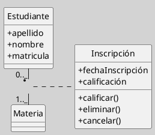
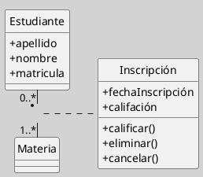
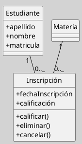

---
{"dg-publish":true,"permalink":"/050 Base de Conocimientos/200  Mi Zettelkasten/100 Docencia/IS1/2025/Clase 13 Diagrama de Clases (Fundamentos, Elementos, Relaciones, etc.)/Zk Diagrama de Clases (Relaciones, Clases Asociativas)/","tags":["digitalGarden","diagramaDeClases"]}
---

## Diagrama de Clases (Relaciones, Clases Asociativas)

> [!info] **Resumen**  
> La **clase asociativa** es un elemento estructural del diagrama de clases de UML que permite modelar asociaciones que requieren atributos, operaciones o comportamientos propios, más allá de los que pueden representarse mediante una simple relación entre dos o más clases. Es fundamental para capturar información relevante de la relación misma y no de las clases participantes.  
> ([[050 Base de Conocimientos/900 Biblioteca/Zk Lit (OMG, 2017) UML Specifications\|OMG (2017)]], [[050 Base de Conocimientos/900 Biblioteca/Zk Lit (Booch et al., 2006) Booch, G., Rumbaugh, J., y Jacobson, I. (2006). El lenguaje Unificado de Modelado - Guía del Usuario (2a ed). Addison-Wesley.\|Booch et al (2006)]], [[050 Base de Conocimientos/900 Biblioteca/Zk Lit (Rumbaugh et al., 2007) Lenguaje Unificado de Modelado. Manual de Referencia\|Rumbaugh (2007)]]).

## Definición

Una **clase asociativa** es una clase que se asocia a una relación (asociación) entre dos o más clases y que permite modelar atributos y operaciones propios de la relación, no de las clases individuales. Es útil cuando la asociación entre clases posee información que debe ser gestionada de manera explícita.

## Notación y Sintaxis

**Representación gráfica:**
- Se dibuja la asociación entre las clases participantes.
- Sobre la línea de la asociación se coloca un rectángulo (la clase asociativa) conectado a la línea con una línea discontinua (UML estándar).
- La clase asociativa puede contener atributos y operaciones, igual que cualquier clase.

**Figura**
_Ejemplo de la Relación de Clase Asociativa_

_Nota_: En una relación entre `Estudiante` y `Materia`, la inscripción (`Inscripción`) puede requerir atributos como la fecha de inscripción o la calificación obtenida, que no pertenecen ni a `Estudiante` ni a `Materia`, sino a la relación entre ambos. También puede representarse como clases relacionadas entre sí, manteniendo la misma semántica.

**Figura**
_Ejemplo de la Relación de Clase Asociativa

_Nota_: En una relación entre `Estudiante` y `Curso`, la inscripción (`Inscripcion`) puede requerir atributos como la fecha de inscripción o la calificación obtenida, que no pertenecen ni a `Estudiante` ni a `Curso`, sino a la relación entre ambos, como se puede apreciar en el gráfico a continuación.

**Figura**
_Ejemplo de Otra Forma de Representar con una Sintaxis Distinta pero con la misma semántica

