---
{"dg-publish":true,"permalink":"/050 Base de Conocimientos/200  Mi Zettelkasten/100 Docencia/IS1/2025/Clase 13 Diagrama de Clases (Fundamentos, Elementos, Relaciones, etc.)/Zk Diagrama de Clases (Relaciones, Dependencia)/","tags":["digitalGarden"]}
---

## Diagrama de Clases (Relaciones, Dependencia)

> [!info]  **Resumen**  
> La **dependencia** es una relación estructural débil en UML que indica que un elemento (por ejemplo, una clase) utiliza, referencia o depende de la definición de otro elemento para su funcionamiento, pero no forma parte de su estructura interna. Es fundamental para modelar acoplamientos temporales, uso de servicios, parámetros, tipos o relaciones de implementación ([[050 Base de Conocimientos/900 Biblioteca/Zk Lit (OMG, 2017) UML Specifications\|OMG, 2017]]; [[050 Base de Conocimientos/900 Biblioteca/Zk Lit (Rumbaugh et al., 2007) Lenguaje Unificado de Modelado. Manual de Referencia\|Rumbaugh et al., 2007]]).

### 1. Definición

La **dependencia** expresa que un cambio en el elemento del que se depende puede afectar al elemento dependiente, pero no implica una relación estructural permanente. Es común en situaciones donde una clase usa otra como parámetro, variable local, tipo de retorno, o invoca sus operaciones de manera temporal.

### 2. Notación y Sintaxis

- Se representa como una **línea punteada** con una **flecha abierta** apuntando desde el elemento dependiente hacia el elemento del que depende.
- Opcionalmente, se puede etiquetar con un estereotipo como `<<use>>`, `<<call>>`, `<<instantiate>>`, etc.

**Figura**
_Ejemplo de una Relación de Dependencia

```plantuml
@startuml 
!pragma layout smetana
skinparam style strictuml
skinparam classAttributeIconSize 0
skinparam BackgroundColor LightGray
'left to right direction
top to bottom direction
skinparam linetype ortho
scale 1

class Cliente
class Servicio

Cliente ..> Servicio : usa
@enduml
```

_Nota_: En este ejemplo, `Cliente` depende de `Servicio` porque lo utiliza, pero no lo contiene ni lo asocia permanentemente.

### 3. Características Clave

- **Relación débil**: No implica propiedad ni vida compartida.
- **Temporalidad**: Usualmente ocurre durante la ejecución de una operación o método.
- **Acoplamiento bajo**: Facilita el diseño modular y la evolución independiente de componentes.
- **Uso frecuente**: Para modelar parámetros, tipos de retorno, llamadas a métodos, uso de librerías, etc.

### 4. Ejemplos Comunes

- Una clase que recibe otra como argumento en un método.
- Una clase que crea instancias de otra temporalmente.
- Una clase que invoca métodos estáticos de otra.

**Figura**
_Ejemplo de una Relación de Asociación por Composición

```plantuml
@startuml 
!pragma layout smetana
skinparam style strictuml
skinparam classAttributeIconSize 0
skinparam BackgroundColor LightGray
'left to right direction
top to bottom direction
skinparam linetype ortho
scale 1

class Pedido
class Logger

Pedido ..> Logger : <<use>>
@enduml
```

_Nota_: `Pedido` depende de `Logger` para registrar información, pero no almacena una referencia permanente.

### 5. Buenas Prácticas

- Utilizar dependencias para reducir acoplamiento entre módulos.
- Documentar el motivo de la dependencia si no es evidente.
- Evitar dependencias innecesarias para mantener la flexibilidad del diseño.
   