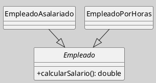

---
{"dg-publish":true,"permalink":"/050 Base de Conocimientos/200  Mi Zettelkasten/100 Docencia/IS1/2025/Clase 13 Diagrama de Clases (Fundamentos, Elementos, Relaciones, etc.)/Zk Diagrama de Clases (Relaciones, Generalización)/","tags":["digitalGarden"]}
---

## Diagrama de Clases (Relaciones, Generalización)

> [!info]  **Resumen**  
> La **generalización** es una relación jerárquica fundamental en UML, que representa herencia entre clases, permitiendo compartir atributos y operaciones comunes, y facilitando la reutilización y extensión del modelo ([[050 Base de Conocimientos/900 Biblioteca/Zk Lit (OMG, 2017) UML Specifications\|OMG, 2017]]; [[050 Base de Conocimientos/900 Biblioteca/Zk Lit (Rumbaugh et al., 2007) Lenguaje Unificado de Modelado. Manual de Referencia\|Rumbaugh et al., 2007]]).

### 1. Definición

La **generalización** establece una relación entre una clase más general (superclase o padre) y una o más clases más específicas (subclases o hijas). Las subclases heredan los atributos, operaciones y relaciones de la superclase, pudiendo además extenderlos o especializarlos.

### 2. Notación y Sintaxis

- Se representa como una **línea continua** con una **flecha hueca** que apunta desde la subclase hacia la superclase.
- Puede involucrar una o varias subclases (herencia simple o múltiple).

**Figura**
_Ejemplo de dos Relaciones de Generalización_

```plantuml
@startuml 
!pragma layout smetana
skinparam style strictuml
skinparam classAttributeIconSize 0
skinparam BackgroundColor LightGray
'left to right direction
top to bottom direction
skinparam linetype ortho
scale 1

class Figura {
  +dibujar(): void
}
class Circulo
class Rectangulo

Circulo --|> Figura
Rectangulo --|> Figura
@enduml
```

_Nota_: En este ejemplo, `Circulo` y `Rectangulo` heredan de `Figura`, por lo que comparten la operación `dibujar()`.

### 3. Características Clave

- **Herencia**: Las subclases reciben automáticamente los atributos y operaciones de la superclase.
- **Polimorfismo**: Las subclases pueden redefinir (sobrescribir) operaciones de la superclase.
- **Especialización**: Las subclases pueden añadir nuevos atributos y operaciones propios.
- **Abstractización**: La superclase puede ser abstracta (no instanciable) si define operaciones sin implementación.

### 4. Ejemplo con Clase Abstracta

**Figura**
_Ejemplo de una Relación de Asociación por Agregación_

_Nota_: `Empleado` es abstracta y define la operación `calcularSalario()`, que debe ser implementada por cada subclase.

### 5. Buenas Prácticas

- Utilizar generalización para evitar duplicidad de código y centralizar comportamientos comunes.
- No abusar de la herencia; preferir composición cuando la relación no sea de tipo “es-un”.
- Documentar claramente las diferencias y responsabilidades de cada subclase.
