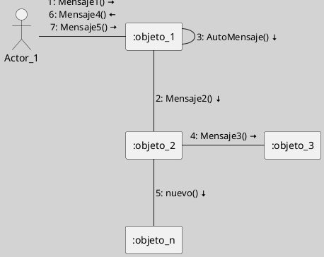
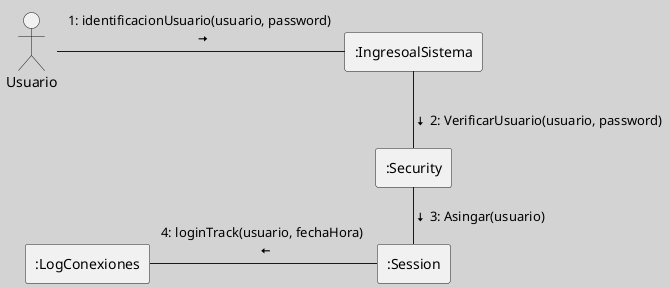
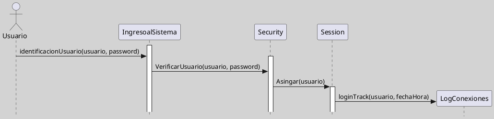

---
{"dg-publish":true,"permalink":"/050 Base de Conocimientos/200  Mi Zettelkasten/100 Docencia/IS1/2025/Clase 14 Diagramas de Interacción/Zk Diagramas de Interacción (Diagrama de Comunicación)/","tags":["digitalGarden"]}
---

## Diagramas de Interacción (Diagrama de Comunicación)

Un **diagrama de comunicación UML** (anteriormente llamado diagrama de colaboración) es un tipo de diagrama de interacción que modela cómo los **objetos** y **actores** colaboran, mostrando explícitamente las **relaciones estructurales** (**enlaces**) entre ellos y el flujo de mensajes que intercambian para cumplir una función o caso de uso. A diferencia del diagrama de secuencia, el énfasis está en la organización espacial y las conexiones entre objetos, no en el orden temporal de los mensajes, aunque este se indica mediante numeración secuencial ([[050 Base de Conocimientos/900 Biblioteca/Zk Lit (Booch et al., 2006) Booch, G., Rumbaugh, J., y Jacobson, I. (2006). El lenguaje Unificado de Modelado - Guía del Usuario (2a ed). Addison-Wesley.\|Booch et al., 2006]]; [[050 Base de Conocimientos/900 Biblioteca/Zk Lit (OMG, 2017) UML Specifications\|OMG, 2017]]; [[050 Base de Conocimientos/900 Biblioteca/Zk Lit (Pressman, 2013) Ingeniería del Software - Un Enfoque Práctico (Séptima edición). McGraw-Hill Education\|Pressman, 2013]]; [[050 Base de Conocimientos/900 Biblioteca/Zk Lit (Rumbaugh et al., 2007) Lenguaje Unificado de Modelado. Manual de Referencia\|Rumbaugh et al., 2007]]).

### Casos de Uso de Aplicación

Los diagramas de  comunicación se emplean para ([[050 Base de Conocimientos/900 Biblioteca/Zk Lit (Booch et al., 2006) Booch, G., Rumbaugh, J., y Jacobson, I. (2006). El lenguaje Unificado de Modelado - Guía del Usuario (2a ed). Addison-Wesley.\|Booch et al., 2006]]; [[050 Base de Conocimientos/900 Biblioteca/Zk Lit (Pressman, 2013) Ingeniería del Software - Un Enfoque Práctico (Séptima edición). McGraw-Hill Education\|Pressman, 2013]]; [[050 Base de Conocimientos/900 Biblioteca/Zk Lit (Rumbaugh et al., 2007) Lenguaje Unificado de Modelado. Manual de Referencia\|Rumbaugh et al., 2007]]):

- Visualizar la estructura de colaboración entre objetos en la ejecución de un escenario o caso de uso.
- Analizar y documentar cómo los objetos están conectados y cómo fluyen los mensajes a través de dichos enlaces.
- Identificar dependencias y relaciones entre componentes, facilitando el diseño de arquitecturas desacopladas.
- Complementar diagramas de secuencia, proporcionando una visión estructural de las interacciones, útil para detectar redundancias o acoplamientos excesivos.

### Elementos Principales

| Elemento            | Descripción                                                                             |
| ------------------- | --------------------------------------------------------------------------------------- |
| Actor               | Usuario o sistema externo que interactúa con el sistema.                                |
| Objeto/Participante | Instancia que participa en la colaboración (rectángulo con nombre subrayado o tipo).    |
| Enlace/Conector     | Línea que representa una relación estructural (asociación, enlace) entre objetos.       |
| Mensaje             | Flecha sobre el enlace, etiquetada con número secuencial y nombre del mensaje.          |
| Número de secuencia | Indica el orden de los mensajes (1, 2, etc.), esencial para comprender el flujo lógico. |
| Notas               | Comentarios o aclaraciones sobre elementos o interacciones.                             |

### Ejemplos

### Ejemplo 1

**Figura**
_Ejemplo Genérico de Diagrama de Comunicación_

Nota:
- Elaboración Propia, usando la herramienta [[050 Base de Conocimientos/900 Biblioteca/Zk Lit (Plantuml) Herramienta Para Crear Diagramas a Partir de Texto\|Plantuml]].
- Este diagrama es la versión equivalente a:


<div class="transclusion internal-embed is-loaded"><a class="markdown-embed-link" href="/050 Base de Conocimientos/200  Mi Zettelkasten/100 Docencia/IS1/2025/Clase 14 Diagramas de Interacción/Zk Diagramas de Interacción (Diagrama de Secuencia)/#ejemplo-1" aria-label="Open link"><svg xmlns="http://www.w3.org/2000/svg" width="24" height="24" viewBox="0 0 24 24" fill="none" stroke="currentColor" stroke-width="2" stroke-linecap="round" stroke-linejoin="round" class="svg-icon lucide-link"><path d="M10 13a5 5 0 0 0 7.54.54l3-3a5 5 0 0 0-7.07-7.07l-1.72 1.71"></path><path d="M14 11a5 5 0 0 0-7.54-.54l-3 3a5 5 0 0 0 7.07 7.07l1.71-1.71"></path></svg></a><div class="markdown-embed">


#### Ejemplo 1
**Figura**
_Ejemplo Genérico de Diagrama de Secuencia_
```plantuml
!pragma layout smetana
skinparam style strictuml
skinparam classAttributeIconSize 0
skinparam BackgroundColor LightGray
'left to right direction
'top to bottom direction
skinparam linetype ortho
scale 0.8

'Actores
Actor Actor_1
Activate Actor_1
note over Actor_1: Actor

'Objetos

participant ":objeto_1" as objeto1
note over objeto1: Participante\nu Objeto

participant ":objeto_2" as objeto2
participant ":objeto_3" as objeto3
participant ":objeto_4" as objeton

Actor_1 -> objeto1 :mensaje1()

activate objeto1
note right: Activación
objeto1 -> objeto2 : mensaje2()

activate objeto2

objeto1 -> objeto1 : AutoMensaje()
deactivate objeto1

objeto2 -> objeto3 : mensaje3()

activate objeto3

return retornoDelMensaje3()

create objeton

objeto2 -> objeton : nuevo()

activate objeton

destroy objeto2
note right: Destrucción\ndel Objeto

Activate objeto1
Actor_1 <- objeto1 :mensaje4()
Actor_1 -> objeto1 : mensaje5()

@enduml
```
_Nota_: Elaboración Propia, usando la herramienta [[050 Base de Conocimientos/900 Biblioteca/Zk Lit (Plantuml) Herramienta Para Crear Diagramas a Partir de Texto\|Plantuml]].

---

</div></div>


#### Ejemplo 2

**Figura**
_Ejemplo Básico Diagrama de Comunicación de un Esquema de Autenticación de Usuario_

Nota:
- Elaboración Propia, usando la herramienta [[050 Base de Conocimientos/900 Biblioteca/Zk Lit (Plantuml) Herramienta Para Crear Diagramas a Partir de Texto\|Plantuml]]. 
- Este diagrama es la versión equivalente a:


<div class="transclusion internal-embed is-loaded"><a class="markdown-embed-link" href="/050 Base de Conocimientos/200  Mi Zettelkasten/100 Docencia/IS1/2025/Clase 14 Diagramas de Interacción/Zk Diagramas de Interacción (Diagrama de Secuencia)/#ejemplo-2" aria-label="Open link"><svg xmlns="http://www.w3.org/2000/svg" width="24" height="24" viewBox="0 0 24 24" fill="none" stroke="currentColor" stroke-width="2" stroke-linecap="round" stroke-linejoin="round" class="svg-icon lucide-link"><path d="M10 13a5 5 0 0 0 7.54.54l3-3a5 5 0 0 0-7.07-7.07l-1.72 1.71"></path><path d="M14 11a5 5 0 0 0-7.54-.54l-3 3a5 5 0 0 0 7.07 7.07l1.71-1.71"></path></svg></a><div class="markdown-embed">


#### Ejemplo 2
**Figura**
_Ejemplo Básico Diagrama de Secuencia de un Esquema de Autenticación de Usuario_

_Nota_: Elaboración Propia, usando la herramienta [[050 Base de Conocimientos/900 Biblioteca/Zk Lit (Plantuml) Herramienta Para Crear Diagramas a Partir de Texto\|Plantuml]].

---

</div></div>

