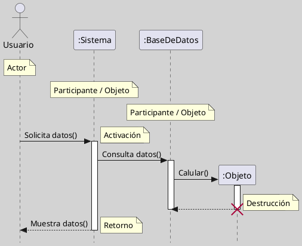
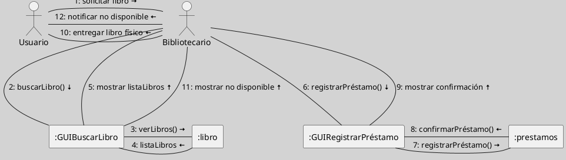

---
{"dg-publish":true,"permalink":"/050 Base de Conocimientos/200  Mi Zettelkasten/100 Docencia/IS1/2025/Clase 14 Diagramas de Interacción/Zk Diagramas de Interacción (Diagrama de Comunicación)/","tags":["digitalGarden"]}
---

## Diagramas de Interacción (Diagrama de Comunicación)

Un **diagrama de comunicación UML** (anteriormente llamado diagrama de colaboración) es un tipo de diagrama de interacción que modela cómo los **objetos** y **actores** colaboran, mostrando explícitamente las **relaciones estructurales** (**enlaces**) entre ellos y el flujo de mensajes que intercambian para cumplir una función o caso de uso. A diferencia del diagrama de secuencia, el énfasis está en la organización espacial y las conexiones entre objetos, no en el orden temporal de los mensajes, aunque este se indica mediante numeración secuencial ([[050 Base de Conocimientos/900 Biblioteca/Zk Lit (Booch et al., 2006) Booch, G., Rumbaugh, J., y Jacobson, I. (2006). El lenguaje Unificado de Modelado - Guía del Usuario (2a ed). Addison-Wesley.\|Booch et al., 2006]]; [[050 Base de Conocimientos/900 Biblioteca/Zk Lit (OMG, 2017) UML Specifications\|OMG, 2017]]; [[050 Base de Conocimientos/900 Biblioteca/Zk Lit (Pressman, 2013) Ingeniería del Software - Un Enfoque Práctico (Séptima edición). McGraw-Hill Education\|Pressman, 2013]]; [[050 Base de Conocimientos/900 Biblioteca/Zk Lit (Rumbaugh et al., 2007) Lenguaje Unificado de Modelado. Manual de Referencia\|Rumbaugh et al., 2007]]).

### Casos de Uso de Aplicación

Los diagramas de  comunicación se emplean para ([[050 Base de Conocimientos/900 Biblioteca/Zk Lit (Booch et al., 2006) Booch, G., Rumbaugh, J., y Jacobson, I. (2006). El lenguaje Unificado de Modelado - Guía del Usuario (2a ed). Addison-Wesley.\|Booch et al., 2006]]; [[050 Base de Conocimientos/900 Biblioteca/Zk Lit (Pressman, 2013) Ingeniería del Software - Un Enfoque Práctico (Séptima edición). McGraw-Hill Education\|Pressman, 2013]]; [[050 Base de Conocimientos/900 Biblioteca/Zk Lit (Rumbaugh et al., 2007) Lenguaje Unificado de Modelado. Manual de Referencia\|Rumbaugh et al., 2007]]):

- Visualizar la estructura de colaboración entre objetos en la ejecución de un escenario o caso de uso.
- Analizar y documentar cómo los objetos están conectados y cómo fluyen los mensajes a través de dichos enlaces.
- Identificar dependencias y relaciones entre componentes, facilitando el diseño de arquitecturas desacopladas.
- Complementar diagramas de secuencia, proporcionando una visión estructural de las interacciones, útil para detectar redundancias o acoplamientos excesivos.

### Elementos Principales

| Elemento            | Descripción                                                                                  |
| ------------------- | -------------------------------------------------------------------------------------------- |
| Actor               | Usuario o sistema externo que interactúa con el sistema.                                     |
| Objeto/Participante | Instancia que participa en la colaboración (rectángulo con nombre subrayado o tipo).         |
| Enlace/Conector     | Línea que representa una relación estructural (asociación, enlace) entre objetos.            |
| Mensaje             | Flecha sobre el enlace, etiquetada con número secuencial y nombre del mensaje.               |
| Número de secuencia | Indica el orden de los mensajes (1, 1.1, 2, etc.), esencial para comprender el flujo lógico. |
| Notas               | Comentarios o aclaraciones sobre elementos o interacciones.                                  |

### Ejemplos

**Figura**
_Ejemplo Básico_

Nota: Elaboración Propia, usando la herramienta [[050 Base de Conocimientos/900 Biblioteca/Zk Lit (Plantuml) Herramienta Para Crear Diagramas a Partir de Texto\|Plantuml]].

**Figura**
_Ejemplo Complejo_

Nota: Elaboración Propia, usando la herramienta [[050 Base de Conocimientos/900 Biblioteca/Zk Lit (Plantuml) Herramienta Para Crear Diagramas a Partir de Texto\|Plantuml]].
