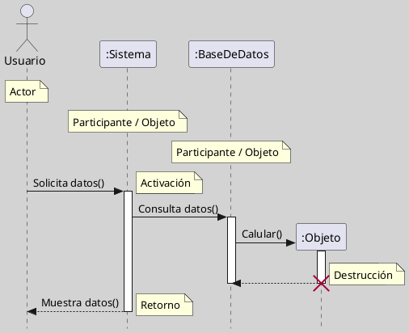

---
{"dg-publish":true,"permalink":"/050 Base de Conocimientos/200  Mi Zettelkasten/100 Docencia/IS1/2025/Clase 14 Diagramas de Interacción/Zk Diagramas de Interacción (Diagrama de Secuencia)/","tags":["digitalGarden"]}
---

## Diagramas de Interacción (Diagrama de Secuencia)

Un **diagrama de secuencia UML** es un tipo de [[050 Base de Conocimientos/200  Mi Zettelkasten/100 Docencia/IS1/2025/Clase 14 Diagramas de Interacción/Zk Diagramas de Interacción (Introducción)\|diagrama de interacción]] que representa cómo los [[050 Base de Conocimientos/200  Mi Zettelkasten/100 Docencia/IS1/2025/Clase 07 Modelo Conceptual del UML - Diagramas/Zk Modelo Conceptual del UML (Diagrama de Objetos)\|objetos]] de un sistema colaboran a través del intercambio de mensajes en un **orden temporal específico** para cumplir una función o [[050 Base de Conocimientos/200  Mi Zettelkasten/100 Docencia/IS1/2025/Clase 09 Diagrama de Casos de Uso (Fundamentos, Elementos, Relaciones)/Zk UML Casos de Uso - Definición\|caso de uso]]. Su **eje vertical** representa el tiempo, y el **eje horizontal** los **participantes** (**objetos** o **actores**). El diagrama muestra explícitamente la secuencia de mensajes y las activaciones de los objetos involucrados ([[050 Base de Conocimientos/900 Biblioteca/Zk Lit (Booch et al., 2006) Booch, G., Rumbaugh, J., y Jacobson, I. (2006). El lenguaje Unificado de Modelado - Guía del Usuario (2a ed). Addison-Wesley.\|Booch et al., 2006]]; [[050 Base de Conocimientos/900 Biblioteca/Zk Lit (OMG, 2017) UML Specifications\|OMG, 2017]]; [[050 Base de Conocimientos/900 Biblioteca/Zk Lit (Pressman, 2013) Ingeniería del Software - Un Enfoque Práctico (Séptima edición). McGraw-Hill Education\|Pressman, 2013]]; [[050 Base de Conocimientos/900 Biblioteca/Zk Lit (Rumbaugh et al., 2007) Lenguaje Unificado de Modelado. Manual de Referencia\|Rumbaugh et al., 2007]]).

### Casos de Uso de Aplicación

Los diagramas de secuencia se utilizan para ([[050 Base de Conocimientos/900 Biblioteca/Zk Lit (Booch et al., 2006) Booch, G., Rumbaugh, J., y Jacobson, I. (2006). El lenguaje Unificado de Modelado - Guía del Usuario (2a ed). Addison-Wesley.\|Booch et al., 2006]]; [[050 Base de Conocimientos/900 Biblioteca/Zk Lit (Pressman, 2013) Ingeniería del Software - Un Enfoque Práctico (Séptima edición). McGraw-Hill Education\|Pressman, 2013]]; [[050 Base de Conocimientos/900 Biblioteca/Zk Lit (Rumbaugh et al., 2007) Lenguaje Unificado de Modelado. Manual de Referencia\|Rumbaugh et al., 2007]]):

- Modelar escenarios detallados de casos de uso, describiendo cómo los objetos interactúan paso a paso.
- Analizar y documentar el comportamiento dinámico de sistemas orientados a objetos.
- Identificar responsabilidades de clases y colaborar en el diseño de la arquitectura.
- Visualizar flujos de eventos, condiciones, bucles, creación y destrucción de objetos.
- Detectar posibles errores de diseño, como dependencias innecesarias o acoplamientos excesivos

### Elementos Principales

| Elemento              | Descripción                                                                                |
| --------------------- | ------------------------------------------------------------------------------------------ |
| Actor                 | Representa un usuario o sistema externo.                                                   |
| Participante/Objeto   | Entidad que participa en la interacción.                                                   |
| Línea de vida         | Línea vertical que indica la existencia del objeto durante la interacción.                 |
| Mensaje               | Flecha horizontal que indica el envío de un mensaje.                                       |
| Activación            | Barra vertical sobre la línea de vida, indica ejecución de una operación.                  |
| Retorno               | Flecha punteada que indica el retorno de un mensaje.                                       |
| Creación de objeto    | Flecha con etiqueta `create` hacia un nuevo participante.                                  |
| Destrucción de objeto | Una 'X' al final de la línea de vida.                                                      |
| Marcos de interacción | Rectángulos que agrupan mensajes bajo condiciones (Alternativa `alt`, Ciclo `loop`, etc.). |
| Notas                 | Comentarios o aclaraciones sobre elementos o interacciones.                                |

### Ejemplos

**Figura**
_Ejemplo Básico_

Nota: Elaboración Propia, usando la herramienta [[050 Base de Conocimientos/900 Biblioteca/Zk Lit (Plantuml) Herramienta Para Crear Diagramas a Partir de Texto\|Plantuml]].

<a class="markdown-embed-link" href="/050 Base de Conocimientos/200  Mi Zettelkasten/100 Docencia/IS1/2025/Clase 07 Modelo Conceptual del UML - Diagramas/Zk Modelo Conceptual del UML (Diagrama de Secuencia)/#escenario-avanzado" aria-label="Open link"><svg xmlns="http://www.w3.org/2000/svg" width="24" height="24" viewBox="0 0 24 24" fill="none" stroke="currentColor" stroke-width="2" stroke-linecap="round" stroke-linejoin="round" class="svg-icon lucide-link"><path d="M10 13a5 5 0 0 0 7.54.54l3-3a5 5 0 0 0-7.07-7.07l-1.72 1.71"></path><path d="M14 11a5 5 0 0 0-7.54-.54l-3 3a5 5 0 0 0 7.07 7.07l1.71-1.71"></path></svg></a>

#### Escenario Avanzado
**Figura**
_Ejemplo de Diagrama de Secuencia más Complejo_

Nota: Elaboración Propia, usando la herramienta [[050 Base de Conocimientos/900 Biblioteca/Zk Lit (Plantuml) Herramienta Para Crear Diagramas a Partir de Texto\|Plantuml]].
