---
{"dg-publish":true,"permalink":"/050 Base de Conocimientos/200  Mi Zettelkasten/100 Docencia/IS1/2025/Clase 14 Diagramas de Interacción/Zk Diagramas de Interacción (Diagramas de Interacción y el SDLS)/","tags":["digitalGarden"]}
---

## Diagramas de Interacción y el SDLC

El desarrollo de [[050 Base de Conocimientos/200  Mi Zettelkasten/100 Docencia/IS1/2025/Clase 14 Diagramas de Interacción/Zk Diagramas de Interacción (Introducción)\|diagramas de interacción]] (como los de [[050 Base de Conocimientos/200  Mi Zettelkasten/100 Docencia/IS1/2025/Clase 14 Diagramas de Interacción/Zk Diagramas de Interacción (Diagrama de Secuencia)\|secuencia]] o [[050 Base de Conocimientos/200  Mi Zettelkasten/100 Docencia/IS1/2025/Clase 14 Diagramas de Interacción/Zk Diagramas de Interacción (Diagrama de Comunicación)\|comunicación]]) suele surgir de forma natural a partir de los [[050 Base de Conocimientos/200  Mi Zettelkasten/100 Docencia/IS1/2025/Clase 09 Diagrama de Casos de Uso (Fundamentos, Elementos, Relaciones)/Zk UML Casos de Uso - Definición\|casos de uso]] y sus [[050 Base de Conocimientos/200  Mi Zettelkasten/100 Docencia/IS1/2025/Clase 09 Diagrama de Casos de Uso (Fundamentos, Elementos, Relaciones)/Zk Diagrama de Casos de Uso - Elementos (Caso de Uso, Especificación)\|descripciones textuales]]. Un camino común y efectivo consiste en:

1. Identificar un **caso de uso** específico.
2. Analizar sus escenarios (flujos principal y alternativos).
3. Utilizar el diagrama de **clases** asociado para determinar los **objetos participantes**.
4. Construir el diagrama de interacción, modelando cómo los objetos colaboran para cumplir el comportamiento descrito.

Este enfoque no es el único posible, pero suele ser el más directo y sistemático dentro del **Ciclo de Vida del Desarrollo de Software (SDLC)**, ya que vincula de forma coherente los requisitos funcionales con el diseño dinámico del sistema.

Figura
_El Camino Natural para Llegar a los Diagramas de Interacción_
.png)

### Diagramas de Interacción y Diagramas de Clase

Los [[050 Base de Conocimientos/200  Mi Zettelkasten/100 Docencia/IS1/2025/Clase 14 Diagramas de Interacción/Zk Diagramas de Interacción (Introducción)\|diagramas de interacción]] (como los de [[050 Base de Conocimientos/200  Mi Zettelkasten/100 Docencia/IS1/2025/Clase 14 Diagramas de Interacción/Zk Diagramas de Interacción (Diagrama de Secuencia)\|secuencia]] o [[050 Base de Conocimientos/200  Mi Zettelkasten/100 Docencia/IS1/2025/Clase 14 Diagramas de Interacción/Zk Diagramas de Interacción (Diagrama de Comunicación)\|comunicación]]) también cumplen una función crucial en el análisis y diseño orientado a objetos, ya que permiten **identificar, validar y refinar las operaciones definidas en las clases**.

Esto se debe a que **cada mensaje enviado entre objetos en un diagrama de interacción representa una posible operación en la clase del objeto receptor**. Por ejemplo:

- Supongamos que `:objeto1` es una instancia de `ClaseA`.
- Y que `:objeto2` es una instancia de `ClaseB`.
- Si `:objeto1` envía un mensaje `m1()` a `:objeto2`, entonces **la clase `ClaseB` debe definir una operación `m1()`** que pueda ser invocada por ese mensaje.

Este análisis permite **alinear el comportamiento dinámico del sistema con la estructura estática definida en el diagrama de clases**, y detectar posibles inconsistencias, operaciones faltantes o mal diseñadas.

**Figura**
_Diagrama de Interacción (Secuencia)_

```plantuml
@startuml
!pragma layout smetana
skinparam style strictuml
skinparam classAttributeIconSize 0
skinparam BackgroundColor LightGray
'left to right direction
'top to bottom direction
skinparam linetype ortho
scale 1

participant ":objeto1" as objeto1
activate objeto1

participant ":objeto2" as objeto2
activate objeto2

objeto1 -> objeto2 :m()
@enduml
```

**Figura**
_Diagrama de Clase Asociado al de Interacción_

```plantuml
@startuml
!pragma layout smetana
skinparam style strictuml
skinparam classAttributeIconSize 0
skinparam BackgroundColor LightGray
left to right direction
'top to bottom direction
skinparam linetype ortho
scale 1

class ClaseA
class ClaseB {
...
+m()
}

ClaseA ----> ClaseB

@enduml
```

**Figura**
_Un Ejemplo más Amplio_
.png)
