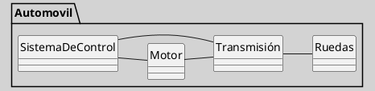

---
{"dg-publish":true,"permalink":"/050 Base de Conocimientos/200  Mi Zettelkasten/100 Docencia/IS1/2025/Clase 14 Diagramas de Interacción/Zk Diagramas de Interacción (Una Metáfora para Comprender los Diagramas de interacción en UML)/","tags":["digitalGarden","diagramasDeInteracción"]}
---

## Una Metáfora para Comprender los Diagramas de interacción en UML

A modo de analogía original, propongo visualizar un **automóvil** como una **orquesta sinfónica**: cada componente del vehículo: motor, transmisión, ruedas, sistema de control, etc.; actúa como un instrumento musical. Para que la melodía del viaje sea armoniosa, todos deben "tocar" en sincronía. El funcionamiento fluido del automóvil requiere que estos componentes colaboren con precisión y ritmo, igual que una sinfonía bien ejecutada.

**Figura**
_Modelo Simplificado de un Automovil_

En este contexto, los **diagramas de interacción** ([[050 Base de Conocimientos/200  Mi Zettelkasten/100 Docencia/IS1/2025/Clase 07 Modelo Conceptual del UML - Diagramas/Zk Modelo Conceptual del UML (Diagrama de Secuencia)\|secuencia]] y [[050 Base de Conocimientos/200  Mi Zettelkasten/100 Docencia/IS1/2025/Clase 07 Modelo Conceptual del UML - Diagramas/Zk Modelo Conceptual del UML (Diagrama de Comunicación)\|comunicación]]), pueden pensarse como las **partituras** que guían a los músicos: muestran con detalle la **cronología de las interacciones** entre los distintos componentes del sistema. Revelan **cómo fluye la información**, **qué actor inicia una acción**, **cuándo se produce una respuesta** y bajo **qué condiciones**.

Así, al igual que en una orquesta, el automóvil necesita que sus elementos “toquen” en sintonía para que el viaje sea placentero. Aquí es donde surgen los **diagramas de interacción**:

- Permiten visualizar cómo interactúan los componentes, mostrando quién envía y recibe información, en qué orden y bajo qué condiciones.

- Ayudan a identificar posibles problemas, como cuellos de botella en la comunicación, errores o situaciones que puedan afectar el funcionamiento del sistema.

- Facilitan el diseño de sistemas robustos y eficientes, ya que comprender estas interacciones permite optimizar el rendimiento del vehículo.

> [!Note] Nota
> Esta metáfora ha sido desarrollada con fines didácticos para facilitar la comprensión del concepto de diagramas de interacción en el ámbito del diseño de software.

