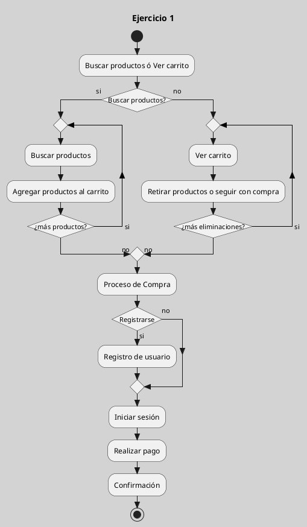
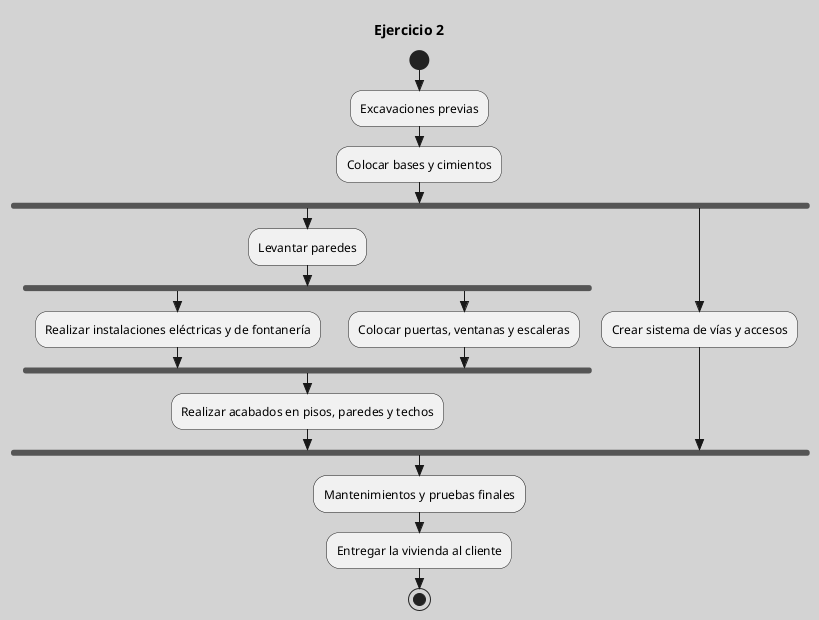
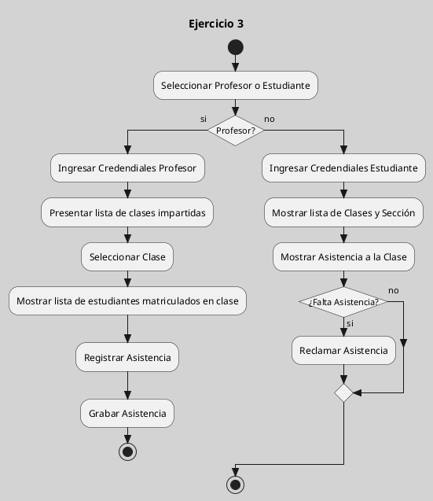
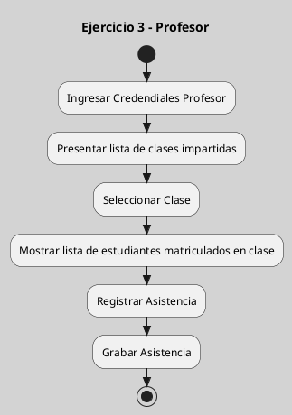
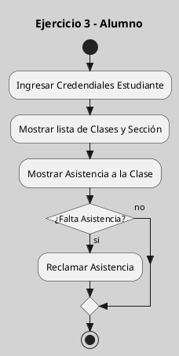
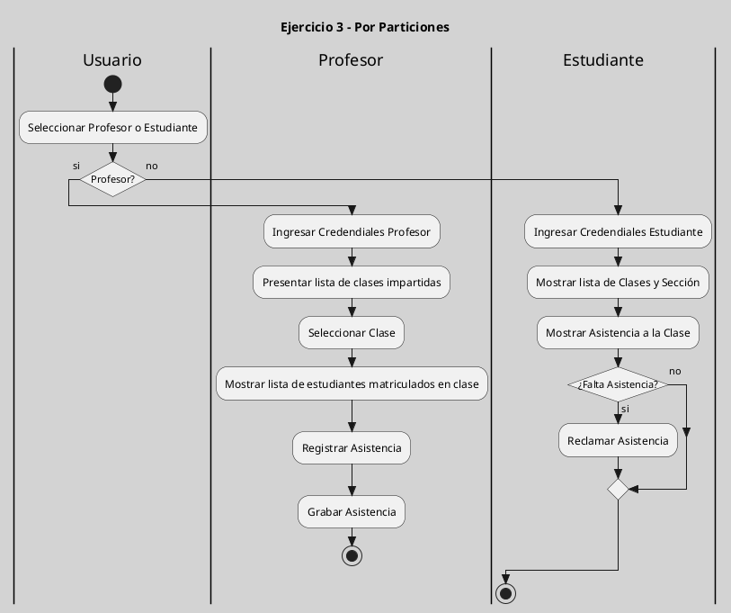

---
{"dg-publish":true,"permalink":"/050 Base de Conocimientos/200  Mi Zettelkasten/100 Docencia/IS1/2025/Clase 15 Diagrama de Actividades/Zk Diagrama de Actividades (Ejercicios y Ejemplos)/","tags":["digitalGarden"]}
---

## Diagrama de Actividades (Ejercicios y Ejemplos)

### Ejemplo 1

#### Especificación
En una compañía de desarrollo de software, se requiere crear un diagrama de actividades detallado, para el proceso de compras en línea a través de una plataforma e-commerce.

Los requisitos específicos para el proceso son los siguientes:

- El usuario debe poder navegar por los diferentes productos y categorías disponibles.
- El usuario debe poder agregar uno o varios productos al carrito de compras.
- El usuario debe poder ver el contenido del carrito de compras actualizado en todo momento.
- El usuario debe poder retirar cualquier producto del carrito de compras.
- El usuario debe poder iniciar sesión o registrarse con su información personal y de pago.
- El usuario debe poder realizar el pago de los productos en el carrito.
- El usuario debe recibir una confirmación o comprobante de la compra realizada.
- El diagrama de actividades tiene una entrada en la actividad “Iniciar”. Desde allí, el usuario puede elegir entre buscar productos o ver el contenido del carrito. Si el usuario decide buscar productos, el diagrama continúa por la actividad “Buscar productos” y luego el usuario puede agregar uno o varios productos al carrito.
- Si el usuario decide ver el carrito, el diagrama continúa por la actividad “Ver carrito” donde el usuario puede retirar cualquier producto o continuar con el proceso de compra.
- En la actividad “Proceso de compra”, el usuario tiene la opción de iniciar sesión o registrarse.
- Si decide registrarse, el diagrama continúa por la actividad “Registro de usuario”.
- Si ya está registrado, puede iniciar sesión en la actividad “Iniciar sesión”.
- Luego, el usuario es dirigido a la actividad “Pago” para realizar el proceso de pago.
- Finalmente, la actividad “Confirmación” se ejecuta para emitir la confirmación o comprobante de compra.
- Una vez que se ha completado el proceso de compra, el diagrama termina en la actividad “Finalizar”.

#### Resolución

**Figura**
_Resolución del Ejercicio 1_

---
### Ejemplo 2

#### Especificación
Una empresa de construcción requiere crear un diagrama de actividades para el proceso de construcción de una vivienda unifamiliar.

Los requisitos específicos para el proceso son los siguientes:

- Se deben realizar excavaciones previas para adecuar el terreno a las necesidades de la construcción.
- Se deben colocar las bases y cimientos de acuerdo con el proyecto arquitectónico.
- Se debe levantar las paredes con bloques de cemento y ladrillo.
- Se deben realizar instalaciones eléctricas y de fontanería.
- Se debe crear un sistema de vías y accesos para la entrada y salida de vehículos.
- Se deben colocar las puertas, ventanas y escaleras de la vivienda.
- Se deben realizar acabados en pisos, paredes y techos.
- Se deben hacer mantenimientos y pruebas finales antes de entregar la vivienda al cliente.

Crear el diagrama de actividades que represente el proceso completo de construcción de la vivienda unifamiliar, siguiendo la secuencia lógica de los requisitos mencionados más arriba. En el proceso de elaboración del diagrama se deberán especificar los elementos, tales como los puntos de decisión, bifurcación, etc.

#### Resolución

**Figura**
_Resolución del Ejercicio 2_

---
### Ejemplo 3

#### Especificación
La universidad ha solicitado a los estudiantes de Ingeniería del Software 1, la confección de un diagrama de actividades, sobre el registro y verificación de de asistencias a clases, conforme a los siguientes lineamientos:

- Los estudiantes no tienen acceso directo al sistema para registrar su asistencia a clases.
- Solo los profesores tienen acceso para registrar la asistencia de los estudiantes en sus clases.
- La pantalla de inicio del sistema solicita al usuario que seleccione si es profesor o estudiante.
- Si se selecciona “Profesor”, el sistema solicitará al usuario que ingrese sus credenciales de inicio de sesión. Una vez que el profesor ha iniciado sesión, se le presentará una lista de las clases que imparte ese día.
- El profesor selecciona la clase que está impartiendo actualmente, y el sistema muestra una lista de los estudiantes matriculados en la clase.
- El profesor puede registrar la asistencia de los estudiantes en la lista indicando la cantidad de horas de asistencia para cada estudiante. Al terminar de registrar debe grabar la asistencia y salir.
- Si se selecciona “Estudiante”, el sistema solicitará al usuario que ingrese sus credenciales de inicio de sesión y se le pedirá al usuario que seleccione su curso y sección.
- Una vez que el estudiante ha seleccionado su curso y sección, el sistema mostrará una lista de las clases que ha recibido.
- El estudiante puede ver si su asistencia ha sido registrada por el profesor o no. Si la asistencia no ha sido registrada, el estudiante puede solicitar que el profesor la registre luego de la clase, por medio de la opción “reclamar asistencia”, en cualquiera de los casos luego debe salir.

Se solicita:

- Crear un diagrama de actividades general
- Crear un diagrama de actividades, dirigido al Profesor
- Crear un diagrama de actividades, dirigido al Estudiante.
- Crear un diagrama por particiones o calles que incluya a todos los actores.

#### Resolución

**Figura**
_Resolución del Ejercicio  General_

**Figura**
_Resolución del Ejercicio - Profesor_

**Figura**
_Resolución del Ejercicio - Estudiante_

**Figura**
_Resolución del Ejercicio - Por Particiones_

