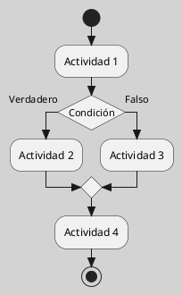
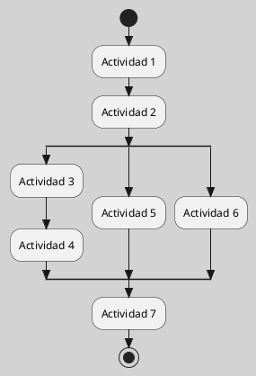
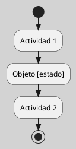
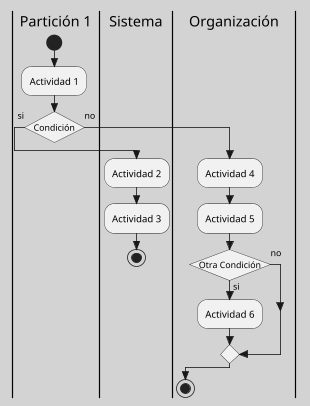

```plantuml
@startuml
!pragma layout smetana
skinparam style strictuml
skinparam BackgroundColor LightGray
skinparam conditionStyle InsideDiamond
scale 1

start
:Actividad 1;
:Actividad 2;
stop

@enduml
```

---
{"dg-publish":true,"permalink":"/050 Base de Conocimientos/200  Mi Zettelkasten/100 Docencia/IS1/2025/Clase 15 Diagrama de Actividades/Zk Diagrama de Actividades (Elementos)/","tags":["digitalGarden"]}
---

## Diagrama de Actividades (Elementos)

Los **diagramas de actividades** en UML se componen de una serie de elementos gráficos y conceptuales que permiten modelar el flujo de control y de datos en procesos, algoritmos o flujos de trabajo complejos ([[050 Base de Conocimientos/900 Biblioteca/Zk Lit (Booch et al., 2006) Booch, G., Rumbaugh, J., y Jacobson, I. (2006). El lenguaje Unificado de Modelado - Guía del Usuario (2a ed). Addison-Wesley.\|Booch et al., 2006]]; [[050 Base de Conocimientos/900 Biblioteca/Zk Lit (OMG, 2017) UML Specifications\|OMG, 2017]]; [[050 Base de Conocimientos/900 Biblioteca/Zk Lit (Rumbaugh et al., 2007) Lenguaje Unificado de Modelado. Manual de Referencia\|Rumbaugh et al., 2007]]). A continuación se describen los principales elementos y su notación, siguiendo la especificación UML y la literatura de referencia:

### Elementos

#### Actividad

Representa una tarea o una acción que se lleva a cabo dentro del sistema. Puede ser una operación, una función o cualquier otra acción que se deba realizar. El nombre debe indicar la acción que lleva a cabo.

**Figura**
_Actividad_

```plantuml
@startuml
!pragma layout smetana
skinparam style strictuml
skinparam BackgroundColor LightGray
skinparam conditionStyle InsideDiamond
scale 1

:Actividad;

@enduml
```

---
### Inicio y Final

El inicio representa el punto de inicio del flujo de actividades, y el fin representa el punto de finalización.

**Figura**
_Inicio y Final_

```plantuml
@startuml
!pragma layout smetana
skinparam style strictuml
skinparam BackgroundColor LightGray
skinparam conditionStyle InsideDiamond
scale 1

start
note right :Inicio

stop
note left :Final
@enduml
```

---
### Transición

Representa el flujo de control entre las actividades o nodos, indicando la secuencia en la que se deben llevar a cabo. Se representa con una flecha dirigida desde la actividad de origen a la actividad de destino.

**Figura**
_Transición_

---
### Decisión

Representa una bifurcación en el flujo de actividades, donde se toma una decisión basada en una condición lógica. Se representa con u rombo, indicando además la condición que se está evaluando. La condición puede ir dentro o fuera del rombo, dependiendo de la herramienta CASE utilizada.

**Figura**
_Decisión_

---
### Barra de Sincronización

La **bifurcación** se utiliza para dividir el flujo en múltiples caminos **simultáneos**.

La **fusión** se utiliza para finalizar y **unir** los caminos paralelos.

**Figura**
_Transición_

---
### Flujo de Objetos

Los flujos de objetos representan el paso de objetos entre las actividades en un diagrama de actividades.

Muestran cómo los objetos son producidos, consumidos o modificados durante el proceso.

**Figura**
_Flujo de Objetos_

---
### Particiones (Calles o Swimlanes)

Permite organizar el flujo de control.

**Figura**
_Particiones (Calles o Swimlanes)_

---
### Conectores

Se utiliza para conectar partes del diagrama de actividades [[050 Base de Conocimientos/900 Biblioteca/Zk Lit (OMG, 2017) UML Specifications\|(OMG, 2017, 15.6)]]

**Figura**
_Conector_

```plantuml
@startuml
!pragma layout smetana
skinparam style strictuml
skinparam BackgroundColor LightGray
skinparam conditionStyle InsideDiamond
scale 0.8

start
:Actividad 1;
(A)
detach
(A)
:Actividad 2;
stop
@enduml
```

