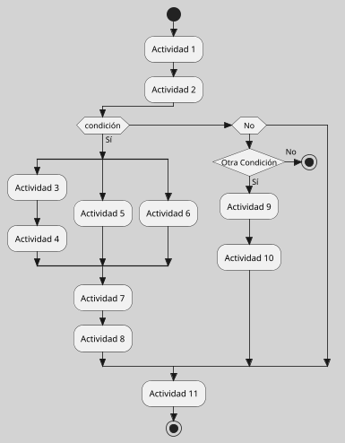
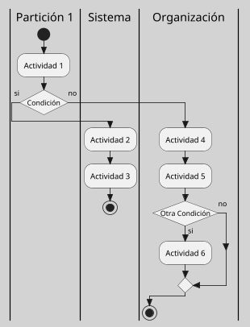

---
{"dg-publish":true,"permalink":"/050 Base de Conocimientos/200  Mi Zettelkasten/100 Docencia/IS1/2025/Clase 15 Diagrama de Actividades/Zk Diagrama de Actividades (Introducción)/","tags":["digitalGarden"]}
---

## Diagrama de Actividades (Introducción)

El **diagrama de actividades** en UML es una herramienta de modelado que permite describir el comportamiento **dinámico** de un [[050 Base de Conocimientos/200  Mi Zettelkasten/100 Docencia/Org1/2025/Clase 05 Sistemas, Subsistemas, Suprasistemas/Zk !MOC Sistemas, Subsistemas y Suprasistemas\|sistema]] (en el sentido amplio), enfocándose en la representación de **flujos de trabajo** y **procesos**, tanto de **sistemas de software** como de **organizaciones**. Estos diagramas muestran la **secuencia** y **condiciones** de las **actividades**, así como las **decisiones**, **bifurcaciones**, **concurrencia** y **sincronización** de tareas dentro de un proceso. Su notación gráfica es similar a los diagramas de flujo tradicionales, pero con capacidades extendidas para modelar actividades concurrentes y flujos de datos, lo que los hace especialmente útiles en el análisis y diseño de sistemas complejos ([[050 Base de Conocimientos/900 Biblioteca/Zk Lit (Booch et al., 2006) Booch, G., Rumbaugh, J., y Jacobson, I. (2006). El lenguaje Unificado de Modelado - Guía del Usuario (2a ed). Addison-Wesley.\|Booch et al., 2006]]; [[050 Base de Conocimientos/900 Biblioteca/Zk Lit (OMG, 2017) UML Specifications\|OMG, 2017]]; [[050 Base de Conocimientos/900 Biblioteca/Zk Lit (Rumbaugh et al., 2007) Lenguaje Unificado de Modelado. Manual de Referencia\|Rumbaugh et al., 2007]]).

### Ejemplo Simple

**Figura**
_Ejemplo Genérico de un Diagrama de Actividades_

### Casos de Uso del Diagrama de Actividades

Los diagramas de actividades se utilizan fundamentalmente para ([[050 Base de Conocimientos/900 Biblioteca/Zk Lit (Booch et al., 2006) Booch, G., Rumbaugh, J., y Jacobson, I. (2006). El lenguaje Unificado de Modelado - Guía del Usuario (2a ed). Addison-Wesley.\|Booch et al., 2006]]; [[050 Base de Conocimientos/900 Biblioteca/Zk Lit (Rumbaugh et al., 2007) Lenguaje Unificado de Modelado. Manual de Referencia\|Rumbaugh et al., 2007]]):

- Modelar **procesos** de negocio y flujos de trabajo organizacionales, representando cómo se desarrolla una tarea desde el inicio hasta su finalización.

- Especificar el **comportamiento** interno de un caso de uso, detallando los pasos que lo componen y las posibles ramificaciones de su ejecución.

- Describir la **lógica** de control de operaciones complejas, incluyendo decisiones, ciclos, concurrencia y sincronización de actividades.

- Representar la **interacción** entre diferentes roles, sistemas o componentes, especialmente cuando se requiere visualizar la responsabilidad de cada uno en el proceso.

- **Documentar** procedimientos operativos, algoritmos o procesos que involucren múltiples pasos y condiciones.

---
### Tipos de Diagramas de Actividades
Se distinguen dos tipos o configuración del diagrama de actividades ([[050 Base de Conocimientos/900 Biblioteca/Zk Lit (Booch et al., 2006) Booch, G., Rumbaugh, J., y Jacobson, I. (2006). El lenguaje Unificado de Modelado - Guía del Usuario (2a ed). Addison-Wesley.\|Booch et al., 2006]]; [[050 Base de Conocimientos/900 Biblioteca/Zk Lit (OMG, 2017) UML Specifications\|OMG, 2017]]; [[050 Base de Conocimientos/900 Biblioteca/Zk Lit (Rumbaugh et al., 2007) Lenguaje Unificado de Modelado. Manual de Referencia\|Rumbaugh et al., 2007]]):

| Tipo                                                         | Explicación                                                                                                                                                                                                                                                                                                                                                                                                                                                                                                                   |
| ------------------------------------------------------------ | ----------------------------------------------------------------------------------------------------------------------------------------------------------------------------------------------------------------------------------------------------------------------------------------------------------------------------------------------------------------------------------------------------------------------------------------------------------------------------------------------------------------------------- |
| Diagrama de Actividades                                      | Representan el flujo de acciones y decisiones sin distinguir responsables. Son útiles para procesos lineales o de baja complejidad. Ver [[050 Base de Conocimientos/200  Mi Zettelkasten/100 Docencia/IS1/2025/Clase 15 Diagrama de Actividades/Zk Diagrama de Actividades (Introducción)#Ejemplo Simple\|Ejemplo]].                                                                                                                                                                                                                                                                                                                |
| Diagrama de Actividades con Particiones (Calles o Swimlanes) | Dividen el [[050 Base de Conocimientos/200  Mi Zettelkasten/100 Docencia/IS1/2025/Clase 15 Diagrama de Actividades/Zk Diagrama de Actividades (Elementos)#Particiones (Calles o Swimlanes)\|diagrama en regiones]], denominadas particiones o calles, que agrupan las [[050 Base de Conocimientos/200  Mi Zettelkasten/100 Docencia/IS1/2025/Clase 15 Diagrama de Actividades/Zk Diagrama de Actividades (Elementos)#Actividad\|actividades]] según el responsable (por ejemplo, un actor, un sistema o una unidad organizacional, etc.). Esta configuración facilita identificar claramente quién ejecuta cada paso del proceso. Ver [[050 Base de Conocimientos/200  Mi Zettelkasten/100 Docencia/IS1/2025/Clase 15 Diagrama de Actividades/Zk Diagrama de Actividades (Introducción)#Ejemplo con Particiones (Calles o Swimlanes)\|Ejemplo]] |

>[!Note] Not
>Si bien no se trata propiamente de tipos de diagramas, por su función semántica los presentamos como tales. En rigor, las particiones son un tipo de [[050 Base de Conocimientos/200  Mi Zettelkasten/100 Docencia/IS1/2025/Clase 15 Diagrama de Actividades/Zk Diagrama de Actividades (Elementos)#Particiones (Calles o Swimlanes)\|elemento]] dentro del diagrama de actividades.

### Ejemplo con Particiones (Calles o Swimlanes)

**Figura**
__Ejemplo Genérico de un Diagrama de Actividades con Particiones__

