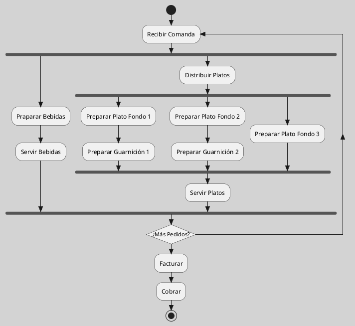

---
{"dg-publish":true,"permalink":"/050 Base de Conocimientos/200  Mi Zettelkasten/100 Docencia/IS1/2025/Clase 15 Diagrama de Actividades/Zk Zk Diagrama de Actividades (Organización la Cocina de un Restaurant)/","tags":["digitalGarden"]}
---

## Diagrama de Actividades (Organización la Cocina de un Restaurant)

Imagine que un chef profesional en un restaurante de alta cocina recibe la tarea de preparar una cena para 3 personas de un grupo de clientes muy exigentes. Sabe que debe cuidar cada detalle para garantizar que la experiencia sea perfecta y que los comensales queden completamente satisfechos. Sin embargo, también es consciente de que dispone de un tiempo limitado para realizar cada tarea, por lo que debe ser eficiente y preciso para completar la cena en el plazo previsto.

En este contexto, el diagrama de actividades en UML podría ser una herramienta útil. Este tipo de diagrama permite visualizar todas las tareas necesarias para completar la cena, así como las relaciones y dependencias entre ellas. Facilita la definición de los pasos requeridos para cada actividad, las decisiones que deben tomarse, los puntos de control y los flujos de información. Gracias al diagrama de actividades, el chef puede asegurarse de que todo está organizado y de que ningún detalle queda fuera del proceso, avanzando con seguridad hacia una cena impecable.

**Figura**
_Diagrama de Actividades de la Organización de una Centa_

