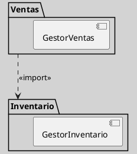
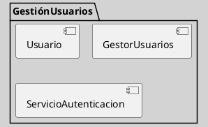

---
{"dg-publish":true,"permalink":"/050 Base de Conocimientos/200  Mi Zettelkasten/100 Docencia/IS1/2025/Clase 17 Diagrama de Paquetes/Zk Diagrama de Paquetes (Acoplamiento y Cohesión)/","tags":["digitalGarden","diagramaDePaquetes"]}
---

## Diagrama de Paquetes (Acoplamiento y Cohesión)

Los principios de **acoplamiento** y **cohesión** son criterios para evaluar la calidad de la modularización en el diseño de sistemas software. Su correcta aplicación impacta directamente en la mantenibilidad, flexibilidad y escalabilidad de los sistemas, facilitando la evolución y el trabajo colaborativo en proyectos de mediana y gran envergadura ([[050 Base de Conocimientos/900 Biblioteca/Zk Lit (Pressman, 2013) Ingeniería del Software - Un Enfoque Práctico (Séptima edición). McGraw-Hill Education\|Pressman, 2013]]; [[050 Base de Conocimientos/900 Biblioteca/Zk Lit (Booch et al., 2006) Booch, G., Rumbaugh, J., y Jacobson, I. (2006). El lenguaje Unificado de Modelado - Guía del Usuario (2a ed). Addison-Wesley.\|Booch et al., 2006]]).

### Acoplamiento

El acoplamiento mide el grado de dependencia entre módulos o paquetes de un sistema. Un **acoplamiento alto** implica que los cambios en un paquete pueden afectar significativamente a otros, dificultando la evolución y el mantenimiento. Por el contrario, un **acoplamiento bajo** indica que los paquetes son relativamente independientes, lo que permite modificar, reemplazar o reutilizar módulos con menor riesgo de efectos colaterales ([[050 Base de Conocimientos/900 Biblioteca/Zk Lit (Pressman, 2013) Ingeniería del Software - Un Enfoque Práctico (Séptima edición). McGraw-Hill Education\|Pressman, 2013]]).

Siguiendo a [[050 Base de Conocimientos/900 Biblioteca/Zk Lit (Pressman, 2013) Ingeniería del Software - Un Enfoque Práctico (Séptima edición). McGraw-Hill Education\|Pressman (2013)]], las características del acoplamiento son:

- **Alto acoplamiento:**
    - Cambios en un paquete suelen requerir modificaciones en otros.
    - Dificulta la reutilización y la prueba de componentes.
    - Ejemplo: Un paquete de “Facturación” que accede directamente a las clases internas de un paquete de “Inventario”.

- **Bajo acoplamiento (deseable):**
    - Los paquetes interactúan mediante interfaces bien definidas.
    - Favorece la independencia, la comprensión y la evolución del sistema.
    - Se logra mediante encapsulación, abstracción y separación clara de responsabilidades 

**Figura**
_Ejemplo de Acoplamiento Bajo_

_Nota_: En este caso es una relación de dependencia controlada, porque el paquete "Ventas" depende de "Inventario" solo a través de una interfaz pública, minimizando el acoplamiento.

### Cohesión

La cohesión evalúa el grado en que los elementos de un paquete están relacionados y colaboran para cumplir una responsabilidad común. Una **alta cohesión** implica que los componentes del paquete trabajan juntos para una función específica, mientras que una** baja cohesión** indica que el paquete agrupa elementos dispersos o con múltiples propósitos ([[050 Base de Conocimientos/900 Biblioteca/Zk Lit (Pressman, 2013) Ingeniería del Software - Un Enfoque Práctico (Séptima edición). McGraw-Hill Education\|Pressman, 2013]]; [[050 Base de Conocimientos/900 Biblioteca/Zk Lit (Booch et al., 2006) Booch, G., Rumbaugh, J., y Jacobson, I. (2006). El lenguaje Unificado de Modelado - Guía del Usuario (2a ed). Addison-Wesley.\|Booch et al., 2006]]).

Son Características de la cohesión ([[050 Base de Conocimientos/900 Biblioteca/Zk Lit (Pressman, 2013) Ingeniería del Software - Un Enfoque Práctico (Séptima edición). McGraw-Hill Education\|Pressman, 2013]]; [[050 Base de Conocimientos/900 Biblioteca/Zk Lit (Booch et al., 2006) Booch, G., Rumbaugh, J., y Jacobson, I. (2006). El lenguaje Unificado de Modelado - Guía del Usuario (2a ed). Addison-Wesley.\|Booch et al., 2006]]):

- **Alta cohesión (deseable):**
    - Los elementos del paquete están fuertemente relacionados y enfocados en una sola funcionalidad.
    - Facilita el mantenimiento, la comprensión y la reutilización.
    - Ejemplo: Un paquete “Gestión de Usuarios” que contiene solo clases y servicios relacionados con usuarios.

- **Baja cohesión:**
    - El paquete agrupa elementos poco relacionados o con responsabilidades múltiples.
    - Genera confusión y dificulta la evolución del sistema.
    - Ejemplo: Un paquete que contiene clases de usuarios, facturación y reportes sin relación directa.

**Figura**
__Ejemplo de Alta Cohesión__

_Nota_: Todos los elementos del paquete “GestiónUsuarios” están orientados a la administración de usuarios, mostrando alta cohesión.

### Buenas Prácticas

- Diseñar paquetes con **bajo acoplamiento** y **alta cohesión** mejora la calidad del software y reduce los riesgos de mantenimiento y evolución ([[050 Base de Conocimientos/900 Biblioteca/Zk Lit (Pressman, 2013) Ingeniería del Software - Un Enfoque Práctico (Séptima edición). McGraw-Hill Education\|Pressman, 2013]]; [[050 Base de Conocimientos/900 Biblioteca/Zk Lit (Booch et al., 2006) Booch, G., Rumbaugh, J., y Jacobson, I. (2006). El lenguaje Unificado de Modelado - Guía del Usuario (2a ed). Addison-Wesley.\|Booch et al., 2006]]).
