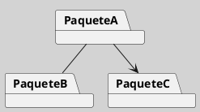
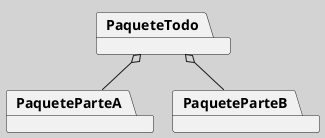
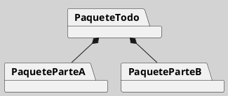
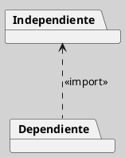

---
{"dg-publish":true,"permalink":"/050 Base de Conocimientos/200  Mi Zettelkasten/100 Docencia/IS1/2025/Clase 17 Diagrama de Paquetes/Zk Diagrama de Paquetes (Elementos y Relaciones)/","tags":["digitalGarden","diagramaDePaquetes"]}
---

## Elementos y Relaciones

### Paquete
Representado como un rectángulo con una pestaña en la esquina superior izquierda.Puede contener clases, interfaces, otros paquetes, casos de uso, etc. Cada paquete debe tener un nombre único en su espacio de nombres ([[050 Base de Conocimientos/900 Biblioteca/Zk Lit (Booch et al., 2006) Booch, G., Rumbaugh, J., y Jacobson, I. (2006). El lenguaje Unificado de Modelado - Guía del Usuario (2a ed). Addison-Wesley.\|Booch et al., 2006]]; [[050 Base de Conocimientos/200  Mi Zettelkasten/010 Informática/Zk (OMG, 2017) About the Unified Modeling Language Specification Version 2.5.1\|OMG, 2017]]; [[050 Base de Conocimientos/900 Biblioteca/Zk Lit (Rumbaugh et al., 2007) Lenguaje Unificado de Modelado. Manual de Referencia\|Rumbaugh et al., 2007]]). 

**Figura**
_Notación del Elemento Paquete_

Analogías:
- Son como unidades modulares que encapsulan elementos relacionados dentro del sistema.

- Es como una caja o contenedor que alberga clases, interfaces e incluso otros paquetes.

- Similar a las carpetas en un sistema de archivos, los paquetes permiten organizar y estructurar los componentes del software de manera significativa.

### Relaciones
Los paquetes pueden estar relacionados mediante [[050 Base de Conocimientos/200  Mi Zettelkasten/100 Docencia/IS1/2025/Clase 08 Modelo Conceptual del UML - Elementos, Relaciones, Reglas y Mecanismos Comunes/Zk Modelo Conceptual del UML (Relaciones)#Dependencia\|dependencias]], [[050 Base de Conocimientos/200  Mi Zettelkasten/100 Docencia/IS1/2025/Clase 08 Modelo Conceptual del UML - Elementos, Relaciones, Reglas y Mecanismos Comunes/Zk Modelo Conceptual del UML (Relaciones)#Generalización\|generalizaciones]], [[050 Base de Conocimientos/200  Mi Zettelkasten/100 Docencia/IS1/2025/Clase 08 Modelo Conceptual del UML - Elementos, Relaciones, Reglas y Mecanismos Comunes/Zk Modelo Conceptual del UML (Relaciones)#Realización\|realizaciones]] y [[050 Base de Conocimientos/200  Mi Zettelkasten/100 Docencia/IS1/2025/Clase 08 Modelo Conceptual del UML - Elementos, Relaciones, Reglas y Mecanismos Comunes/Zk Modelo Conceptual del UML (Relaciones)#Asociación\|asociaciones]].

Estas relaciones son conexiones que representan interacciones dinámicas o estructurales entre los paquetes dentro de un sistema de software. Proporcionan información importante sobre la estructura, dependencias y jerarquía del sistema. Ayudan a comprender cómo los paquetes interactúan entre sí y cómo contribuyen al sistema en general ([[050 Base de Conocimientos/900 Biblioteca/Zk Lit (Booch et al., 2006) Booch, G., Rumbaugh, J., y Jacobson, I. (2006). El lenguaje Unificado de Modelado - Guía del Usuario (2a ed). Addison-Wesley.\|Booch et al., 2006]]; [[050 Base de Conocimientos/200  Mi Zettelkasten/010 Informática/Zk (OMG, 2017) About the Unified Modeling Language Specification Version 2.5.1\|OMG, 2017]]; [[050 Base de Conocimientos/900 Biblioteca/Zk Lit (Rumbaugh et al., 2007) Lenguaje Unificado de Modelado. Manual de Referencia\|Rumbaugh et al., 2007]]).

#### Asociación
Representan una relación semántica entre dos o más paquetes, indicando que están relacionados de alguna manera. La relación pueden ser de cualquier tipo y no necesariamente implican una dependencia directa entre los paquetes ([[050 Base de Conocimientos/900 Biblioteca/Zk Lit (Booch et al., 2006) Booch, G., Rumbaugh, J., y Jacobson, I. (2006). El lenguaje Unificado de Modelado - Guía del Usuario (2a ed). Addison-Wesley.\|Booch et al., 2006]]; [[050 Base de Conocimientos/200  Mi Zettelkasten/010 Informática/Zk (OMG, 2017) About the Unified Modeling Language Specification Version 2.5.1\|OMG, 2017]]; [[050 Base de Conocimientos/900 Biblioteca/Zk Lit (Rumbaugh et al., 2007) Lenguaje Unificado de Modelado. Manual de Referencia\|Rumbaugh et al., 2007]]).

**Figura**
_Notación de Relación de Asociación entre Paquetes_

#### Asociación por Agregación
Tiene la misma semántica que para [[050 Base de Conocimientos/200  Mi Zettelkasten/100 Docencia/IS1/2025/Clase 13 Diagrama de Clases (Fundamentos, Elementos, Relaciones, etc.)/Zk Diagrama de Clases (Relaciones, Agregación)\|Asociación por Agregación que las clases]], pero este caso entre paquetes ([[050 Base de Conocimientos/900 Biblioteca/Zk Lit (Booch et al., 2006) Booch, G., Rumbaugh, J., y Jacobson, I. (2006). El lenguaje Unificado de Modelado - Guía del Usuario (2a ed). Addison-Wesley.\|Booch et al., 2006]]; [[050 Base de Conocimientos/200  Mi Zettelkasten/010 Informática/Zk (OMG, 2017) About the Unified Modeling Language Specification Version 2.5.1\|OMG, 2017]]; [[050 Base de Conocimientos/900 Biblioteca/Zk Lit (Rumbaugh et al., 2007) Lenguaje Unificado de Modelado. Manual de Referencia\|Rumbaugh et al., 2007]]).

**Figura**
_Notación de Relación de Asociación por Agregación entre Paquetes_

#### Asociación por Composición
De igualmente, mantiene la misma semántica que para [[050 Base de Conocimientos/200  Mi Zettelkasten/100 Docencia/IS1/2025/Clase 13 Diagrama de Clases (Fundamentos, Elementos, Relaciones, etc.)/Zk Diagrama de Clases (Relaciones, Composición)\|Asociación por Composición de Clases]], pero este caso entre paquetes ([[050 Base de Conocimientos/900 Biblioteca/Zk Lit (Booch et al., 2006) Booch, G., Rumbaugh, J., y Jacobson, I. (2006). El lenguaje Unificado de Modelado - Guía del Usuario (2a ed). Addison-Wesley.\|Booch et al., 2006]]; [[050 Base de Conocimientos/200  Mi Zettelkasten/010 Informática/Zk (OMG, 2017) About the Unified Modeling Language Specification Version 2.5.1\|OMG, 2017]]; [[050 Base de Conocimientos/900 Biblioteca/Zk Lit (Rumbaugh et al., 2007) Lenguaje Unificado de Modelado. Manual de Referencia\|Rumbaugh et al., 2007]]).

**Figura**
_Notación de Relación de Asociación por Composición entre Paquetes_

#### Generalización
La relación de generalización entre paquetes, muestra que un paquete hereda de otro, estableciendo una relación jerárquica. El paquete más específico hereda características y funcionalidades del paquete más general. Las generalizaciones permiten la reutilización y la organización jerárquica de los paquetes ([[050 Base de Conocimientos/900 Biblioteca/Zk Lit (Booch et al., 2006) Booch, G., Rumbaugh, J., y Jacobson, I. (2006). El lenguaje Unificado de Modelado - Guía del Usuario (2a ed). Addison-Wesley.\|Booch et al., 2006]]; [[050 Base de Conocimientos/200  Mi Zettelkasten/010 Informática/Zk (OMG, 2017) About the Unified Modeling Language Specification Version 2.5.1\|OMG, 2017]]; [[050 Base de Conocimientos/900 Biblioteca/Zk Lit (Rumbaugh et al., 2007) Lenguaje Unificado de Modelado. Manual de Referencia\|Rumbaugh et al., 2007]]).

**Figura**
_Notación de Relación de Generalización entre Paquetes_

```plantuml
@startuml
!pragma layout smetana
skinparam style strictuml
skinparam BackgroundColor LightGray
skinparam conditionStyle InsideDiamond
scale 1

package PaqueteGeneral
package PaqueteEspecífico

PaqueteGeneral <|-- PaqueteEspecífico
@enduml
```

#### Realización
Representa una relación en la que un paquete implementa una interfaz definida por otro paquete. Esto es común en entornos de desarrollo orientados a interfaces, donde un paquete proporciona una implementación concreta de los métodos definidos en una interfaz de otro paquete ([[050 Base de Conocimientos/900 Biblioteca/Zk Lit (Booch et al., 2006) Booch, G., Rumbaugh, J., y Jacobson, I. (2006). El lenguaje Unificado de Modelado - Guía del Usuario (2a ed). Addison-Wesley.\|Booch et al., 2006]]; [[050 Base de Conocimientos/200  Mi Zettelkasten/010 Informática/Zk (OMG, 2017) About the Unified Modeling Language Specification Version 2.5.1\|OMG, 2017]]; [[050 Base de Conocimientos/900 Biblioteca/Zk Lit (Rumbaugh et al., 2007) Lenguaje Unificado de Modelado. Manual de Referencia\|Rumbaugh et al., 2007]]).

**Figura**
_Notación de Relación de Realización entre Paquetes_

```plantuml
@startuml
!pragma layout smetana
skinparam style strictuml
skinparam BackgroundColor LightGray
skinparam conditionStyle InsideDiamond
scale 1

package Interfaz
package Realizador

Interfaz <|... Realizador
@enduml
```

#### Dependencia
Es un tipo especial de dependencia que indica que un paquete utiliza las definiciones de otro, como clases o interfaces ([[050 Base de Conocimientos/900 Biblioteca/Zk Lit (Booch et al., 2006) Booch, G., Rumbaugh, J., y Jacobson, I. (2006). El lenguaje Unificado de Modelado - Guía del Usuario (2a ed). Addison-Wesley.\|Booch et al., 2006]]; [[050 Base de Conocimientos/200  Mi Zettelkasten/010 Informática/Zk (OMG, 2017) About the Unified Modeling Language Specification Version 2.5.1\|OMG, 2017]]; [[050 Base de Conocimientos/900 Biblioteca/Zk Lit (Rumbaugh et al., 2007) Lenguaje Unificado de Modelado. Manual de Referencia\|Rumbaugh et al., 2007]]).

**Figura**
_Notación de Relación de Dependencia entre Paquetes_

