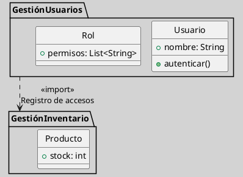
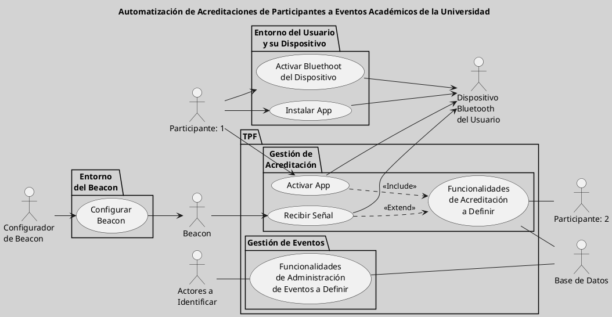

---
{"dg-publish":true,"permalink":"/050 Base de Conocimientos/200  Mi Zettelkasten/100 Docencia/IS1/2025/Clase 17 Diagrama de Paquetes/Zk Diagrama de Paquetes (Relación con Otros Diagramas UML)/","tags":["digitalGarden","diagramaDePaquetes"]}
---

## Diagrama de Paquetes y su Relación con Otros Diagramas del UML

Los diagramas de paquetes UML no operan de forma aislada, sino que se integran con otros diagramas [[050 Base de Conocimientos/200  Mi Zettelkasten/100 Docencia/IS1/2025/Clase 07 Modelo Conceptual del UML - Diagramas/Zk Diagramas UML 2.5.1 (Estructurales)\|estructurales]] y de [[050 Base de Conocimientos/200  Mi Zettelkasten/100 Docencia/IS1/2025/Clase 07 Modelo Conceptual del UML - Diagramas/Zk Diagramas UML 2.5.1 (Dinámicos)\|comportamiento]] para proporcionar una visión completa del sistema. Esta interacción permite organizar elementos complejos y documentar relaciones arquitectónicas críticas ([[050 Base de Conocimientos/900 Biblioteca/Zk Lit (Booch et al., 2006) Booch, G., Rumbaugh, J., y Jacobson, I. (2006). El lenguaje Unificado de Modelado - Guía del Usuario (2a ed). Addison-Wesley.\|Booch et al., 2006]]; [[050 Base de Conocimientos/900 Biblioteca/Zk Lit (Rumbaugh et al., 2007) Lenguaje Unificado de Modelado. Manual de Referencia\|Rumbaugh et al., 2007]]). 

### Integración con Diagramas de Clases

**Función**
Agrupan clases relacionadas en módulos lógicos, reduciendo la complejidad visual.

**Figura**
_Notación del Elemento Paquete_

_Nota_: Interpretación
- Las clases `Usuario` y `Rol` se encapsulan en un paquete cohesivo.
- La dependencia `<<import>>` indica que `GestiónUsuarios` utiliza elementos de `GestiónInventario` [[050 Base de Conocimientos/900 Biblioteca/Zk Lit (Pressman, 2013) Ingeniería del Software - Un Enfoque Práctico (Séptima edición). McGraw-Hill Education\|(Pressman, 2013)]].

### Integración con Diagramas de Casos de Uso

**Función**
Cada paquete puede contener casos de uso relacionados con un subsistema específico. Facilitando la compresión de los mismos, en un entorno cohesivo.

**Figura**
_Notación del Elemento Paquete_

_Nota_: En este diagrama se observa como los casos de uso están agrupados conforme a criterios funcionales y/o de entorno. Esta segregación, permite una mejor interpretación de los casos de uso y también asignar a equipos de desarrollo en la fase correspondiente.

### Otros Diagramas
Esta misma lógica se repite con todos los demás diagramas de UML.
