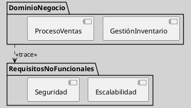
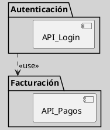
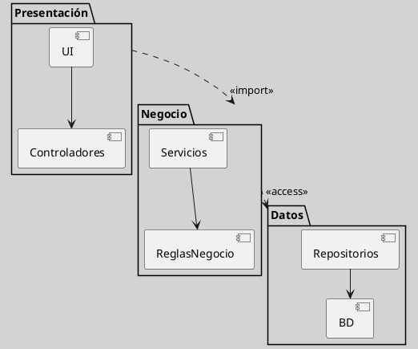

---
{"dg-publish":true,"permalink":"/050 Base de Conocimientos/200  Mi Zettelkasten/100 Docencia/IS1/2025/Clase 17 Diagrama de Paquetes/Zk Diagrama de Paquetes y el SDLC/","tags":["digitalGarden","diagramaDePaquetes"]}
---

## Diagrama de Paquetes y el SDLC

El diagrama de paquetes puede integrarse en cada fase del [[050 Base de Conocimientos/200  Mi Zettelkasten/100 Docencia/IS1/2025/Clase 03 Costos y Complejidad del Software/Zk Ciclo de Vida del Desarrollo del Software\|SDLC]], facilitando la gestión de complejidad y documentación de su arquitectura. Su aplicación sistemática mejora la trazabilidad y reduce riesgos en proyectos de mediana/gran escala ([[050 Base de Conocimientos/900 Biblioteca/Zk Lit (Booch et al., 2006) Booch, G., Rumbaugh, J., y Jacobson, I. (2006). El lenguaje Unificado de Modelado - Guía del Usuario (2a ed). Addison-Wesley.\|Booch et al., 2006]]; [[050 Base de Conocimientos/900 Biblioteca/Zk Lit (Pressman, 2013) Ingeniería del Software - Un Enfoque Práctico (Séptima edición). McGraw-Hill Education\|Pressman, 2013]]). 

### En Identificación del Problema y Planificación

**Función**
Delimitar alcance y estructura modular inicial.

**Figura**
_Diagrama de Paquete en las Fases de Identificación del Problema y Planificación_

_Nota_: `<<trace>>` indica una dependencia crítica

### Captura y Análisis de Requerimientos

**Función**
Agrupar funcionalidades por dominios.

**Figura**
_Diagrama de Paquete en las Fases de Captura y Análisis de Requerimientos_


### Diseño del Sistema

**Función**
Definir arquitectura en capas y reducir acoplamiento.

**Figura**
_Diagrama de Paquete en la Fase de Diseño del Sistema_


### Implementación / Desarrollo

**Función**
Mapear paquetes a estructuras de código.

**Figura**
_Codificación_
```java
// Módulo Usuarios
package com.aplicacion.usuarios;
public class GestorUsuarios { ... }

// Módulo Inventario
package com.aplicacion.inventario;
import com.aplicacion.usuarios.GestorUsuarios;
```

### Otras Fases del SDLC
El diagrama de paquetes es una herramienta útil, que puede ser utilizada en todas las fases del SDLC.