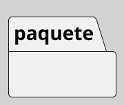

---
{"dg-publish":true,"permalink":"/050 Base de Conocimientos/200  Mi Zettelkasten/100 Docencia/Ingeniería del Software 1/Clase 08 Modelo Conceptual del UML - Elementos, Relaciones, Reglas y Mecanismos Comunes/Zk Modelo Conceptual del UML (Elementos de Agrupación)/","tags":["#digitalGarden"]}
---

## Elemento de Agrupación del Modelo Conceptual del UML

Los elementos de agrupación son mecanismos organizativos en UML que permiten estructurar modelos complejos mediante la encapsulación lógica de componentes relacionados. Su principal función es **modularizar sistemas** y gestionar dependencias entre partes del modelo ([[050 Base de Conocimientos/900 Biblioteca/boochLenguajeUnificadoModelado2006/Zk Ref boochLenguajeUnificadoModelado2006\|Booch et al. (2006)]]; [[050 Base de Conocimientos/900 Biblioteca/omgUnifiedModelingLanguage2017/Zk Lit (OMG, 2017) UML Specifications\|OMG, 2017]]; [[050 Base de Conocimientos/900 Biblioteca/rumbaughLenguajeUnificadoModelado2000/Zk Ref rumbaughLenguajeUnificadoModelado2000\|Rumbaugh et al., 2000]].

### Elemento

#### Actividad

| Item       | Descripción                                                                                                                                                                                                                                              |
| ---------- | -------------------------------------------------------------------------------------------------------------------------------------------------------------------------------------------------------------------------------------------------------- |
| Definición | Contenedores genéricos para clases, casos de uso, diagramas u otros paquetes [[050 Base de Conocimientos/900 Biblioteca/boochLenguajeUnificadoModelado2006/Zk Ref boochLenguajeUnificadoModelado2006\|(Booch et al., 2006)]]. |
| Uso        | -  Agrupar elementos por capas (ejemplo: `Frontend`, `Backend`, `Subsistema`). - Evitar colisiones de nombres en proyectos grandes.                                                                                                                   |

**Figura**
_Representación Gráfica de la Actividad_

