---
{"dg-publish":true,"permalink":"/050 Base de Conocimientos/200  Mi Zettelkasten/100 Docencia/Org1/2025/Clase 02 Introducción a la Teoría General de Sistemas/Zk Enfoque de Sistemas/","tags":["definir"]}
---

## Enfoque de Sistemas
El enfoque de sistemas, también conocido como pensamiento sistémico, representa una metodología integral para analizar y comprender fenómenos complejos. Este enfoque reconoce que los sistemas, ya sean naturales o artificiales, están compuestos por elementos interrelacionados que funcionan como un todo. La perspectiva sistémica nos permite examinar no solo los componentes individuales, sino también las interacciones y relaciones entre ellos [[050 Base de Conocimientos/900 Biblioteca/Zk Lit (Johansen Bertoglio, 2013) Introducción a la Teoría General de Sistemas\|(Johansen Bertoglio, 2013)]]. 

## El Enfoque de Sistemas y la Teoría General de Sistemas
La [[050 Base de Conocimientos/200  Mi Zettelkasten/100 Docencia/Org1/2025/Clase 02 Introducción a la Teoría General de Sistemas/Zk Enfoque de la Teoría General de Sistemas\|Teoría General de Sistemas (TGS)]] es la manifestación más desarrollada y formalizada del enfoque de sistemas. Por lo tanto, cuando hablamos del enfoque de la TGS, nos estamos refiriendo a una aplicación específica y teóricamente fundamentada del enfoque de sistemas en general.

## Resumen Gráfico

```plantuml
@startuml
!pragma layout smetana
skinparam style strictuml
skinparam conditionStyle InsideDiamond
skinparam ConditionEndStyle hline
skinparam classAttributeIconSize 0
skinparam defaultTextAlignment center
skinparam linetype ortho
skinparam wrapWidth 200
'skinparam packageStyle rectangle
'skinparam packageBackgroundColor LightGray

class "Enfoque de Sistemas" {
    + Visión Holística
    + Interrelaciones
    + Perspectiva Sistémica
}
note top of "Enfoque de Sistemas" : Metodología integral para analizar fenómenos complejos

@enduml
```

