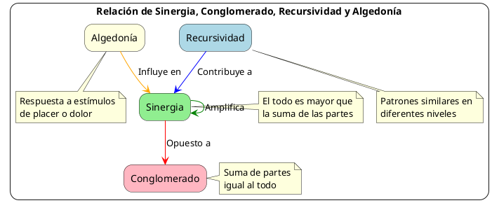

---
{"dg-publish":true,"permalink":"/050 Base de Conocimientos/200  Mi Zettelkasten/100 Docencia/Org1/2025/Clase 03 Sinergia y Recursividad/Zk Relación de Sinergia, Conglomerado, Recursividad y Algedonía/","tags":["definir"]}
---

## Relación de Sinergia, Conglomerado, Recursividad y Algedonía

Los conceptos de Sinergia, Conglomerado, Recursividad y Algedonía están interrelacionados en la Teoría General de Sistemas de la siguiente manera:

### Sinergia y Conglomerado

La [[050 Base de Conocimientos/200  Mi Zettelkasten/100 Docencia/Org1/2025/Clase 03 Sinergia y Recursividad/Zk Sinergia en la Teoría General de Sistemas\|sinergia]] se refiere al fenómeno donde el todo es mayor que la suma de sus partes. En contraste, un [[050 Base de Conocimientos/200  Mi Zettelkasten/100 Docencia/Org1/2025/Clase 03 Sinergia y Recursividad/Zk Conglomerado\|conglomerado]] es una totalidad desprovista de sinergia, donde la suma de las partes es igual al todo. La sinergia surge de las interacciones entre los componentes de un sistema, mientras que en un conglomerado, los elementos están agrupados pero no interactúan significativamente.

### Recursividad y Sinergia

La [[050 Base de Conocimientos/200  Mi Zettelkasten/100 Docencia/Org1/2025/Clase 03 Sinergia y Recursividad/Zk Recursividad en la Teoría General de Sistemas\|recursividad]] en la TGS implica la repetición de patrones o estructuras similares en diferentes niveles de un sistema. Esta característica permite que el efecto [[050 Base de Conocimientos/200  Mi Zettelkasten/100 Docencia/Org1/2025/Clase 03 Sinergia y Recursividad/Zk Sinergia en la Teoría General de Sistemas\|sinérgico]] se manifiesten a múltiples escalas dentro del sistema. La recursividad contribuye a la creación de sinergia al permitir que las interacciones entre componentes se repliquen y amplifiquen a través de diferentes niveles de organización.

### Algedonía y Sinergia

El concepto de la [[050 Base de Conocimientos/200  Mi Zettelkasten/100 Docencia/Org1/2025/Clase 03 Sinergia y Recursividad/Zk Algedonía\|algedonía]] se relaciona con la capacidad de un sistema para responder a estímulos de "placer" o "dolor". En el contexto de la [[050 Base de Conocimientos/200  Mi Zettelkasten/100 Docencia/Org1/2025/Clase 03 Sinergia y Recursividad/Zk Sinergia en la Teoría General de Sistemas\|sinergia]], la algedonía podría influir en cómo los componentes de un sistema interactúan para producir efectos sinérgicos positivos (placer) o negativos (dolor).

### Integración de los conceptos

Estos conceptos juntos ayudan a comprender la complejidad, adaptabilidad y evolución de los sistemas en la Teoría General de Sistemas:

- La [[050 Base de Conocimientos/200  Mi Zettelkasten/100 Docencia/Org1/2025/Clase 03 Sinergia y Recursividad/Zk Sinergia en la Teoría General de Sistemas\|sinergia]] emerge cuando los componentes de un sistema **interactúan** de manera que el resultado es mayor que la suma de sus partes individuales.

- El [[050 Base de Conocimientos/200  Mi Zettelkasten/100 Docencia/Org1/2025/Clase 03 Sinergia y Recursividad/Zk Conglomerado\|conglomerado]] representa el estado opuesto, donde **no hay interacciones** significativas ni efectos emergentes.

- La [[050 Base de Conocimientos/200  Mi Zettelkasten/100 Docencia/Org1/2025/Clase 03 Sinergia y Recursividad/Zk Recursividad en la Teoría General de Sistemas\|recursividad]] permite que los patrones sinérgicos se repitan y amplíen a través de diferentes niveles del sistema.

- La [[050 Base de Conocimientos/200  Mi Zettelkasten/100 Docencia/Org1/2025/Clase 03 Sinergia y Recursividad/Zk Algedonía\|algedonía]] puede influir en cómo el sistema busca y mantiene estados sinérgicos positivos mientras evita los negativos.