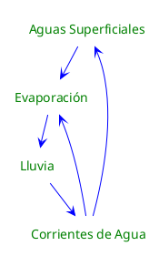

---
{"dg-publish":true,"permalink":"/050 Base de Conocimientos/200  Mi Zettelkasten/100 Docencia/Org1/2025/Clase 03 Sinergia y Recursividad/Zk Sinergia en Acción (Ciclo de Vida del Agua)/","tags":["digitalGarden","sinergia"]}
---

## Sinergia en Acción (Ciclo de Vida del Agua)

La [[050 Base de Conocimientos/200  Mi Zettelkasten/100 Docencia/Org1/2025/Clase 03 Sinergia y Recursividad/Zk Sinergia en la Teoría General de Sistemas\|sinergia]] juega un papel fundamental en el contexto de la compresión de la dinámica interna que se desarrolla en un sistemas. Utilizaremos un ejemplo cotidiano para ilustrar cómo las variables interactúan y se refuerzan mutuamente.

### Variables

- Aguas Superficiales (lagos, estanques, océanos, etc.)
- Evaporación (evaporación de las aguas)
- Lluvia (agua evaporada que vuelve a caer)
- Corrientes de Agua (rios, arroyos, etc.)

### Relación de Variables

- Aguas Superficiales y Evaporación
	- La cantidad de agua en las aguas superficiales influye positivamente en la evaporación.
	- Cuanto más agua en las aguas superficiales, más evaporación ocurre.

- Evaporación y Lluvias
	- La evaporación influye positivamente en la lluvia.
	- Más evaporación significa más vapor de agua disponible para condensarse y caer como lluvia.

- Lluvia y Corrientes de Agua
	- La lluvia influye positivamente en las corrientes de agua.
	- Más lluvia significa más agua disponible para las corrientes.

- Corrientes de Agua y Evaporación
	- La cantidad de agua en las corrientes de agua influye positivamente en la evaporación, aunque en menor medida que las Aguas Superficiales
	- Cuanto más agua en las corrientes de agua, más evaporación ocurre.

- Corrientes de Agua y Aguas Superficiales
	- Las corrientes de agua influyen positivamente en las aguas superficiales.
	- Las corrientes finalmente desembocan en las aguas superficiales, aumentando su volumen.

Este ejemplo muestra cómo las variables en un sistema (en este caso, un el ciclo de vida del agua) **interactúan** de manera **sinérgica**, para crear un **efecto mayor que la suma de sus partes**. Además, ilustra cómo estos efectos pueden ser recursivos, donde el cambio en una variable puede influir en otras y eventualmente volver a influir en sí misma a través de un ciclo de retroalimentación.