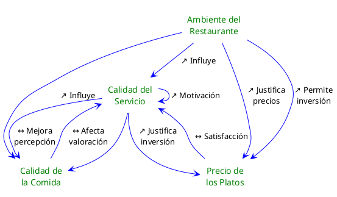

---
{"dg-publish":true,"permalink":"/050 Base de Conocimientos/200  Mi Zettelkasten/100 Docencia/Org1/2025/Clase 03 Sinergia y Recursividad/Zk Sinergia en Acción (Ejemplo)/","tags":["digitalGarden","sinergia"]}
---

## Sinergia en Acción (Ejemplo)

La [[050 Base de Conocimientos/200  Mi Zettelkasten/100 Docencia/Org1/2025/Clase 03 Sinergia y Recursividad/Zk Sinergia en la Teoría General de Sistemas\|sinergia]] juega un papel fundamental en el contexto de la compresión de la dinámica interna que se desarrolla en un sistemas. Utilizaremos un ejemplo cotidiano para ilustrar cómo las variables interactúan y se refuerzan mutuamente.

### Sinergia en un Restaurante

Para este ejemplo, consideremos las siguientes variables:

- Calidad del Servicio
- Calidad de la Comida
- Ambiente del Restaurante
- Precio de los Platos

Analicemos si existe algún tipo de interacción entre estas variables:

- Calidad del Servicio y Calidad de la Comida
	Si la Calidad del servicio es excelente, los clientes valoran más la Calidad de la Comida, incluso si no es perfecta. A su vez, una comida deliciosa mejora la percepción del servicio.
    
- Ambiente del Restaurante y Calidad del Servicio
	Un ambiente acogedor y bien acondicionado aumenta la percepción de calidad tanto del servicio como de la comida. Esto puede llevar a que los clientes estén dispuestos a pagar precios más altos.
    
- Precio de los Platos y Calidad del Servicio
	Si los precios son razonables en comparación con la Calidad del Servicio y la Calidad de la Comida, los clientes se sienten satisfechos y más propensos a regresar.
	Esto, a su vez, puede aumentar la calidad del servicio, ya que el personal se siente más motivado por la buena retroalimentación.

Un aumento en la Calidad del Servicio puede llevar a más clientes satisfechos, lo que a su vez puede mejorar la calidad del servicio al aumentar la motivación del personal.

Si el restaurante decide invertir en mejorar el ambiente, esto puede aumentar la percepción general del establecimiento, lo que a su vez puede justificar precios más altos, lo que a su vez puede permitir más inversiones en calidad y servicio.

Este ejemplo muestra cómo las variables en un sistema (en este caso, un restaurante) **interactúan** de manera **sinérgica**, para crear un **efecto mayor que la suma de sus partes**. Además, ilustra cómo estos efectos pueden ser recursivos, donde el cambio en una variable puede influir en otras y eventualmente volver a influir en sí misma a través de un ciclo de retroalimentación.