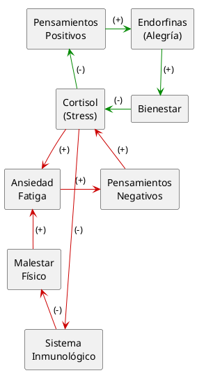

---
{"dg-publish":true,"permalink":"/050 Base de Conocimientos/200  Mi Zettelkasten/100 Docencia/Org1/2025/Clase 04 Dinámica de Sistemas/Zk Diagrama de Bucle Causal (Ejemplo de Incidencia de los Pensamientos en el Sistema Inmunológico del ser Humano)/","tags":["digitalGarden","diagramaCausal"]}
---

## Dinámica Causal Incidencia de los Pensamientos en el Sistema Inmunológico del ser Humano

Figura
_Dinámica Causal Incidencia de los Pensamientos en el Sistema Inmunológico del ser Humano_

Fuente: Elaboración Propia

### Interpretación

#### 1. Flujos Principales

1. **Pensamientos positivos → (+) Endorfinas → (+) Bienestar → (−) Cortisol**
    
    - Pensamientos positivos incrementan la liberación de endorfinas, asociadas con alegría y placer.​
        
    - Más endorfinas aumentan el bienestar subjetivo y reducen la percepción de dolor, lo que disminuye la activación del eje del estrés y, por tanto, el cortisol.
        
2. **Cortisol → (−) Pensamientos positivos**
    
    - Un nivel elevado de cortisol se asocia con peor estado de ánimo, dificultad para experimentar placer y mayor tendencia a la preocupación, lo que reduce la frecuencia de pensamientos positivos.
        
3. **Pensamientos negativos → (+) Cortisol → (+) Ansiedad/Fatiga → (+) Pensamientos negativos**
    
    - Los pensamientos negativos y la rumiación activan la respuesta de estrés, elevando el cortisol.
        
    - Más cortisol incrementa la ansiedad y la fatiga, que a su vez alimentan la rumiación y los pensamientos negativos, cerrando un círculo vicioso.
        
4. **Cortisol → (−) Sistema inmunológico → (−) Malestar físico → (+) Ansiedad/Fatiga**
    
    - Un cortisol crónicamente alto deprime la respuesta del sistema inmunológico, disminuyendo la capacidad de defenderse de infecciones y otras agresiones.
        
    - Un sistema inmune debilitado aumenta el malestar físico, lo que incrementa la ansiedad y la fatiga y refuerza las dinámicas negativas.

#### 2. Bucles Causales del Diagrama

El diagrama presenta **tres bucles de refuerzo (R)**, que describen cómo el sistema puede entrar en espirales ascendentes (virtuosas) o descendentes (viciosas).

- **R1 (reforzador “bueno”)**  
    Pensamientos positivos → (+) Endorfinas → (+) Bienestar → (−) Cortisol → (−) Pensamientos positivos.  
    Al disminuir el cortisol, se reducen las condiciones que dificultan los pensamientos positivos, facilitando su mantenimiento y potenciando el círculo virtuoso.
    
- **R2 (reforzador “malo” corto)**  
    Pensamientos negativos → (+) Cortisol → (+) Ansiedad/Fatiga → (+) Pensamientos negativos.  
    La combinación de rumiación, cortisol elevado y síntomas de ansiedad/fatiga genera un circuito de deterioro progresivo en el humor y el bienestar psicológico.
    
- **R3 (reforzador “malo” ampliado con cuerpo)**  
    Cortisol → (−) Sistema inmunológico → (−) Malestar físico → (+) Ansiedad/Fatiga → (+) Pensamientos negativos → (+) Cortisol.  
    Aquí se integra la dimensión somática: el estrés sostenido debilita el cuerpo, el malestar físico incrementa la ansiedad y los pensamientos negativos, y eso vuelve a elevar el cortisol.

#### 3. Ausencia de mecanismos de equilibrio (bucles negativos)

El sistema, tal como está modelado, **carece de bucles de equilibrio explícitos** que limiten el crecimiento del estrés o consoliden el bienestar. La dinámica está dominada por patrones reforzadores, por lo que tiende a estabilizarse en “atractores emocionales” (bienestar con cortisol bajo, o malestar con cortisol alto).

Para romper los círculos viciosos y fortalecer los virtuosos, se podrían introducir variables reguladoras, por ejemplo:

- **Prácticas de regulación emocional y cognitiva** (meditación, reestructuración cognitiva, terapia): reducen la rumiación y los pensamientos negativos, disminuyendo el cortisol y facilitando pensamientos positivos.
    
- **Actividad física regular**: aumenta endorfinas y bienestar, reduce cortisol y mejora la función inmunológica.

- **Apoyo social y hábitos de sueño saludables**: amortiguan la respuesta al estrés, reducen ansiedad/fatiga y contribuyen a mantener cortisol en rangos adaptativos.

Agregar a seguimiento

Comprobar fuentes