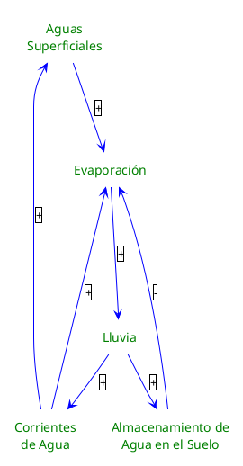

---
{"dg-publish":true,"permalink":"/050 Base de Conocimientos/200  Mi Zettelkasten/100 Docencia/Org1/2025/Clase 04/Zk Diagrama de Bucle Causal (Ejemplo del Ciclo de Vida del Agua) con una Nueva Variable/","tags":["definir"]}
---

## Diagrama de Bucle Causal (Ejemplo del Ciclo de Vida del Agua) con una Nueva Variable

En el modelado, análisis y simulación del comportamiento de sistemas complejos, a menudo es necesario agregar o eliminar variables para evaluar su impacto en un contexto específico. En este caso, incorporaremos una nueva variable para analizar su efecto particular.

En nuestro ejemplo sobre el el [[050 Base de Conocimientos/200  Mi Zettelkasten/100 Docencia/Org1/2025/Clase 04/Zk Diagrama de Bucle Causal (Ejemplo del Ciclo de Vida del Agua)\|Ciclo de Vida del Agua]], consideraremos que no toda el agua de lluvia regresa directamente a las superficies de agua. En la realidad, una parte se infiltra en el suelo y queda almacenada en él. Introduciremos al modelo la variable Almacenamiento de Agua en el Suelo.

### Análisis de Variables
Solo analizaremos la nueva variable introducida, las demás permanecen como en el ejemplo original.

- Lluvia y Almacenamiento de Agua en el Suelo
	- La lluvia favorece que los suelos permeables absorban parte del agua
- Almacenamiento de Agua en el Suelo y Evaporación
	- El agua absorbida por el suelo, hace que la cantidad de agua evaporada disminuya

### Identificación de Bucles
- Aguas Superficiales - Evaporación - Lluvia - Corrientes de Agua - Aguas Superficiales
	- Tipo de Bucle: (+) o de Refuerzo, porque el número de relaciones negativas es cero (considerado par).
- Aguas Superficiales - Evaporación - Lluvia - Corrientes de Agua - Evaporación
	- Tipo de Bucle: (+) o de Refuerzo, porque el número de relaciones negativas es cero (considerado par).

#### Nuevo Bucle
- Evaporación - Lluvia - Almacenamiento de Agua en el Suelo - Evaporación
	- Tipo de Bucle: (-) o Equilibrio, porque el número de relaciones negativas es impar.

### Análisis de la Estabilidad del Modelo
Para determinar si un modelo es estable o inestable en el contexto de un Diagrama de Bucle Causal, se analiza el comportamiento de los bucles presentes en el sistema. Un sistema es estable si tiende a regresar a un estado de equilibrio después de una perturbación, mientras que un sistema inestable se aleja del equilibrio.

La estabilidad del sistema depende de cómo interactúan los bucles entre sí.

En este caso, el bucle de equilibrio actúa como un mecanismo de retroalimentación negativa que ayuda a estabilizar el sistema. Cuando la evaporación aumenta, más agua se evapora, lo que eventualmente conduce a más lluvia, que a su vez aumenta el almacenamiento de agua en el suelo. A medida que el suelo se satura, la evaporación disminuye debido a la relación negativa entre el almacenamiento de agua en el suelo y la evaporación.

Por lo tanto, el modelo puede considerarse **estable** porque incluye un bucle de equilibrio que ayuda a mantener el sistema en un estado estable a pesar de las perturbaciones. Sin embargo, la estabilidad real dependerá de los parámetros específicos del sistema, como la intensidad de las relaciones y las condiciones iniciales.