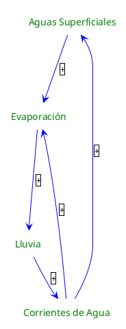

---
{"dg-publish":true,"permalink":"/050 Base de Conocimientos/200  Mi Zettelkasten/100 Docencia/Org1/2025/Clase 04/Zk Diagrama de Bucle Causal (Ejemplo del Ciclo de Vida del Agua)/","tags":["definir"]}
---

## Diagrama de Bucle Causal (Ejemplo del Ciclo de Vida del Agua)

Basados en el [[050 Base de Conocimientos/200  Mi Zettelkasten/100 Docencia/Org1/2025/Clase 03 Sinergia y Recursividad/Zk Sinergia en Acción (Ciclo de Vida del Agua)\| ejemplo del Ciclo de Vida del Agua]], analizamos las variables para determinar el [[050 Base de Conocimientos/200  Mi Zettelkasten/100 Docencia/Org1/2025/Clase 04/Zk Tipos de Relaciones Causales\|tipo de relación causal]] entre ellas.

### Análisis de Variables
- Aguas Superficiales y Evaporación 
	- La cantidad de agua en las aguas superficiales influye positivamente en la evaporación.
	- Cuanto más agua en las aguas superficiales, más evaporación ocurre.
	- Tipo de Relación Causal: Positiva **(+)**

- Evaporación y Lluvias
	- La evaporación influye positivamente en la lluvia.
	- Más evaporación significa más vapor de agua disponible para condensarse y caer como lluvia.
	- Tipo de Relación Causal: Positiva **(+)**

- Lluvia y Corrientes de Agua
	- La lluvia influye positivamente en las corrientes de agua.
	- Más lluvia significa más agua disponible para las corrientes.
	- Tipo de Relación Causal: Positiva **(+)**

- Corrientes de Agua y Evaporación
	- La cantidad de agua en las corrientes de agua influye positivamente en la evaporación, aunque en menor medida que las Aguas Superficiales
	- Cuanto más agua en las corrientes de agua, más evaporación ocurre.
	- Tipo de Relación Causal: Positiva **(+)**

- Corrientes de Agua y Aguas Superficiales
	- Las corrientes de agua influyen positivamente en las aguas superficiales.
	- Las corrientes finalmente desembocan en las aguas superficiales, aumentando su volumen.
	- Tipo de Relación Causal: Positiva **(+)**

### Identificación de Bucles
- Aguas Superficiales - Evaporación - Lluvia - Corrientes de Agua - Aguas Superficiales
	- Tipo de Bucle: (+) o de Refuerzo, porque el número de relaciones negativas es cero (considerado par).
- Aguas Superficiales - Evaporación - Lluvia - Corrientes de Agua - Evaporación
	- Tipo de Bucle: (+) o de Refuerzo, porque el número de relaciones negativas es cero (considerado par).
- Evaporación - Lluvia - Almacenamiento de Agua en el Suelo - Evaporación

### Análisis de la Estabilidad del Modelo
Este modelo se considerarse **inestable** en el sentido de que no incluye un mecanismo de retroalimentación negativa que contrarreste los cambios excesivos en el sistema. Sin embargo, en el contexto real del ciclo del agua, existen muchos mecanismos naturales que ayudan a mantener el equilibrio, como la infiltración y el almacenamiento de agua en el suelo, que actúan como mecanismos de equilibrio.