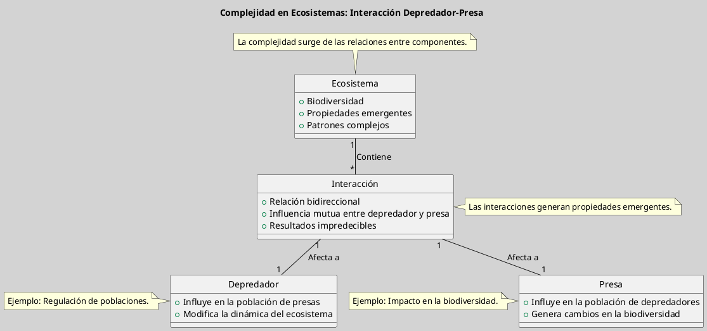

---
{"dg-publish":true,"permalink":"/050 Base de Conocimientos/200  Mi Zettelkasten/100 Docencia/Org1/2025/Clase 06 Sistemas (Fronteras, Complejidad y Tipologías)/Zk La Complejidad del Sistema/","tags":["digitalGarden","complejidad"]}
---

## Complejidad del Sistema

**La complejidad de un sistema se debe a la interacción entre sus componentes y al número de variables que influyen en su comportamiento**. Esto puede llevar a resultados impredecibles y a la emergencia de propiedades que no están presentes en los componentes individuales. Según [[050 Base de Conocimientos/900 Biblioteca/Zk Lit (García, 2020) Teoría y Ejercicios Prácticos de Dinámica de Sistemas\|García (2020)]], la complejidad es un aspecto clave en la comprensión de sistemas económicos, ambientales y sociales, donde la interacción entre diferentes elementos puede generar patrones complejos y dinámicos.

### Ejemplo

**Complejidad en Ecosistemas**: Los ecosistemas son sistemas complejos donde la interacción entre especies y su entorno puede generar patrones complejos. La relación entre depredadores y presas ilustra cómo esta interacción influye en la población de ambas especies y en la biodiversidad del ecosistema. Este tipo de interacciones es un ejemplo clásico de cómo la complejidad puede dar lugar a comportamientos emergentes que no son predecibles a partir de las propiedades individuales de los componentes, como se discute en [[050 Base de Conocimientos/900 Biblioteca/Zk Lit (von Bertalanffy, 1989) Teoría General de los Sistemas Fundamentos, Desarrollo, Aplicaciones\|von Bertalanffy (1989)]].

**Figura**
_Complejidad en Ecosistemas: Relación Depredador - Presa_

Nota: Elaboración propia a partir del ejemplo.

### Importancia de la Complejidad

La complejidad es vital para la adaptabilidad y la resiliencia de los sistemas. En sistemas complejos, como los económicos o ambientales, la interacción entre componentes puede generar resultados impredecibles y patrones emergentes. Según [[050 Base de Conocimientos/200  Mi Zettelkasten/040 Teoría General de Sistemas (TGS)/Zk (Ossa Ossa, 2016) Teoría General de Sistemas -  Conceptos y Aplicaciones\|Ossa Ossa (2016)]], comprender la complejidad es esencial para gestionar sistemas complejos y predecir su comportamiento en diferentes escenarios.