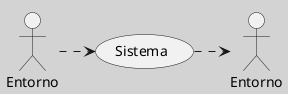

---
{"dg-publish":true,"permalink":"/050 Base de Conocimientos/200  Mi Zettelkasten/100 Docencia/Org1/2025/Clase 06 Sistemas (Fronteras, Complejidad y Tipologías)/Zk Sistemas Cerrados/","tags":["digitalGarden"]}
---

## Sistemas Cerrados

### Definición

Un sistema cerrado se define como aquel que no intercambia [[050 Base de Conocimientos/200  Mi Zettelkasten/100 Docencia/Org1/2025/Clase 06 Sistemas (Fronteras, Complejidad y Tipologías)/Zk Sistemas (Intercambio de Materia)\|materia]] con su entorno, aunque puede intercambiar [[050 Base de Conocimientos/200  Mi Zettelkasten/100 Docencia/Org1/2025/Clase 06 Sistemas (Fronteras, Complejidad y Tipologías)/Zk Sistemas (Intercambio de Energía)\|energía]] en forma de calor o trabajo. Esta definición está en línea con las ideas generales sobre sistemas en la Teoría General de Sistemas, como se discute en trabajos de [[050 Base de Conocimientos/900 Biblioteca/Zk Lit (von Bertalanffy, 1989) Teoría General de los Sistemas Fundamentos, Desarrollo, Aplicaciones\|von Bertalanffy (1989)]].

**Figura**
_Sistemas Cerrados

Fuente: Elaboración propia
_Nota:_ La línea punteada es para indicar que "puede"

En la práctica, pocos sistemas son completamente cerrados, ya que la mayoría interactúa de alguna manera con su entorno. La definición tradicional de sistemas cerrados excluye el intercambio de [[050 Base de Conocimientos/200  Mi Zettelkasten/100 Docencia/Org1/2025/Clase 06 Sistemas (Fronteras, Complejidad y Tipologías)/Zk Sistemas (Intercambio de Información)\|información]], pero en contextos teóricos o abstractos, podría haber un intercambio limitado de información a través de retroalimentación o modelos específicos.

La teoría de sistemas cerrados ha sido útil en ciencias como la física para modelar sistemas aislados, pero tiene limitaciones en la descripción de sistemas complejos que interactúan con su entorno. [[050 Base de Conocimientos/200  Mi Zettelkasten/040 Teoría General de Sistemas (TGS)/Zk (Ossa Ossa, 2016) Teoría General de Sistemas -  Conceptos y Aplicaciones\|Ossa Ossa (2016)]] destaca que los sistemas cerrados son más teóricos que prácticos en la mayoría de los casos.

En contextos específicos o abstractos, podría haber un intercambio limitado de información si se considera la retroalimentación o la interacción con el entorno de manera teórica o en modelos específicos. La teoría general de sistemas proporciona una base para entender estas interacciones, como se discute en trabajos de [[050 Base de Conocimientos/200  Mi Zettelkasten/040 Teoría General de Sistemas (TGS)/Zk Introducción a la Teoría General de Sistemas - Johansen\|Johansen (2013)]] y [[050 Base de Conocimientos/200  Mi Zettelkasten/040 Teoría General de Sistemas (TGS)/Zk (Ossa Ossa, 2016) Teoría General de Sistemas -  Conceptos y Aplicaciones\|Ossa Ossa (2016)]].

### Ejemplos

- **Sistemas Termodinámicos Cerrados**: Un ejemplo clásico es un termo aislado, donde el calor puede transferirse pero no la materia. Este tipo de sistemas es útil para modelar procesos termodinámicos en condiciones controladas.

- **Modelo de Depredador-Presa en un Ecosistema Cerrado**: Aunque los ecosistemas naturales suelen ser abiertos, el [[050 Base de Conocimientos/200  Mi Zettelkasten/100 Docencia/Org1/2025/Clase 06 Sistemas (Fronteras, Complejidad y Tipologías)/Zk Volterra - Lotka (Modelo Depredador - Presa)\|modelo depredador/presa de Volterra-Lotka]] puede simular un sistema cerrado, donde las poblaciones de depredadores y presas interactúan sin influencias externas. Esto es útil para estudiar la dinámica poblacional en condiciones teóricas.

- **Sistemas de Control de Clima en Habitaciones Aisladas**: Un sistema de control de clima en una habitación herméticamente sellada puede considerarse un sistema cerrado, ya que no hay intercambio de aire con el exterior, aunque puede haber intercambio de calor.

- **Sistemas Biológicos en Laboratorio**: En experimentos de laboratorio, los sistemas biológicos pueden ser mantenidos en condiciones cerradas para controlar variables y evitar influencias externas. Por ejemplo, un cultivo de células en un medio de cultivo estéril.

### Limitaciones y Aplicaciones

La teoría de sistemas cerrados ha sido útil en ciencias como la física para modelar sistemas aislados, pero tiene limitaciones en la descripción de sistemas complejos que interactúan con su entorno. Según [[050 Base de Conocimientos/200  Mi Zettelkasten/040 Teoría General de Sistemas (TGS)/Zk (Ossa Ossa, 2016) Teoría General de Sistemas -  Conceptos y Aplicaciones\|Ossa Ossa (2016)]], los sistemas cerrados son más teóricos que prácticos en la mayoría de los casos, ya que en la realidad, la mayoría de los sistemas interactúan con su entorno de alguna manera.