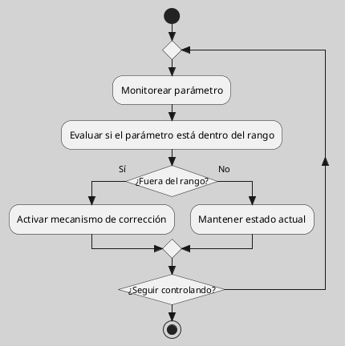
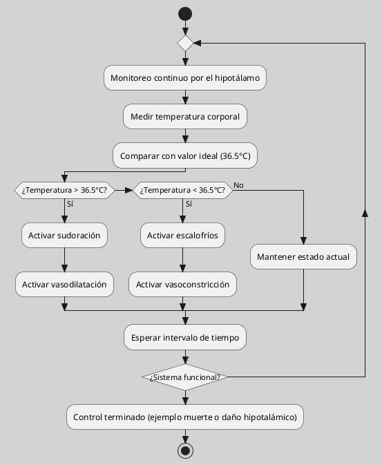
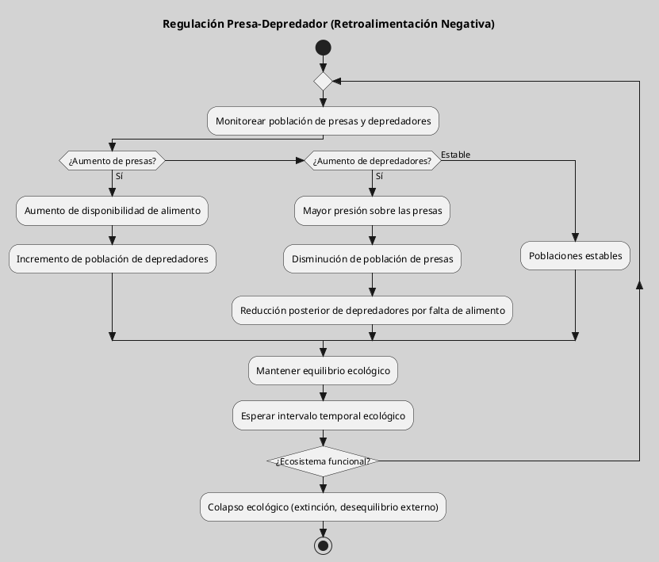
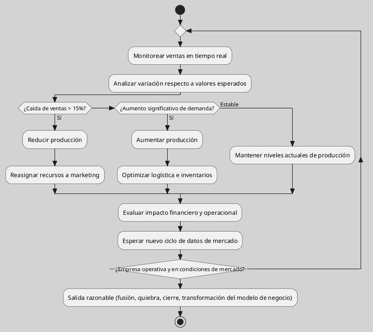

---
{"dg-publish":true,"permalink":"/050 Base de Conocimientos/200  Mi Zettelkasten/100 Docencia/Org1/2025/Clase 06 Sistemas, Fundamentos, Propiedades, Principios Básicos/Zk Homeostasis/","tags":["digitalGarden"]}
---

## Homeostasis

> [!abstract]
> La homeostasis es el proceso por el cual un sistema mantiene su equilibrio interno a pesar de los cambios en el entorno. Este concepto es fundamental en la biología y se aplica a sistemas desde el nivel celular hasta el de organismos completos. Según [[050 Base de Conocimientos/900 Biblioteca/Zk Lit (von Bertalanffy, 1989) Teoría General de los Sistemas Fundamentos, Desarrollo, Aplicaciones\|von Bertalanffy (1989)]], la homeostasis es un aspecto clave en la [[050 Base de Conocimientos/200  Mi Zettelkasten/100 Docencia/Org1/2025/Clase 02 Introducción a la Teoría General de Sistemas/Zk Enfoque de la Teoría General de Sistemas\|Teoría General de Sistemas]], ya que permite a los sistemas mantener su estabilidad a través de mecanismos de retroalimentación.
> 

### Definición

La homeostasis se define como la capacidad de un sistema para mantener un [[050 Base de Conocimientos/200  Mi Zettelkasten/040 Teoría General de Sistemas (TGS)/Zk Sistemas Estables\|estado estable]] a pesar de las perturbaciones externas. Esto se logra a través de mecanismos de regulación que ajustan las variables internas del sistema para mantener un [[050 Base de Conocimientos/200  Mi Zettelkasten/100 Docencia/Org1/2025/Clase 06 Sistemas, Fundamentos, Propiedades, Principios Básicos/Zk Sistemas (Estados)\|equilibrio]] óptimo. En sistemas biológicos, la homeostasis es crucial para la supervivencia, ya que permite a los organismos adaptarse a cambios ambientales sin perder su función.

**Figura**
_Mecanismo Homeostático_

_Nota:_ Elaboración propia en base a la definición.

### Ejemplos

**Organismos Vivientes**
En los seres humanos, la homeostasis se manifiesta en la **regulación térmica mediante mecanismos de** [[050 Base de Conocimientos/200  Mi Zettelkasten/100 Docencia/Org1/2025/Clase 08 Elementos de un Sistema (Proceso de Conversión, Corriente de Salida, Mecanismos de Retroalimentación)/Zk Sistemas (Mecanismos de Retroalimentación Negativa o Morfostasis)\|retroalimentación negativa]]. El hipotálamo funciona como un **sistema cibernético** que monitorea desviaciones: activa la sudoración y vasodilatación ante hipertermia, y genera escalofríos/vasoconstricción en hipotermia, manteniendo la temperatura en aproximadamente 36.5 grados Celcius.

**Figura**
_Mecanismo Homeostático de la Temperatura Corporal en el Humano_

_Nota:_ Elaboración propia en base al ejemplo.

----
**Ecosistemas**
Los ecosistemas mantienen equilibrio mediante [[050 Base de Conocimientos/200  Mi Zettelkasten/100 Docencia/Org1/2025/Clase 03 Sinergia y Recursividad/Zk Sinergia en la Teoría General de Sistemas\|interacciones sinérgicas]], por ejemplo:
- El ciclo del carbono regula CO2 atmosférico mediante fotosíntesis/respiración
- Las relaciones depredador-presa estabilizan poblaciones mediante [[050 Base de Conocimientos/200  Mi Zettelkasten/100 Docencia/Org1/2025/Clase 08 Elementos de un Sistema (Proceso de Conversión, Corriente de Salida, Mecanismos de Retroalimentación)/Zk Sistemas (Mecanismos de Retroalimentación Negativa o Morfostasis)\|retroalimentación negativa]] (aumento de depredadores reduce presas, y viceversa).

**Figura**
_Mecanismo Homeostático Presa - Depredador_

_Nota:_ Elaboración propia en base al ejemplo.

----
**Organizaciones**
Las empresas aplican homeostasis al **ajustar la  producción mediante datos de mercado**. Por ejemplo, un fabricante automotriz usa sistemas de monitoreo en tiempo real para regular existencias: si las ventas caen un 15%, reduce la producción y reasigna recursos a marketing, manteniendo viabilidad financiera.

**Figura**
_Mecanismo Homeostático de Ventas en Función a Datos de Mercado _

_Nota:_ Elaboración propia en base al ejemplo.

---
### Importancia en Sistemas Complejos

Es vital para la [[050 Base de Conocimientos/200  Mi Zettelkasten/100 Docencia/Org1/2025/Clase 06 Sistemas, Fundamentos, Propiedades, Principios Básicos/Zk Sistemas (Supervivencia)\|supervivencia ]]y adaptabilidad de los sistemas complejos. En la [[050 Base de Conocimientos/200  Mi Zettelkasten/100 Docencia/Org1/2025/Clase 02 Introducción a la Teoría General de Sistemas/Zk Enfoque de la Teoría General de Sistemas\|Teoría General de Sistemas]], la homeostasis se considera un mecanismo que permite a los sistemas mantener su estabilidad en un entorno cambiante. Según [[050 Base de Conocimientos/900 Biblioteca/Zk Lit (Johansen Bertoglio, 2013) Introducción a la Teoría General de Sistemas\|Johansen (2013)]], la comprensión de la homeostasis es requerida para analizar cómo los sistemas se adaptan y evolucionan.

