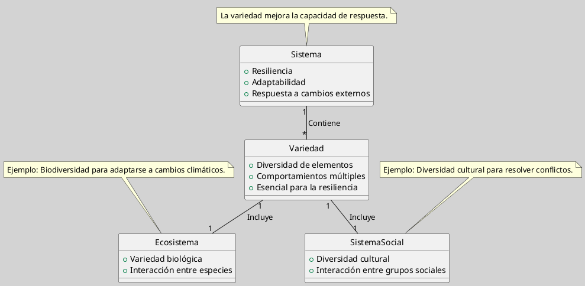

---
{"dg-publish":true,"permalink":"/050 Base de Conocimientos/200  Mi Zettelkasten/100 Docencia/Org1/2025/Clase 06 Sistemas, Fundamentos, Propiedades, Principios Básicos/Zk La Variedad en los Sistemas/","tags":["digitalGarden"]}
---

## La Variedad en los Sistemas

La variedad en los sistemas se refiere a la diversidad de elementos y comportamientos que pueden presentar. Esto incluye desde la variedad biológica en ecosistemas hasta la diversidad cultural en sistemas sociales. La variedad es esencial para la resiliencia y adaptabilidad del sistema, ya que permite responder a cambios en el entorno de manera efectiva. Según [[050 Base de Conocimientos/200  Mi Zettelkasten/040 Teoría General de Sistemas (TGS)/Zk (Ossa Ossa, 2016) Teoría General de Sistemas -  Conceptos y Aplicaciones\|Ossa Ossa (2016)]], la variedad es crucial en el análisis de sistemas, ya que esta diversidad puede influir en la estabilidad y el crecimiento del sistema.

**Figura**
_Variedad en los Sistemas_

Nota: Elaboración propia a partir de la definición.

### Ejemplo

**Variedad en Sistemas Sociales**: En sistemas sociales, la variedad se refleja en la diversidad cultural, lingüística y étnica. Esta diversidad puede enriquecer la sociedad al promover la innovación y la adaptabilidad. Además, la variedad cultural puede facilitar la resiliencia social al proporcionar diferentes perspectivas y soluciones frente a desafíos comunes. Esto está en línea con las ideas de [[050 Base de Conocimientos/900 Biblioteca/Zk Lit (García, 2024) Ciencias de la Complejidad - Teoría General de Sistemas, Pensamiento Sistémico y sus Aplicaciones Prácticas en las Ciencias Económicas, Ambientales y Sociales\|García (2024)]] sobre la importancia de la diversidad en sistemas complejos.

## Importancia de la Variedad

La variedad es vital para la supervivencia y evolución de los sistemas. En sistemas complejos, como los económicos o ambientales, la diversidad de elementos y comportamientos permite una mayor flexibilidad y capacidad de adaptación a cambios en el entorno. Según [[050 Base de Conocimientos/900 Biblioteca/Zk Lit (Johansen Bertoglio, 2013) Introducción a la Teoría General de Sistemas\|Johansen Bertoglio (2013)]], la variedad en los sistemas sociales es esencial para su dinamismo y capacidad de innovación.