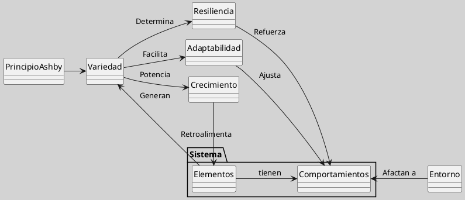

---
{"dg-publish":true,"permalink":"/050 Base de Conocimientos/200  Mi Zettelkasten/100 Docencia/Org1/2025/Clase 06 Sistemas, Fundamentos, Propiedades, Principios Básicos/Zk La Variedad en los Sistemas/","tags":["digitalGarden"]}
---

## La Variedad en los Sistemas

La variedad en los sistemas se refiere a la diversidad de elementos y comportamientos que estos pueden presentar. Es esencial para la resiliencia y adaptabilidad del sistema, ya que permite responder a cambios en el entorno de manera efectiva. Según [[050 Base de Conocimientos/200  Mi Zettelkasten/040 Teoría General de Sistemas (TGS)/Zk Lit (Ossa Ossa, 2016) Teoría General de Sistemas -  Conceptos y Aplicaciones\|Ossa Ossa (2016)]], la variedad es crucial en el análisis de sistemas, ya que esta diversidad puede influir en la estabilidad y el crecimiento del sistema.

La **variedad** en la [[050 Base de Conocimientos/200  Mi Zettelkasten/100 Docencia/Org1/2025/Clase 02 Introducción a la Teoría General de Sistemas/Zk Enfoque de la Teoría General de Sistemas\|Teoría General de Sistemas]] se refiere a la **diversidad de elementos, interacciones y comportamientos** que un sistema puede presentar para adaptarse a su entorno. Según [[050 Base de Conocimientos/900 Biblioteca/Zk Lit (Johansen Bertoglio, 2013) Introducción a la Teoría General de Sistemas\|Johansen Bertoglio (2013)]], esta propiedad está ligada al [[050 Base de Conocimientos/200  Mi Zettelkasten/100 Docencia/Org1/2025/Clase 07 Elementos de un Sistema (Corriente de Entrada)/Zk Sistemas (Principio de Variedad de Ashby)\|Principio de Variedad de Ashby]], que establece que un sistema necesita diversidad interna proporcional a la del entorno para gestionar la complejidad. [[050 Base de Conocimientos/200  Mi Zettelkasten/040 Teoría General de Sistemas (TGS)/Zk Lit (Ossa Ossa, 2016) Teoría General de Sistemas -  Conceptos y Aplicaciones\|Ossa Ossa (2016)]] enfatiza que la variedad es crucial para la estabilidad y el crecimiento sistémico, ya que permite respuestas efectivas ante cambios externos.

**Figura**
_Variedad en los Sistemas_

Nota: Elaboración propia a partir de la definición.

----
### Ejemplo

**Variedad en Sistemas Sociales**: En sistemas sociales, la variedad se refleja en la diversidad cultural, lingüística y étnica. Esta diversidad puede enriquecer la sociedad al promover la innovación y la adaptabilidad. Además, la variedad cultural puede facilitar la resiliencia social al proporcionar diferentes perspectivas y soluciones frente a desafíos comunes. Esto está en línea con las ideas de [[050 Base de Conocimientos/900 Biblioteca/Zk Lit (García, 2024) Ciencias de la Complejidad - Teoría General de Sistemas, Pensamiento Sistémico y sus Aplicaciones Prácticas en las Ciencias Económicas, Ambientales y Sociales\|García (2024)]] sobre la importancia de la diversidad en sistemas complejos.

### Importancia de la Variedad

La variedad es vital para la supervivencia y evolución de los sistemas. En sistemas complejos, como los económicos o ambientales, la diversidad de elementos y comportamientos permite una mayor flexibilidad y capacidad de adaptación a cambios en el entorno. Según [[050 Base de Conocimientos/900 Biblioteca/Zk Lit (Johansen Bertoglio, 2013) Introducción a la Teoría General de Sistemas\|Johansen Bertoglio (2013)]], la variedad en los sistemas sociales es esencial para su dinamismo y capacidad de innovación.

| Característica         | Descripción                                                                                                                                                                                                                                                                                                     |
| ---------------------- | --------------------------------------------------------------------------------------------------------------------------------------------------------------------------------------------------------------------------------------------------------------------------------------------------------------- |
| Gestión de complejidad | La variedad permite afrontar entornos dinámicos ([[050 Base de Conocimientos/200  Mi Zettelkasten/100 Docencia/Org1/2025/Clase 06 Sistemas, Fundamentos, Propiedades, Principios Básicos/Zk Sistemas (Complejidad de los Sistemas)\|complejidad]]).                                                                                                                                                                                                   |
| Supervivencia          | Mayor variedad = más opciones para mantener el [[050 Base de Conocimientos/200  Mi Zettelkasten/100 Docencia/Org1/2025/Clase 06 Sistemas, Fundamentos, Propiedades, Principios Básicos/Zk Sistemas (Estado Uniforme)\|estado uniforme]] ([[050 Base de Conocimientos/900 Biblioteca/Zk Lit (Johansen Bertoglio, 2013) Introducción a la Teoría General de Sistemas\|Johansen Bertoglio, 2013]]).                                                                                               |
| Innovación             | Diversidad de componentes facilita propiedades emergentes (ejemplo: sinergias en equipos multidisciplinarios).                                                                                                                                                                                                  |
| Dinamismo social       | Según [[050 Base de Conocimientos/900 Biblioteca/Zk Lit (García, 2024) Ciencias de la Complejidad - Teoría General de Sistemas, Pensamiento Sistémico y sus Aplicaciones Prácticas en las Ciencias Económicas, Ambientales y Sociales\|García (2024)]], la variedad cultural en sistemas sociales promueve innovación y resiliencia frente a conflictos. |
### Características Clave

| Característica       | Descripción                                                                                                      |
| -------------------- | ---------------------------------------------------------------------------------------------------------------- |
| Diversidad Funcional | Subsistemas o elementos con roles especializados (ejemplo: órganos en organismos, departamentos en empresas).    |
| Adaptabilidad        | Capacidad de generar múltiples respuestas ante perturbaciones ([[050 Base de Conocimientos/200  Mi Zettelkasten/100 Docencia/Org1/2025/Clase 06 Sistemas, Fundamentos, Propiedades, Principios Básicos/Zk Sistemas (Equifinidad)\|equifinalidad]]).    |
| Resiliencia          | Sistemas con alta variedad compensan fallos en componentes individuales (ejemplo: biodiversidad en ecosistemas). |

