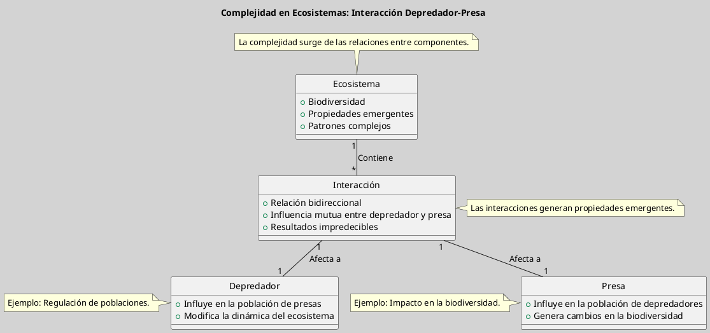

---
{"dg-publish":true,"permalink":"/050 Base de Conocimientos/200  Mi Zettelkasten/100 Docencia/Org1/2025/Clase 06 Sistemas, Fundamentos, Propiedades, Principios Básicos/Zk Sistemas (Complejidad de los Sistemas)/","tags":["digitalGarden","complejidad"]}
---

## Complejidad del Sistema

**La complejidad de un sistema se debe a la interacción entre sus componentes y al número de variables que influyen en su comportamiento**. Esto puede llevar a resultados impredecibles y a la emergencia de propiedades que no están presentes en los componentes individuales. Según [[050 Base de Conocimientos/900 Biblioteca/Zk Lit (García, 2020) Teoría y Ejercicios Prácticos de Dinámica de Sistemas\|García (2020)]], la complejidad es un aspecto clave en la comprensión de sistemas económicos, ambientales y sociales, donde la interacción entre diferentes elementos puede generar patrones complejos y dinámicos.

### Ejemplo

**Complejidad en Ecosistemas**: Los ecosistemas son sistemas complejos donde la interacción entre especies y su entorno puede generar patrones complejos. La relación entre depredadores y presas ilustra cómo esta interacción influye en la población de ambas especies y en la biodiversidad del ecosistema. Este tipo de interacciones es un ejemplo clásico de cómo la complejidad puede dar lugar a comportamientos emergentes que no son predecibles a partir de las propiedades individuales de los componentes, como se discute en [[050 Base de Conocimientos/900 Biblioteca/Zk Lit (von Bertalanffy, 1989) Teoría General de los Sistemas Fundamentos, Desarrollo, Aplicaciones\|von Bertalanffy (1989)]].

**Figura**
_Complejidad en Ecosistemas: Relación Depredador - Presa_

Nota: Elaboración propia a partir del ejemplo.

### Importancia de la Complejidad

La complejidad es vital para la adaptabilidad y la resiliencia de los sistemas. En sistemas complejos, como los económicos o ambientales, la interacción entre componentes puede generar resultados impredecibles y patrones emergentes. Según [[050 Base de Conocimientos/200  Mi Zettelkasten/040 Teoría General de Sistemas (TGS)/Zk (Ossa Ossa, 2016) Teoría General de Sistemas -  Conceptos y Aplicaciones\|Ossa Ossa (2016)]], comprender la complejidad es esencial para gestionar sistemas complejos y predecir su comportamiento en diferentes escenarios.

La **complejidad** en la Teoría General de Sistemas se refiere a la **interconexión no lineal entre componentes de un sistema**, donde el número de variables y sus interacciones generan comportamientos emergentes e impredecibles. Según [[050 Base de Conocimientos/900 Biblioteca/Zk Lit (Johansen Bertoglio, 2013) Introducción a la Teoría General de Sistemas\|Johansen Bertoglio (2013, p. 115)]], la complejidad surge de la interdependencia entre subsistemas y su entorno, dificultando la reducción del sistema a partes aisladas sin perder su esencia funcional.

[[050 Base de Conocimientos/900 Biblioteca/Zk Lit (García, 2020) Teoría y Ejercicios Prácticos de Dinámica de Sistemas\|García (2020)]] añade que, en sistemas económicos, ambientales o sociales, esta propiedad es clave para entender patrones dinámicos como crisis financieras o cambios ecológicos.

### Características Clave

1. **Interacciones no lineales**: Relaciones entre componentes que amplifican o atenúan efectos (ejemplo: retroalimentación en redes alimentarias).

2. **Propiedades emergentes**: Comportamientos globales no predecibles desde componentes individuales ([[Zk Sistemas (Propiedades Emergentes)\|Zk Sistemas (Propiedades Emergentes)]]).

3. **Incertidumbre**: Resultados impredecibles debido a la sensibilidad a condiciones iniciales (ejemplo: [[Zk El Efecto Mariposa\|el efecto mariposa]]).

### Ejemplo: Complejidad en Ecosistemas

Los ecosistemas ilustran cómo la interacción entre especies y su entorno genera patrones complejos. La relación depredador-presa demuestra:

- **Influencia mutua**: Las poblaciones de depredadores y presas se regulan dinámicamente.
    
- **Biodiversidad**: La complejidad de interacciones sostiene la estabilidad del sistema ([[050 Base de Conocimientos/900 Biblioteca/Zk Lit (von Bertalanffy, 1989) Teoría General de los Sistemas Fundamentos, Desarrollo, Aplicaciones\|von Bertalanffy, 1989]]).

text

_Nota: Elaboración propia basada en [[Zk Lit (von Bertalanffy, 1989)\|von Bertalanffy (1989)]]._

## **Importancia de la Complejidad**

1. **Adaptabilidad**: Los sistemas complejos pueden reorganizarse ante perturbaciones mediante la [[050 Base de Conocimientos/200  Mi Zettelkasten/100 Docencia/Org1/2025/Clase 06 Sistemas, Fundamentos, Propiedades, Principios Básicos/Zk Sistemas (Regulación Secundaria)\|regulación secundaria]].

2. **Resiliencia**: La redundancia funcional (ejemplo: especies con roles similares) mitiga riesgos de colapso.

3. **Innovación**: Interacciones complejas facilitan soluciones emergentes (ejemplo: inteligencia colectiva en colonias de hormigas).

Según [[Zk Lit (Ossa Ossa, 2016) Teoría General de Sistemas - Conceptos y Aplicaciones\|Ossa Ossa (2016)]], gestionar sistemas complejos requiere modelos dinámicos que capturen su no linealidad, como los usados en predicción climática o planificación urbana.